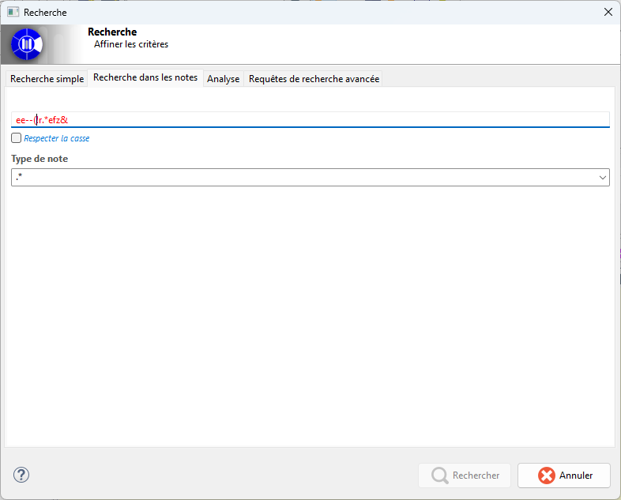

// Disable all captions for figures.
:!figure-caption:
// Path to the stylesheet files
:stylesdir: .

= Notes Search

== Introduction

The Notes Search feature allows users to quickly find model elements based on the textual content of their notes.

It provides an easy-to-use search mechanism that combines a search expression, a note type selection, and a case-sensitivity option.

== Interface

The first input field allows users to specify the expression to search for within notes.

Users enter the text or pattern they want to find in note contents.

This field is the primary component of the search. As long as the expression is invalid (highlighted in red) or remains empty, the search cannot be executed.

The second field is the case-sensitivity option.

This checkbox specifies whether the search should distinguish between uppercase and lowercase characters.

The third field allows users to select a note type.

A drop-down list displays the note types available in the current session.

This list is automatically populated from the note types defined in the model.

Users can therefore restrict the search to a specific note category or leave the field unselected to broaden the search scope.

== Use Case

In an enterprise architecture project, architects document each model element (component, interface, process, capability, etc.) with a textual description.

During the design phase, it is common to add markers such as *TODO* items to indicate remaining work.

These markers are useful, but they become scattered across dozens or even hundreds of model elements.

As the model grows, it becomes increasingly difficult to locate all the TODO items.

The project manager therefore performs regular text searches, such as the one shown below, to scan all model descriptions and obtain an overview of the project's completion status.

image::images/note_search_view_usecase.png[Searching for TODO Items]
