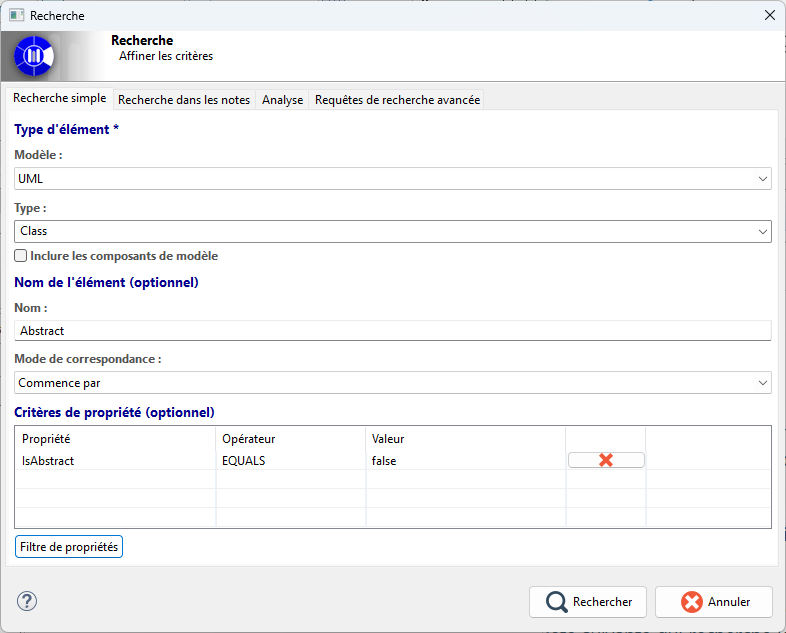

// Disable all captions for figures.
:!figure-caption:
// Path to the stylesheet files
:stylesdir: .

= Simple Search

== Introduction

The Simple Search tab allows users to search the model by combining several complementary filters.

These filters make it possible to define a business scope, refine it using element names, and further constrain it using element properties.

image::images/advanced_search_view.png[Simple Search View]

== Description

A Simple Search is based on three main filtering concepts.

The first filter defines the search scope. Users begin by selecting the type of elements they want to search for.

This choice establishes the search domain: it determines which objects can be returned, which stereotypes may be considered, and which properties become relevant for the remainder of the search.

The second filter, which is optional, is based on pattern matching against element names.

The set of elements belonging to the previously defined search domain can be restricted by checking whether their names contain a given character string.

This mechanism makes it possible to quickly narrow down a large set of elements to a more targeted subset based on their names.

The third filter, also optional, allows users to add business constraints based on element properties.

Each criterion adds an additional condition that must be satisfied by a property available on the selected business type.

The Simple Search view combines these three filters into a coherent search process:

* the type defines the search scope,
* the name applies an optional textual filter,
* and the properties add specialized constraints.

An additional option allows users to include or exclude library elements from the search.

== How Simple Search Works

=== 1. Business Scope

The first section of the search interface is used to select the element type, that is, the metamodel it belongs to and the specific element type.

==== 1.1 Metamodel Selection

This drop-down list allows users to filter the metamodel from which the searched elements will be drawn.

* It defines the category of elements to be searched.
* When applicable, it provides an additional level of specialization through stereotypes.
* It determines the validity of the remainder of the search definition, since a search without a target metamodel cannot be interpreted correctly.
* It also determines the set of element types that can subsequently be used as search criteria.

==== 1.2 Type Definition

This list allows users to further specialize the business scope of the search.

* It specifies the exact element type to search for.
* It depends on the metamodel selected previously.
* It also determines the set of properties that can later be used as search criteria.

==== 1.3 Defining the Search Scope

This checkbox determines whether the search should remain limited to model elements or also include library elements (RAMCs).

=== 2. Name Pattern Filtering

This second section of the interface allows users to filter the selected business elements based on their names.

This makes it possible to search for an exact name or only an approximate match.

Because this filter is optional, it can be used as a progressive refinement rather than as a mandatory constraint.

It therefore provides a first level of semantic filtering after selecting the business type.

==== 2.1 Name

This field specifies the character string that will be searched for within the name of each element.

==== 2.2 Pattern

This list allows users to choose the matching logic applied to the specified name.

Several matching modes are available:

* Exact Name
* Contains
* Starts With
* Ends With

=== 3. Property Criteria

This third and final section of the interface allows users to enrich the search with additional business conditions.

* Each criterion defines an additional condition applied to a property of the selected type, which must be satisfied by all returned results.
* The set of criteria provides a more precise and discriminating definition than name filtering alone.
* Existing criteria can be reviewed or removed at any time to adjust the expected level of precision.

When a change in the business scope makes existing property criteria invalid, those criteria are automatically removed in order to preserve the validity of the search.

=== 4. Defining a Property Criterion

The screenshot below shows the guided dialog used to define a basic business constraint.

image::images/property_criteria_definition.png[Defining a Property Criterion]

This dialog allows users to:

* Select a property compatible with the searched element type.
* Associate that property with an appropriate comparison operator.
* Define the type of value used for comparison.
* Ensure that a criterion is added only when it is sufficiently defined to be interpreted by the search engine.

== Use Case

The following example illustrates how the Simple Search feature can be used.

Suppose we have a class model and want to ensure that no non-abstract class has a name beginning with the prefix *Abstract*.

Indeed, different class-model naming conventions may exist. For example, a project may adopt the convention that abstract classes are prefixed with *Abstract*.

However, having a non-abstract class whose name begins with *Abstract* can be misleading.

We therefore want to verify that no such classes exist.

To do so, we:

* Search for all classes in the model.
* Filter those whose names start with *Abstract*.
* Verify that the *IsAbstract* property is set to *false*.

