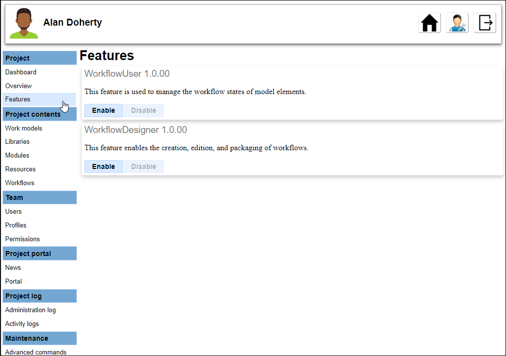

// Disable all captions for figures.
:!figure-caption:
// Path to the stylesheet files
:stylesdir: .

// Hightlight code source and add the line number
:source-highlighter: coderay
:coderay-linenums-mode: table

= Activate the Workflow features in a Modelio Server project

The workflow features can be activated from the *Features* section of the project configuration.

For the project dedicated to the Workflow design, both the <<WorkflowDesigner.adoc#,Modelio Workflow Designer>> and <<WorkflowUser.adoc#,Modelio Workflow User>> features must be activated.

For the projects in which the workflows will be deployed, only the <<WorkflowUser.adoc#,Modelio Workflow User>> feature must be activated.

