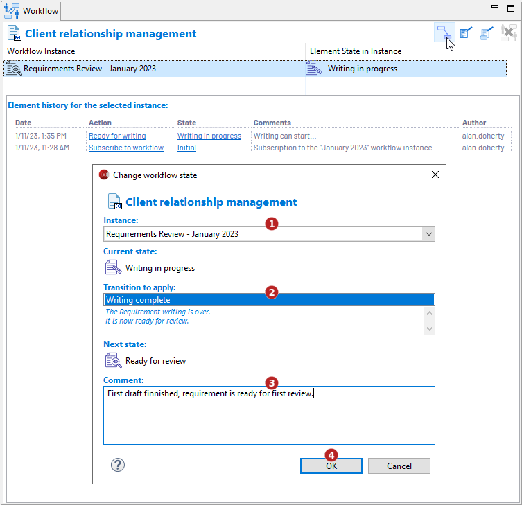

// Disable all captions for figures.
:!figure-caption:
// Path to the stylesheet files
:stylesdir: .

// Hightlight code source and add the line number
:source-highlighter: coderay
:coderay-linenums-mode: table

= Change state

This command consists in executing a transition on an element, thereby changing its current state to another state of the workflow.
This command only applies to elements already subscribed to a workflow.
Note that only transitions authorized by <<NotificationsAndRightsConfiguration.adoc#,permissions>> defined for each user can be executed.

=== Using the model browser popup menu command

Select an eligible element in the model browser then execute the image:images/changestateicon.png[changestateicon.png] *Workflow > Change state...* command.

image::images/ChangeStateCommand.png[ChangeStateCommand.png]

In the dialog carry out the following actions:

1. Select a workflow instance (if the element has been subscribed to several ones)
2. Select the transition to perform. Only transitions authorized for the current user are available.
3. Enter a comment. For example, the reason why the element state has changed.
4. Validate by clicking on "OK".

=== Using the <<WorkflowUserPropertyView.adoc#,Workflow property view>>

Select an eligible element then click on the image:images/changestateicon.png[changestateicon.png] *Change state...* button.

In the dialog carry out the following actions: +

1. Select a workflow instance (if the element has been subscribed to several ones)
2. Select the transition to perform. Only transitions authorized for the current user are available.
3. Enter a comment. For example, the reason why the element state has changed.
4. Validate by clicking on "OK".

