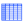
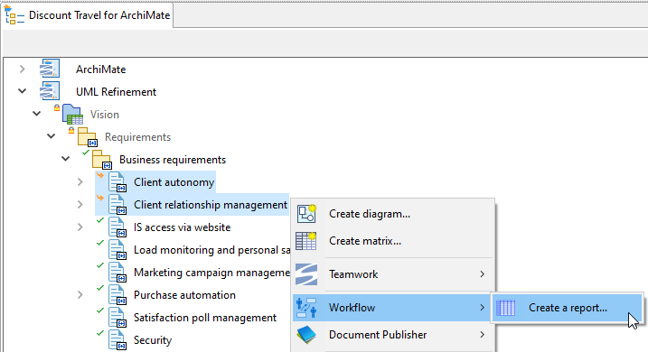

// Disable all captions for figures.
:!figure-caption:
// Path to the stylesheet files
:stylesdir: .

// Hightlight code source and add the line number
:source-highlighter: coderay
:coderay-linenums-mode: table

= Create a report matrix

This command is used to create a Workflow report matrix.

A workflow report matrix displays, for a set of chosen elements subscribed to at least one workflow instance, a summary of their properties in the workflow:

* current state
* last comment
* last transition
* last modification date and author

The command is available in the model browser pop up menu from high-level elements (Package, Component, Analyst Container analyst, ArchiMate Folder, etc.)

==== Difference between the workflow synthesis and report matrices

To summarize:  _"a synthesis matrix is about a *workflow* while a report matrix is about *model elements* "_

More exactly, the workflow report matrix is used to answer the question: +
_"What is happening to some model elements in terms of workflow follow-up, whatever the workflow?"_

while the workflow synthesis matrix is answering the question: +
_"What is happening in a particular workflow?"_

=== Using the model browser popup menu command

Select one or several eligible element in the model browser then execute the  **Workflow > Create a report** command:

Please note that:

. the model elements that were selected when the command was launched, appear as lines in the matrix (if they are subscribed in a workflow).
. if a model element is subscribed in several workflow instance, it will appear as several lines in the matrix, one per workflow instance.
. the matrix contents are refreshed each time the matrix is opened to guarantee that the displayed results do reflect the real situation of the workflow elements. +
. while the matrix is being displayed, you can can fire a refresh of its contents by clicking on the matrix update button image:images/RefreshMatrixContents16.png[RefreshMatrixContents16.png] in its toolbar.
. It is possible to add elements to the matrix by drag'n'dropping them to the image:images/bottomcorner.png[bottomcorner.png] column. Such added elements are persisted in the matrix definition and will be displayed at new matrix opening and update.

Example of a workflow report matrix:

image::images/ReportMatrix.png[]

