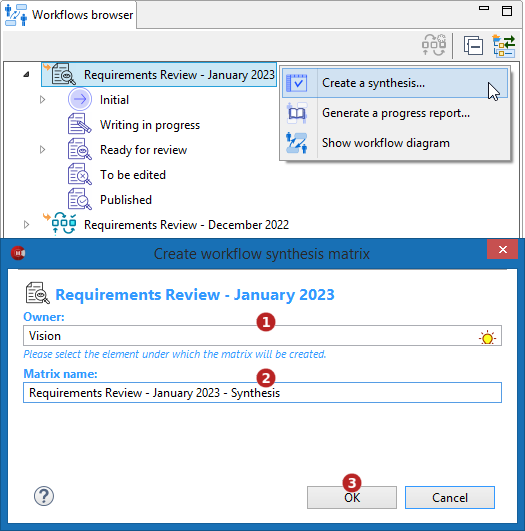

// Disable all captions for figures.
:!figure-caption:
// Path to the stylesheet files
:stylesdir: .

// Highlight code source and add the line number
:source-highlighter: coderay
:coderay-linenums-mode: table

= Create a synthesis matrix

This command is used to create a Workflow synthesis matrix.

A workflow synthesis matrix displays all the elements subscribed to a given workflow along with their individual current states in the workflow.

* The matrix lines represent the elements subscribed to the workflow, one element per line.
* The matrix columns represent the workflow defined states
* The cell values hold a boolean value that indicates, when true, that the model element of a line is currently in the state indicated by the column.

==== Difference between the workflow synthesis and report matrices

To summarize:  _"a synthesis matrix is about a *workflow* while a report matrix is about *model elements* "_

More exactly, the workflow report matrix is used to answer the question: +
_"What is happening to some model element in terms of workflow follow-up, whatever the workflow ?"_

while the workflow synthesis matrix is answering the question: +
_"What is happening in a particular workflow?"_

=== Using the Workflows browser popup menu command

To create a synthesis matrix, display the Workflow Browser view, select a workflow instance then execute the * Create a synthesis...* command.

In the dialog carry out the following actions:

In the dialog carry out the following actions:

1. Choose a model element intended to be the owner of the synthesis matrix (the sub-project to which the workflow instance belongs is preset in this field).
2. Enter a name for the matrix.
3. Click on "OK" to create the matrix.

Note that the matrix contents are refreshed each time the matrix is opened to guarantee that the displayed results do reflect the real situation of the workflow elements.
Furthermore, at any time, while the matrix is being displayed, you can can fire a refresh of its contents by clicking on the matrix update button image:images/RefreshMatrixContents16.png[RefreshMatrixContents16.png] in its toolbar.

Example of a workflow synthesis matrix:

image::images/WorkflowSynthesis.png[]
