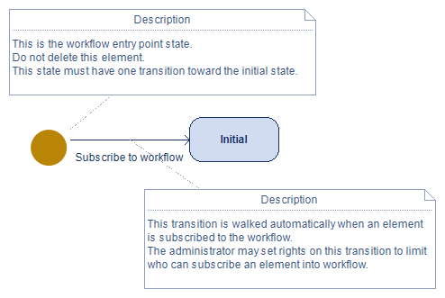

// Disable all captions for figures.
:!figure-caption:
// Path to the stylesheet files
:stylesdir: .

// Hightlight code source and add the line number
:source-highlighter: coderay
:coderay-linenums-mode: table

= Create a workflow

A workflow is a diagram with states and transitions (see the <<Concepts.adoc#,concepts>> section).

A workflow can only be created on a Package or a Component.

To create a workflow, select a Package or a Component on which you have modification rights then run the * Workflow > Workflow Designer > Create a workflow...* command:

image::images/CreateWorkflow.png[CreateWorkflow.png]

1.  Enter the workflow name. Allowed characters: 'a' à 'z', 'A' à 'Z', '0' à '9', '.', '_' and ' '.
2.  Enter the workflow version in V.R.C format.
3.  Add the types of elements which can be enrolled in the workflow:
* The 'Metaclass' field is used to define the metaclass (element type) the workflow can apply to.
* The '^' option is used to defined whether the workflow can be applied to the metaclass only or also to its sub-metaclasses.
* The 'Stereotype' field is used to define the stereotype the workflow can apply to.
* The '^' option is used to defined whether the workflow can be applied to the stereotype only or also to its sub-stereotype.
4.  Enter the workflow description.
5.  Click on 'OK'.

Upon creating the workflow, Modelio generates a workflow diagram which contains a pseudo state and an initial state. These states are essential for the proper functioning of the workflow: when an element is enrolled, it goes to 'Initial' state.

To complete the diagram, just create the desired states and transitions, and end the workflow with a final state:

image::images/RequirementsWorkflowDiagram.png[RequirementsWorkflowDiagram.png]

1.  Transition : the transition name must be relevant (i.e. recall the action or condition allowing the state change). It's recommended to add a description via the <<WorkflowDesignerPropertyView.adoc#,Workflow property view>> .
2.  State: the state name has to be unique in the workflow. It's recommended to add a description via the <<WorkflowDesignerPropertyView.adoc#,Workflow property view>> .
3.  Final state: this state completes the workflow.
