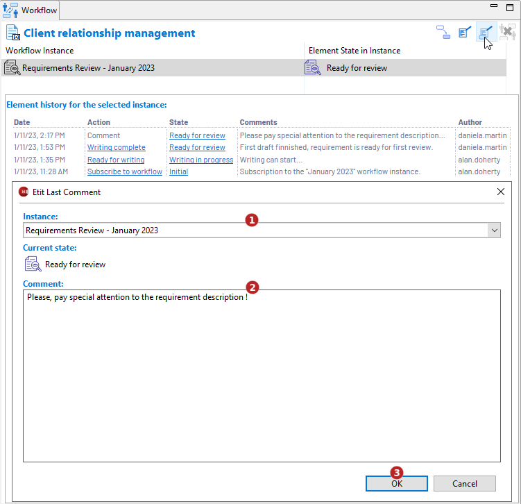

// Disable all captions for figures.
:!figure-caption:
// Path to the stylesheet files
:stylesdir: .

// Hightlight code source and add the line number
:source-highlighter: coderay
:coderay-linenums-mode: table

= Edit last comment

This command is only applicable to elements which have been added to a workflow.
It is used to modify the last entered comment for the current state of the element, for example to modify typos or to add some information.
This command is only available from the workflow property view.

=== Using the Workflow property view

Select an eligible element then click on the image:images/editcommenticon.png[] *Edit last comment...* button.

In the dialog carry out the following actions:

1. Select a workflow instance (if the element has been added to several workflow instances otherwise the unique workflow instance is preselected)
2. Edit the comment. For example, add details or fix typos
3. Validate by clicking  on "OK".
