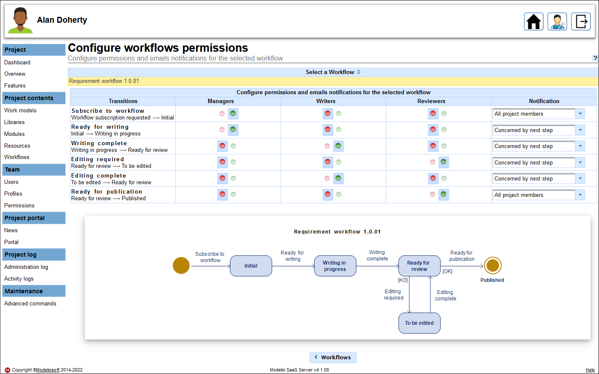

// Disable all captions for figures.
:!figure-caption:
// Path to the stylesheet files
:stylesdir: .

// Hightlight code source and add the line number
:source-highlighter: coderay
:coderay-linenums-mode: table

= Notifications and rights configuration

Once a workflow has been <<AddWorkflowToProject.adoc#,added to a Modelio Server project>>, authorizations and notifications have to be configured. They are based on profiles. It is therefore recommended that several profiles exist in order to fine-tune authorizations management.

Configurations are carried out from the project's Modelio Server portal.

To configure your workflows, proceed as follows:

* Connect to Modelio Server as project administrator then, in the Administered projects Portfolio, click on the relevant 'Configure' button:

image::images/ConfigureProject.png[ConfigureProject.png]

* Go to the *Project contents > Workflows* section then click on the *Configure workflows* button:

image::images/ConfigureWorkflow.png[ConfigureWorkflow.png]

* Select a workflow to configure and set its authorizations and notifications for each transition:

In the above example, only the 'Managers' profile can perform the 'Subscribe to workflow' transition which consists of passing an element from the 'Subscription request' state to the 'Initial' state. A notification e-mail will be sent to all project members when elements passed to the 'Initial' state are committed in the Teamwork repository.

'Managers' can also carry out the 'Ready for writing' transition which consists of passing an element from the 'Initial' state to the 'Writing in progress' state. This time, only the members by the next step will be notified.

Only 'Writers' can perform the 'Writing complete' transition and the 'Editing complete' one. When these transactions are done, the 'Readers' will be notified.

'Readers' can carry out the 'Editing required' and 'Ready for publication' transitions for which a notification will be sent to 'Writers' and 'All project members' respectively.
