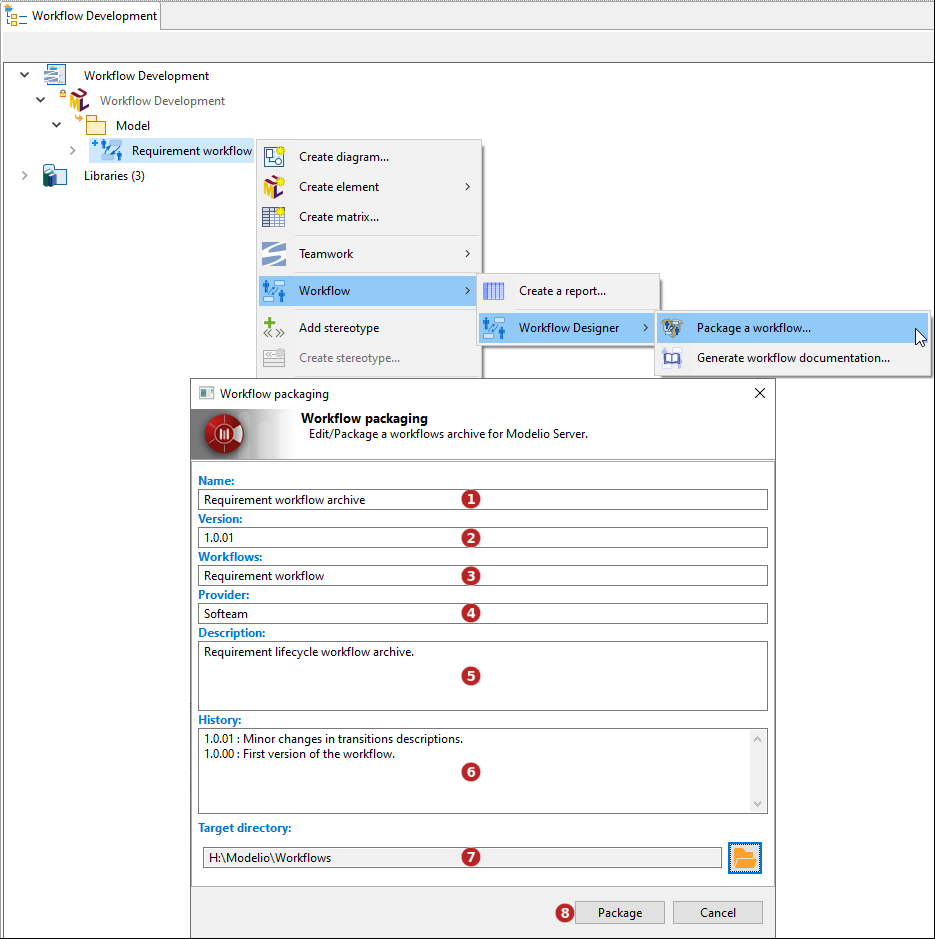

// Disable all captions for figures.
:!figure-caption:
// Path to the stylesheet files
:stylesdir: .

// Hightlight code source and add the line number
:source-highlighter: coderay
:coderay-linenums-mode: table

= Create a workflow archive

A workflow archive is used to deploy workflows onto a Modelio Server.
It can contain several workflows.

To create a Workflow Archive, select a Workflow (or a workflow Archive) and run the *image:images/workflowicon.png[workflowicon.png] Workflow > Workflow Designer > Package a workflow...* command.

1.  Enter the archive name. Allowed characters: 'a' à 'z', 'A' à 'Z', '0' à '9', '.', '_' and ' '.
2.  Enter the archive version in V.R.C. format
3.  Enter the archive provider's name
4.  Select the workflow(s) to embed to the archive
5.  Enter a description of the workflow archive
6.  Enter the archive version history
7.  Select a target directory.
8.  Click on 'Package'.
