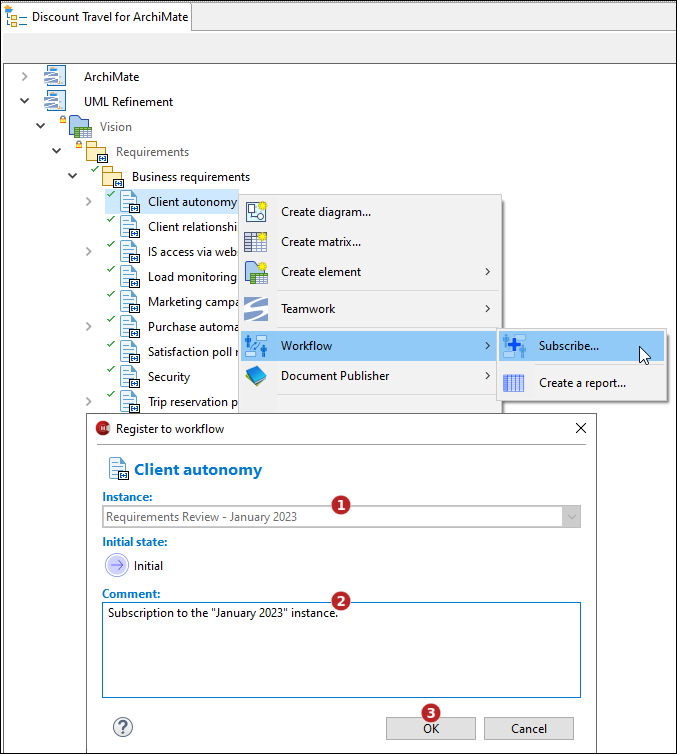

// Disable all captions for figures.
:!figure-caption:
// Path to the stylesheet files
:stylesdir: .

// Hightlight code source and add the line number
:source-highlighter: coderay
:coderay-linenums-mode: table

= Unsubscribe

This command is used to remove a model element from a workflow instance, it is therefore only applicable to model elements enrolled in a workflow instance.

NOTE:  Only those users with sufficient permissions at to perform a model element subscription are allowed to carry out an "Unsubscribe" operation.

=== Using the model browser popup menu command

Select an eligible element in the model browser then execute the  *Workflow > Unsubscribe...* command.
       

In the dialog carry out the following actions:

1. Select the workflow instance to remove the element from (in case the element is registered into several workflow instances)
2. Validate by clicking  on "OK".

=== Using the <<WorkflowUserPropertyView.adoc#,Workflow property view>>

Select an eligible element in the Workflow property view then click on the  *Unsubscribe...* button.

image::images/UnsubscribeButton[UnsubscribeButton.png]

In the dialog carry out the following actions:

1. Select the workflow instance to remove the element from (in case the element is registered into several workflow instances)
2. Validate by clicking  on "OK".

