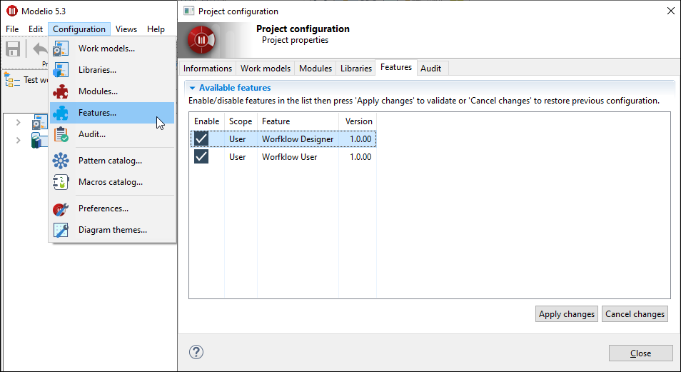

// Disable all captions for figures.
:!figure-caption:
// Path to the stylesheet files
:stylesdir: .

// Hightlight code source and add the line number
:source-highlighter: coderay
:coderay-linenums-mode: table

= Workflow Designer

In Designer mode, the user can design custom workflows and prepare them for installation on Modelio Server to be used in projects.
In order to use Workflow Designer the *Workflow Designer* and *Workflow User* features must be activated in the project.

== Activating Workflow Designer in a server project

See the <<ActivateWorkflowFeature.adoc#,activate the Workflow features in a Modelio Server project>> page.

== Activating Workflow Designer in a local project

To enable the *Worflow Designer* and *Workflow User* features in a local project, go to *Configuration > image:images/featureicon.png[featureicon.png] Features...*, check both *Workflow Designer* and *Workflow User* features and click on the *Apply changes* button.

== Commands

Activating Workflow Designer enables the creation, edition, and packaging of workflows.

For testing purposes, when Workflow Designer is activated, all the transitions of the workflow being designed can be executed, kind of god mode.

The Worflow Designer mode add some additional commands:

*  <<CreateWorkflow.adoc#,Create a workflow...>>
*  <<PackageWorkflow.adoc#,Package a workflow...>>
*  <<GenerateWorkflowDocumentation.adoc#,Generate workflow documentation...>>

== Workflow view

The <<WorkflowDesignerPropertyView.adoc#,Workflow view>> provides information on model elements enrolled in workflow.
When designer mode is activated, the property view can also displays information about workflow, states and transitions and can also be used to edit some of their properties.

