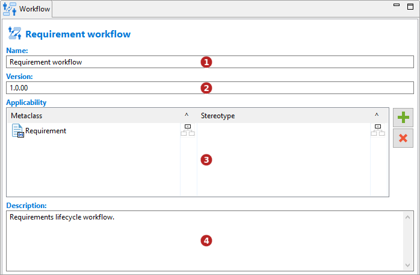
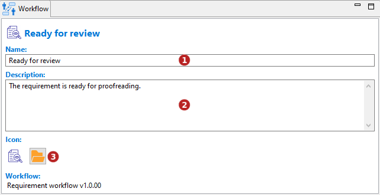

// Disable all captions for figures.
:!figure-caption:
// Path to the stylesheet files
:stylesdir: .

// Hightlight code source and add the line number
:source-highlighter: coderay
:coderay-linenums-mode: table

= Workflow view

Modelio workflow provides a dedicated view that can be enabled from the Modelio *Views* menu:

image::images/WorkflowViewMenu.png[WorkflowViewMenu.png]

The workflow view content depends on the selected element.

Workflow view of a <<CreateWorkflow.adoc#,*Workflow*>> :

1.  Workflow name. Allowed characters: 'a' à 'z', 'A' à 'Z', '0' à '9', '.', '_' and ' '.
2.  Workflow version in V.R.C format
3.  Element types that can subscribe to the workflow:
* The 'Metaclass' field is used to define the metaclass (element type) the workflow can apply to.
* The '^' option is used to defined whether the workflow can be applied to the metaclass only or also to its sub-metaclasses.
* The 'Stereotype' field is used to define the stereotype the workflow can apply to.
* The '^' option is used to defined whether the workflow can be applied to the stereotype only or also to its sub-stereotype.
4.  Workflow description.

Workflow view of a *state* :

1.  State name: it has to be unique in the workflow.
2.  State description. It should describe what the state implies for the element.

Workflow view of a *transition* :

image::images/TransitionWorkflowView.png[TransitionWorkflowView.png]

1.  Transition name. It should mention the action or condition required to change state.
2.  Transition description. It should describe the action or condition required to change states. It can also describe the authorizations required for the transition to be performed.
