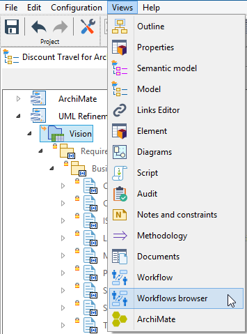
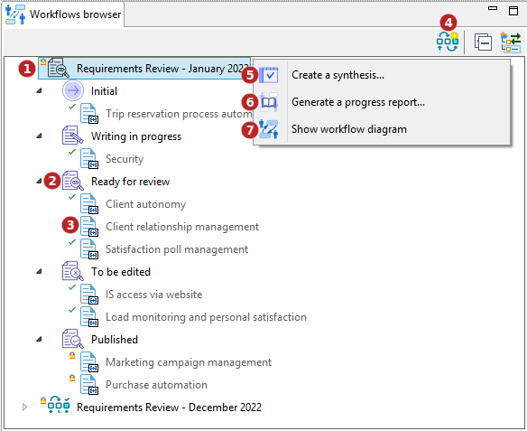

// Disable all captions for figures.
:!figure-caption:
// Path to the stylesheet files
:stylesdir: .

// Hightlight code source and add the line number
:source-highlighter: coderay
:coderay-linenums-mode: table

= Workflows browser

Modelio workflow provides a dedicated view that can be enabled from the Modelio *Views* menu:

The Workflow browser display all the workflow instances of the project:

1. The tree root elements are the different workflow instances in the project.
2. Unfolding a workflow instance displays its possible states.
3. Unfolding a State displays the model element that are currently in this particular state.
4. <<CreateInstance.adoc#,Create a new workflow instance...>>
5. <<CreateSynthesisMatrix.adoc#,Create a synthesis matrix...>>
6. <<GenerateProgressReport.adoc#,Generate a progress report...>>
7. Show Workflow diagram.

