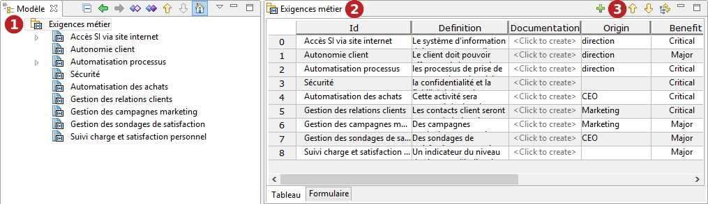
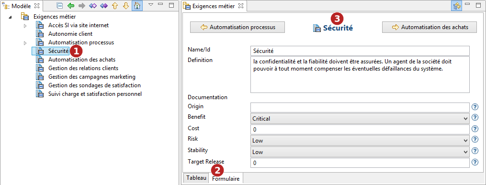

// Disable all captions for figures.
:!figure-caption:
// Path to the stylesheet files
:stylesdir: .

= L'éditeur Analyste

.Editeur d'exigences

*Légende :*

1. Double-cliquez sur un conteneur pour afficher son editeur.
2. L'éditeur est ouvert sur le conteneur et affiche ses éléments avec leur propriétés.
3. Utilisez le bouton image:images/attachment/analyst41/User_Documentation_fr/Editeur_Analyste/Analyst-Editor_add.png[Analyst-Editor_add.png] pour créer un nouvel élément, image:images/attachment/analyst41/User_Documentation_fr/Editeur_Analyste/Analyst-Editor_delete.png[Analyst-Editor_delete.png] pour supprimer un élément existant et  et image:images/attachment/analyst41/User_Documentation_fr/Editeur_Analyste/Analyst-Editor_movedown.png[Analyst-Editor_movedown.png] pour déplacer les éléments, si '  ' est activé, l'éditeur Analyste se synchronisera avec l'explorateur de modèle.

.Formulaire d'exigences

*Légende :*

1. Sélectionnez une exigence.
2. Cliquez sur l'onglet 'Formulaire' pour afficher le formulaire d'exigence.
3. Utilisez les boutons ' image:images/attachment/analyst41/User_Documentation_fr/Editeur_Analyste/Analyst-Editor_leftarrow.png[Analyst-Editor_leftarrow.png] ' et ' image:images/attachment/analyst41/User_Documentation_fr/Editeur_Analyste/Analyst-Editor_rightarrow.png[Analyst-Editor_rightarrow.png] ' pour naviguer parmi les exigences.
