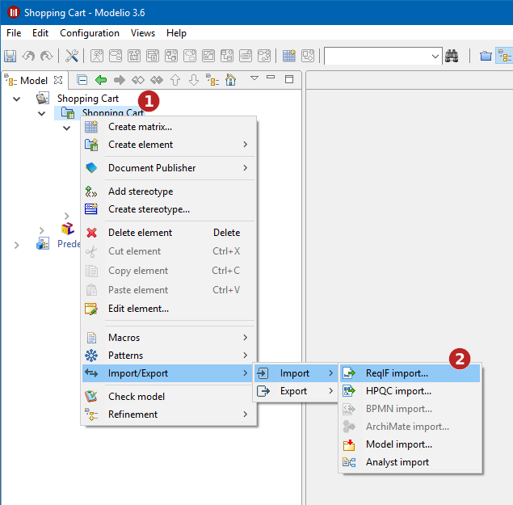
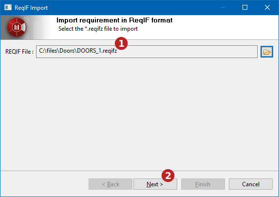
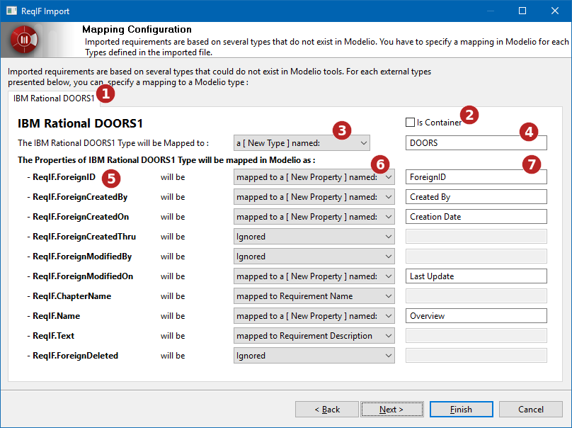
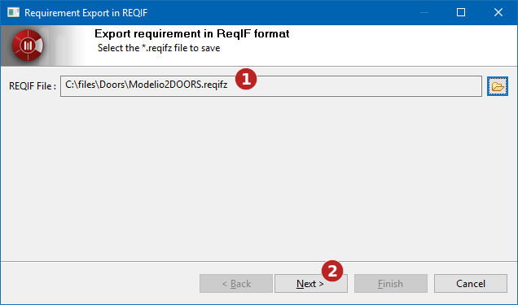
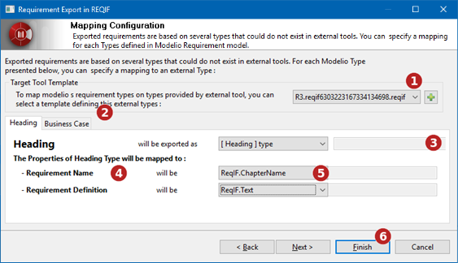
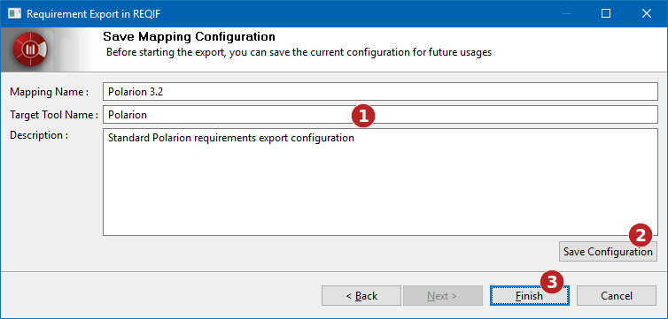

// Disable all captions for figures.
:!figure-caption:
// Path to the stylesheet files
:stylesdir: .

= Import et export ReqIF

= Import ReqIF

Modelio permet d'importer des exigences depuis un fichier au format ReqIF. Les exigences sont typés et un type d'exigence définit une liste de propriétés associées à chaque exigence. Pour importer des exigences depuis un outil externe, il est nécessaire de mettre en place un "mapping" de transformation entre les types d'exigences définis dans Modelio et ceux définis dans l'outil externes.

== Lancez la commande d'import de ReqIF

La commande d'import ReqIF est disponible dans le menu contextuel du sous-projet Analyste:

*Étapes :*

1.  Faites un clic droit sur le sous-projet Analyste
2.  Lancez la commande "Import ReqIF..."

== Sélectionnez le fichier à importer

*Étapes :*

1.  Sélectionnez le fichier à importer.
2.  Cliquez sur "Suivant" pour sélectionner le "mapping".

== Sélectionnez un "mapping"

Par défaut, Modelio fournit plusieurs "mapping". L'utilisateur peut aussi définir un nouveau "mapping" qui pourra être réutiliser ultérieurement.

image::images/attachment/analyst41/User_Documentation_fr/Import_et_Export/Import_et_Export_ReqIF/reqif_import_002.png[reqif_import_002.png]

*Étapes :*

1.  Définir un nouveau "mapping"
2.  Utiliser un 'mapping' existant
3.  Cliquez sur "Suivant" pour configurer le "mapping"

== Configurez le "mapping"

La fenêtre de configuration du "mapping" permet de définir comment Modelio va traiter chaque types d'exigences définis dans le fichier importé.

Pour chaque types définis dans le fichier importé :

* Créer un nouveau type dans Modelio basé sur le type importé.
* Établir le "mapping" entre le type importé et un type Modelio.

Dans le second cas, il sera nécessaire d'établir un "mapping" entre chaque propriétés du type importé et les propretés du type Modelio.

Dans Modelio, les exigences sont organisées en conteneur d'exigences. Certains outils externes utilisent des types particuliers pour représenter cette structuration. Lors de la configuration du "mapping", il est nécessaire d'identifier ces types parmi ceux importés.

*Étapes :*

1.  Chaque type du fichier importé est présenté dans un onglet dédié.
2.  Indique s'il s'agit d'un type de structuration
3.  Choisissez si le type importé sera recréé dans Modelio ou mappé vers un type Modelio existant
4.  Si le type externe est recréé dans Modelio, il est possible de spécifier son nom.
5.  Liste des propriétés définies dans le type importé. Il est nécessaire d'établir un "mapping" pour chaque propriétés.
6.  Sélectionnez le "mapping" d'une propriété.
* Si vous avez choisi de recréer le type importé dans Modelio, les propriétés externes peuvent être :
** Ignoré : Elle ne sera pas importé
** Mappé vers un nom Modelio ou une définition d'exigence.
** Mappé vers une nouvelle propriété crée (dans ce cas, il est possible de spécifier le nom de la nouvelle propriété) (7).
* Si vous avez choisi de mapper le type externe sur un type Modelio existant, les propriétés pourront être :
** Ignoré, elle ne sera pas importée
** Transposé sur une propriété Modelio existante

== Enregistrez le mapping

Après que le "mapping" personnalisé a été configuré, il est possible de l'enregistrer pour être réutilisé ultérieurement.

image::images/attachment/analyst41/User_Documentation_fr/Import_et_Export/Import_et_Export_ReqIF/reqif_import_004.png[reqif_import_004.png]

*Étapes :*

1.  Définissez le nom, l'outil externe et une description du "mapping"
2.  Enregistrez la configuration du "mapping"
3.  Cliquez sur "Terminer" pour lancer le processus d'import du fichier ReqIF.

= Export ReqIF

Modelio vous permet d'exporter des exigences au format ReqIF. Les exigences sont typées et elles définissent la liste des propriétés associées de chaque exigences. Pour exporter des exigences vers un outil cible, il est nécessaire de mettre en place un "mapping" de transformation des types d'exigences définis dans Modelio vers les types supportés par l'outil cible.

== Lancez la commande d'export ReqIF

La commande "Export ReqIF" est disponible dans le menu contextuel d'un sous-projet Analyste:

image::images/attachment/analyst41/User_Documentation_fr/Import_et_Export/Import_et_Export_ReqIF/reqif_export_000.png[reqif_export_000.png]

*Étapes :*

1.  Faites un clic droit sur le sous-projet Analyste
2.  Lancez la commande "Export ReqIF..."

== Sélectionnez la cible de l'export

*Étapes :*

1.  Sélectionnez le chemin vers lequel le fichier sera exporté
2.  Cliquez sur "Suivant" pour pour sélectionner le "mapping" d'export

== Sélectionnez une transformation d'export

Modelio fournit plusieurs "mapping" par défaut. L'utilisateur peut aussi définir un nouveau "mapping" qui pourra être réutiliser ultérieurement.

image::images/attachment/analyst41/User_Documentation_fr/Import_et_Export/Import_et_Export_ReqIF/reqif_export_002.png[reqif_export_002.png]

*Étapes :*

1.  Définir un nouveau "mapping"
2.  Utiliser un 'mapping' existant
3.  Cliquez sur "Suivant" pour configurer le "mapping"

== Configurez le "mapping"

L'interface de la configuration du "mapping" vous permet de définir, pour chaque types d'exigences utilisées dans Modelio, comment ces types seront exportés en ReqIF.

Pour chaque types Modelio, le processus d'export peut :

* Créer un nouveau type dans le fichier exporté basé sur la définition du type Modelio
* Établir un "mapping" entre les types Modelio et les types supportés par l'outil cible. +
Dans ce cas, Modelio doit connaître les types supportés par l'outil cible. Pour cela il doit s'appuyer sur un fichier template fournit par l'outil cible (Par exemple un fichier ReqIF exporté par l'outil cible et contenant la liste des types supportés par celui-ci).

Dans le second cas, il sera nécessaire d'établir un "mapping" entre chaque propriétés du type Modelio est les propriétés du type de l'outil cible..

*Étapes :*

1.  Sélectionnez ou ajoutez un fichier Template (fichier ReqIF exporté par l'outil cible).
2.  Sélectionnez le type de propriété de Modelio à configurer.
3.  Choisissez si le type Modelio sera exporté comme un nouveau type ou s'il sera "mappé" sur un type défini par le fichier Template. Dans le premier cas, le nom du nouveau type peut être spécifié.
4.  Liste des propriétés définies par le type Modelio. Un "mapping" doit être défini pour chacun de ces types.
5.  Sélectionnez le "mapping" pour chaque propriétés :
* Dans le cas où un nouveau type est créé, chaque propriété peut être :
** Ignoré : elle ne sera pas exportée
** Exporté en tant que nouvelle propriété. Le nom de cette nouvelle propriété peut être spécifié.
* Si le type Modelio est mappé vers un type défini dans le fichier de Template, la propriété peut être :
** Ignoré : elle ne sera pas exportée.
** Mappé en une propriété définie par le fichier Template.
6.  Cliquez sur "Terminer" pour lancer l'export.

== Enregistrez le mapping

Si un "mapping" spécifique a été défini, il peut être enregistré pour être réutilisé ultérieurement.

*Étapes :*

1.  Définissez le nom, l'outil cible et la description du "mapping"
2.  Enregistrez la configuration du "mapping"
3.  Cliquez sur "Terminer" pour lancez l'export.
