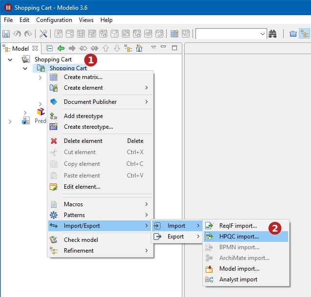
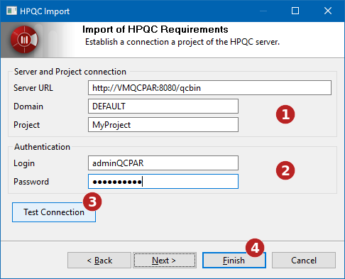

// Disable all captions for figures.
:!figure-caption:
// Path to the stylesheet files
:stylesdir: .

= Importer des exigences depuis un serveur HPQC

Modelio peut importer des exigences depuis un serveur HPQC.

Pour cela Modelio doit être en mesure d'établir une connexion avec le serveur HPQC et avoir les droits d'accès nécessaire au projet HPQC.

== Lancez la commande import HPQC

La commande d'import HPQC est disponible dans le menu contextuel depuis un sous-projet Analyste : +

*Étapes :*

1.  Faites un clic droit sur le sous-projet Analyste
2.  Lancez la commande "Import HPQC..."

= Établissez la connexion au serveur HPQC

La connexion entre Modelio et le serveur HPQC doit être configuré et testé.

*Étapes :*

1.  Spécifiez l'URL du serveur HPQC, le nom de domaine ainsi que le nom du projet contenant les exigences que vous souhaitez importer.
2.  Renseignez le login et le mot de passe pour le serveur HPQC.
3.  Testez la connexion.
4.  Cliquez sur "Suivant"

= Identifiez les types de structurations

HPQC utilise des types spécifiques pour définir des conteneurs de structuration des exigences. Par défaut dans HPQC, le type dédié est "Dossier / Folder". L'administrateur du serveur peut définir d'autres types destinés à cet usage. Cette vue vous permet de déterminer quels sont les types de structurations définis sur le serveur HPQC.
