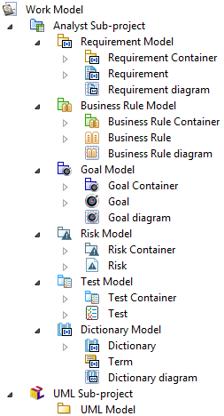

// Disable all captions for figures.
:!figure-caption:
// Path to the stylesheet files
:stylesdir: .

= Les modèles Analyste

= Projets, modèles de travail et sous-projets

==  Projet Modelio 

Dans Modelio, un projet est similaire à un document dans Word: Vous pouvez l'ouvrir, modifiez son contenu et enregistrez les modifications (ou pas) avant de la fermer. Du point de vue de l'utilisateur final, le projet est l'unité de travail et de persistance des modèles Modelio. Une fois ouvert, le projet apparaît à l'utilisateur final comme un modèle unique, composé de nombreux éléments de modèle, généralement organisés en paquets et autres conteneurs de haut niveau. Cependant, dans les coulisses, les éléments de modèle manipulés peuvent être fournis par plusieurs fragments de modèle et leurs référentiels physiques. Modelio est chargé de gérer ces dépôts de façon transparente en tant que modèle unique.

=  Modèles de travail image:images/attachment/analyst41/User_Documentation_fr/Modele_Analyste/workmodel.png[workmodel.png]

Les modèles de travail sont des groupes d'éléments de modèle de haut niveaux. Leur fonction principale est de stocker de façon autonome une partie d'un modèle. Un élément de modèle appartenant à un modèle de travail donné peut être lié à des éléments de modèle appartenant à un autre modèle de travail, mais ce lien doit être une référence simple, et non un lien de composition. Un élément modèle appartient réellement à un modèle de travail, mais sa propriété n'est pas définitive. Il peut être déplacé vers d'autres modèles de travail, selon les besoins organisationnels des architectes.

Les modèles de travail sont étroitement couplés à la notion de système de stockage des éléments de modèles. Modelio prend en charge plusieurs technologies de de stockage de ses modèles (Local, SVN, Model Components ...).

==  Sous-projet Analyste image:images/attachment/analyst41/User_Documentation_fr/Modele_Analyste/analystproject.png[analystproject.png]

Depuis la version 3.6, Modelio prend en charge plusieurs types de sous-projets (UML, ArchiMate, Analyste ...). Ces sous-projets peuvent cohabiter dans le même modèle de travail. Un sous-projet Analyste organise donc tous les éléments Analysts créés sous un modèle de travail.

== Modèles Analyste

Dans le sous-projet Analyste, les différents concepts Analyste sont organisés dans leurs modèles respectifs :  Exigences, image:images/attachment/analyst41/User_Documentation_fr/Modele_Analyste/goalcontainer.png[goalcontainer.png] Objectifs, image:images/attachment/analyst41/User_Documentation_fr/Modele_Analyste/businessrulecontainer.png[businessrulecontainer.png] Règles Métier,  Dictionnaires, image:images/attachment/analyst41/User_Documentation_fr/Modele_Analyste/riskcontainer.png[riskcontainer.png] Risques et  Tests.

