// Disable all captions for figures.
:!figure-caption:
// Path to the stylesheet files
:stylesdir: .

= Utiliser Word avec Modelio Analyst

===== Introduction

Le couplage Word / Modelio Analyst vous permet d'annoter les éléments dans un document Word comme étant des conteneurs de règles métier, des règles métier, des dictionnaires ou des termes. Vous pouvez ensuite générer le document Word comme un fichier XML qui peut être importé dans Modelio, afin de construire le projet Analyst correspondant.

Modelio fournit un modèle dédié, le modèle "Modelio Model fr.dot", pour le couplage Word / Modelio Analyst.

1.  Couplage Word 2013 à Analyst
2.  Couplage Word 2007 à Analyst
3.  Couplage Word 2002 à Analyst [[Couplage-Word-2013-à-Analyst]]

===== Couplage Word 2013 à Analyst

Ajouter le modèle "Modelio Analyst Model fr 2013.dot" à un document Word 2013

.Ajout du modèle "Modelio Analyst Model fr 2013.dot" à un document Word 2013
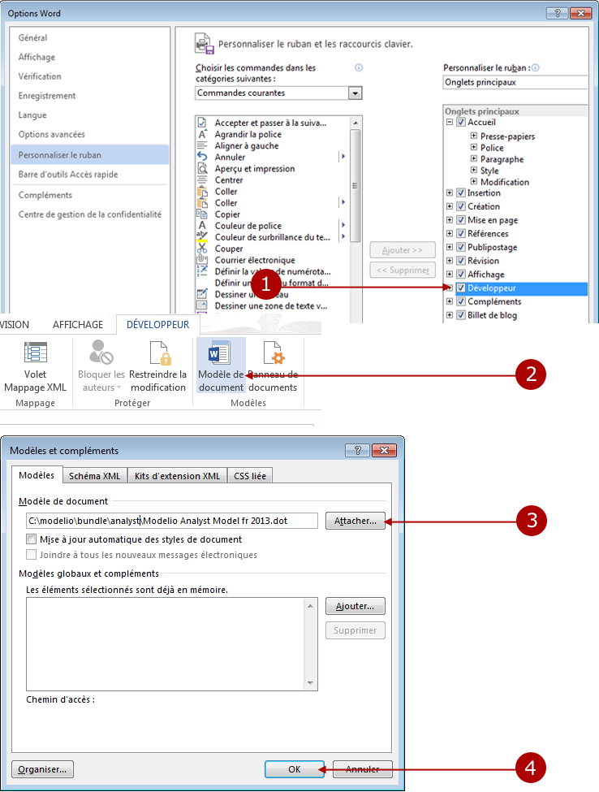

*Légende :*

1. Allez dans "Fichier/Options" puis sélectionnez "Personnaliser le ruban". Cochez la case "Développeur".
2. Dans l'onglet "Développeur", cliquez sur "Modèle de document".
3. Dans la fenêtre "Modèles et compléments", cliquez sur "Attacher" puis sélectionnez le modèle "Modelio Analyst Model fr 2013.dot" (ce modèle est situé dans le répertoire "bundle" de votre installation Modelio).
4. Cliquez sur "OK" pour terminer.

Dans l'onglet "Compléments", apparait alors une barre d'outils spécifique pour Analyst. [[Couplage-Word-2007-à-Analyst]]

===== Couplage Word 2007 à Analyst

Ajouter le modèle "Modelio Model fr.dot" à un document Word 2007

.Ajout du modèle "Modelio Model fr.dot" à un document Word 2007
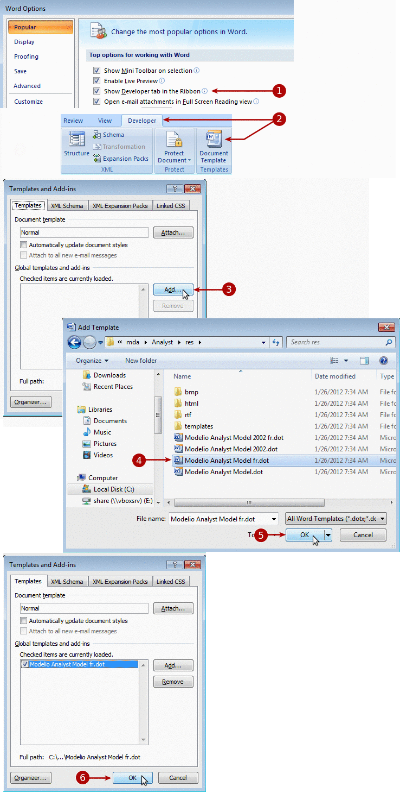

*Légende :*

1. Cliquez sur le bouton MS Office puis sur "Options Word". Cochez la case "Afficher l'onglet Développeur dans le ruban".
2. Dans l'onglet "Développeur", cliquez sur "Modèle de document".
3. Dans la fenêtre "Modèles et compléments", cliquez sur "Attacher".
4. Sélectionnez le modèle "Modelio Model fr.dot" (ce modèle est situé dans le répertoire "bundle" de votre installation Modelio).
5. Cliquez sur "OK" pour valider.
6. Cliquez sur "OK" pour terminer.

Le résultat de cette opération dans votre document Word 2007 est montré ci-dessous.

.La barre d'outils Modelio disponible dans votre document Word 2007
image::images/attachment/analyst41/User_Documentation_fr/Pont_MS_Word/Analyst-MS_Word_bridge_analyst043.png[Analyst-MS_Word_bridge_analyst043.png]

===== Couplage Word 2002 à Analyst

Ajouter le modèle "Modelio Model 2002 fr.dot" à un document Word 2002

.Ajout du modèle "Modelio Model 2002 fr.dot" à un document Word 2002
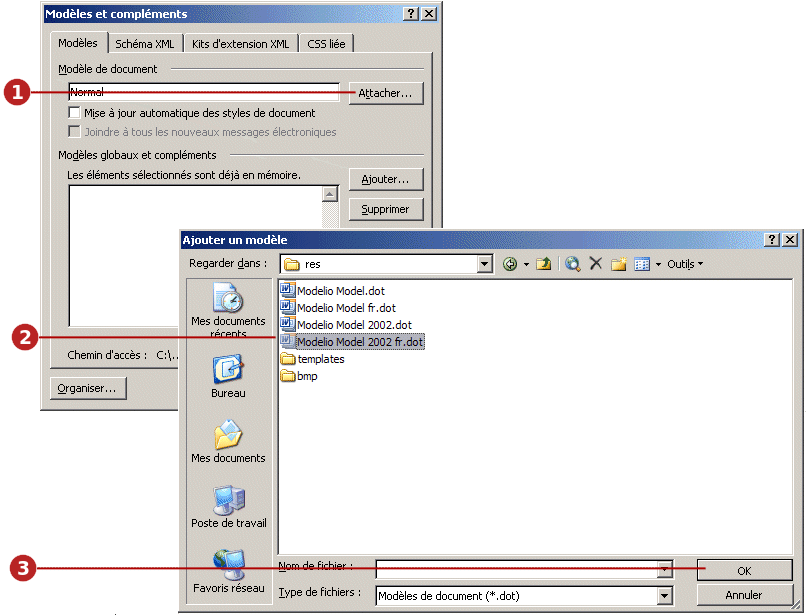

*Légende :*

1. Après avoir cliqué sur "Outils / Modèles et compléments" dans Word, cliquez sur le bouton "Ajouter" dans la fenêtre "Modèles et compléments".
2. Sélectionnez le modèle "Modelio Model 2002 fr.dot" (ce modèle est situé dans le répertoire "bundle" de votre installation Modelio.
3. Cliquez sur "OK" pour terminer.

Le résultat de cette opération est montré ci-dessous.

.Le modèle "Modelio Model 2002 fr.dot" peut maintenant être sélectionné
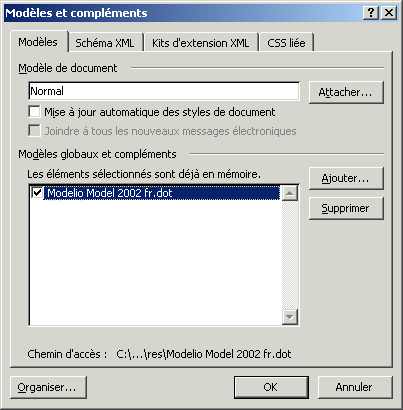

Après avoir vérifié que la case à cocher correspondant est bien cochée, il suffit de cliquer sur "OK" pour appliquer ce modèle à votre document Word. Le résultat de cette opération dans Word est montré ci-dessous.

.La barre d'outils Modelio disponible dans votre document Word 2002
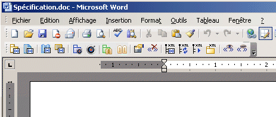

== Annoter des éléments dans un document Word

Pour annoter un élément dans un document Word en tant que conteneur d'exigences ou exigence, il suffit d'effectuer les opérations suivantes :

1. Surlignez le(s) mot(s) ou la phrase que vous voulez utiliser comme description puis cliquez sur l'icône qui correspond au type d'annotation qui vous intéresse.
2. Définissez un nom pour l'élément. Par défaut, le premier mot de la description est proposé comme nom.

L'image ci-dessous montre un exemple d'annotation d'un élément dans un document Word comme étant un conteneur d'exigences.

.Annotation d'un élément comme étant un conteneur d'exigences
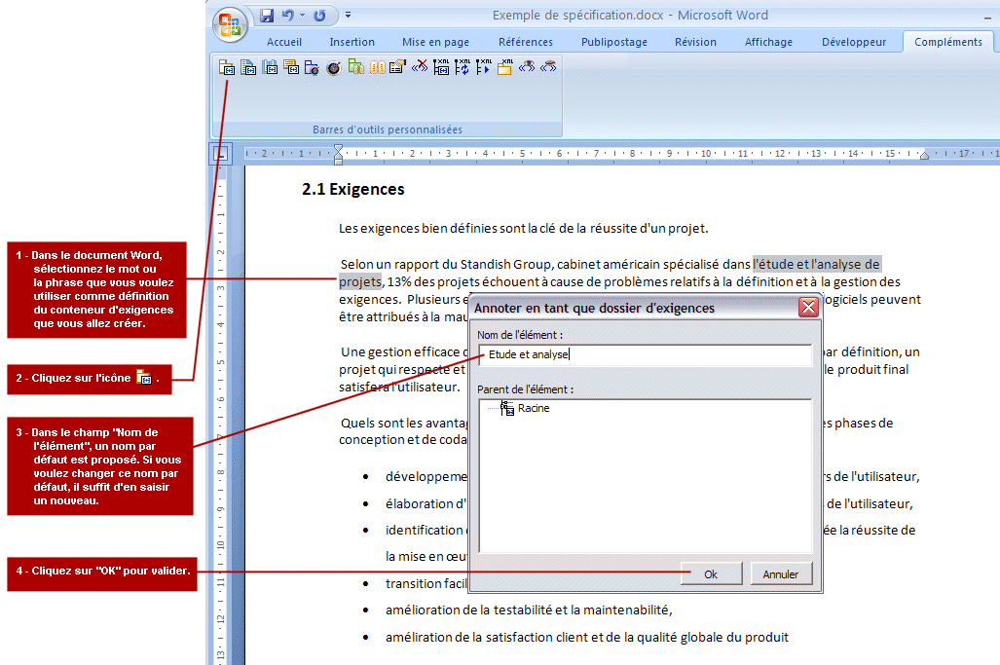

Le résultat de cette opération est montré ci-dessous.

.La nouvelle annotation d'un conteneur d'exigences
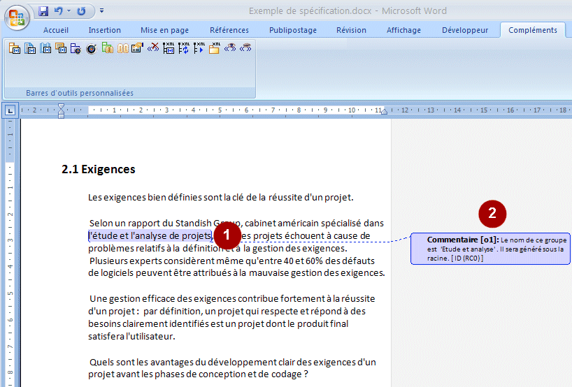

*Légende :*

1. L'élément sélectionné est alors affiché sur un fond de couleur, et une référence paraît entre parenthèses sur le côté droit du document.
2. Une boîte d'information s'affiche, vous informant du nom de l'élément, ainsi que son emplacement dans la hiérarchie. [[Gérer-les-éléments-annotés]]

= Gérer les éléments annotés

===== Hiérarchie basique

Avant d'annoter des éléments dans votre document Word, il existe une hiérarchie de base pour les exigences, comme le montre l'image ci-dessous (pour ouvrir cette fenêtre, il suffit de cliquer sur l'icône 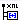 dans la barre d'outils Analyst).

.La fenêtre de hiérarchie
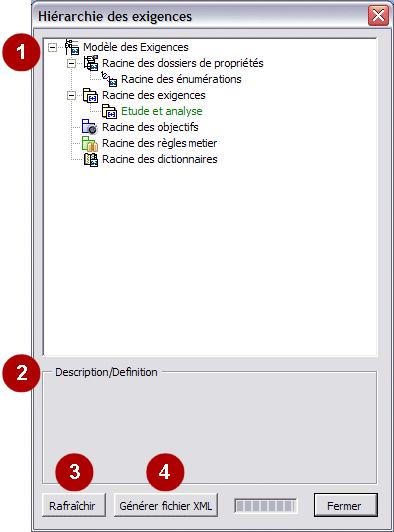

*Légende :*

1. La hiérarchie basique des élements, qui consiste en :
* Une racine pour les ensembles de propriétés,
* Une racine pour les énumérations,
* Une racine pour les exigences,
* Une racine pour les objectifs,
* Une racine pour les règles métier,
* Une racine pour les dictionnaires.
2. Un champ montrant la description d'un élément.
3. Un bouton "Générer fichier XML", pour lancer la génération du fichier XML qui pourra ensuite être importé dans Modelio.
4. Un bouton "Rafraîchir", pour mettre à jour la fenêtre [[Définir-les-propriétés-dun-élément-annoté]]

===== Définir les propriétés d'un élément annoté

Lors de l'annotation des éléments dans un document Word, vous pouvez sélectionner l'endroit où vous voulez que l'élément se situe :

* Les conteneurs d'exigences peuvent se situer sous le conteneur d'exigences racine ou bien sous un conteneur d'exigences déjà annoté dans le document.
* Les exigences peuvent se siteur sous le conteneur d'exigences racine ou sous un conteneur d'exigences déjà annoté dans le document.

L'image ci-dessous vous montre un exemple de l'annotation d'une exigence et de la sélection de l'endroit où elle va se situer.

.Annotation d'une exigence dans le conteneur d'exigences "Etude et analyse"
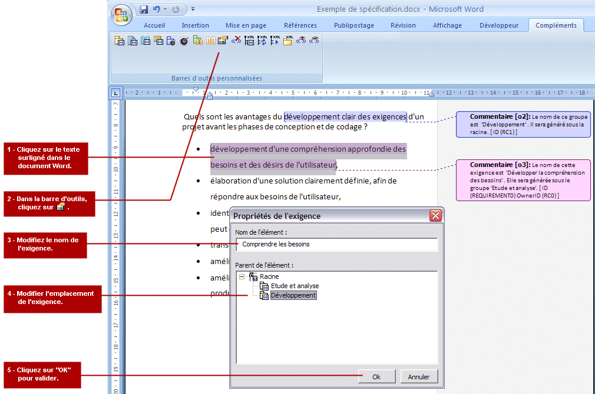

La nouvelle exigence se trouve alors dans le conteneur d'exigences sélectionné.

.La fenêtre "Hiérarchie des exigences" montre la nouvelle exigence
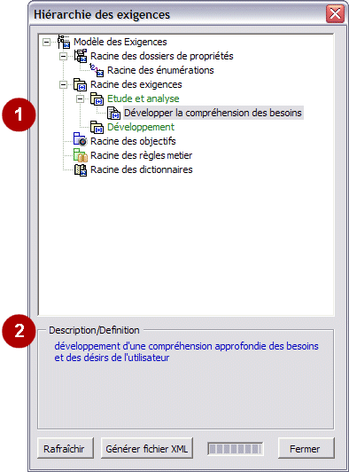

*Légende :*

1. Tout ce qui a été annoté par vous apparaît en vert (c'est-à-dire, tout ce qui ne fait pas partie de la hiérarchie basique des exigences).
2. La description de l'élément annoté apparaît dans le champ "Description / Définition".

*Note :* Si vous cliquez sur un élément dans la fenêtre d'hiérarchie, l'élément est automatiquement sélectionné dans le document Word. Ceci est particulièrement utile pour les documents de taille importante. [[Modifier-les-propriétés-dun-élément-annoté]]

===== Modifier les propriétés d'un élément annoté

La fenêtre "Propriétés de l'exigence" est utilisée pour modifier les propriétés (nom et emplacement) d'un élément annoté. Pour ouvrir cette fenêtre, il suffit de cliquer sur un élément annoté et puis de cliquer sur l'icône "Afficher les propriétés" dans la barre d'outils.

Par exemple, imaginons que nous voulions changer le nom et l'emplacement d'une exigence. Pour ce faire, il suffit d'effectuer des opérations montrées ci- dessous.

.Modification des propriétés d'une exigence
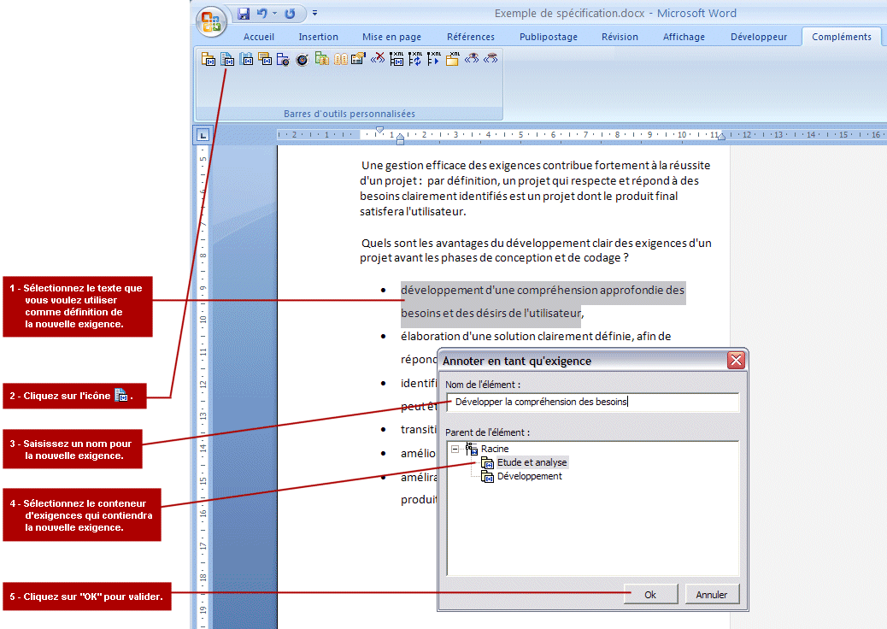

*Note :* Si la fenêtre d'hiérarchie est déjà ouverte lors des modifications, vous devez alors la fermer et la rouvrir, pour rendre les modifications visibles. 

= Générer le fichier XML

===== Générer le fichier XML

Après avoir annoté des éléments Word comme étant des conteneurs d'exigences et des exigences, la prochaine étape est de générer le fichier XML correspondant, qui sera ensuite importé dans Modelio.

.Génération du fichier XML
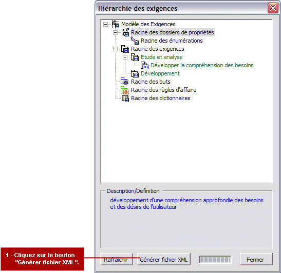

*Note :* Le fichier XML est généré à l'endroit où se trouve le document Word d'origine. [[Autres-fonctionnalités-Analyst-disponibles-dans-Word]]

= Autres fonctionnalités Analyst disponibles dans Word

===== Supprimer une annotation

L'icône  sert à supprimer une annotation sur un élément dans un document Word. Il suffit de positionner le curseur sur un élément annoté ou bien de surligner un élément annoté et puis de cliquer sur cette icône. L'annotation sur l'élément sélectionné est alors supprimée. [[Sélectionner-un-élément-dans-la-hiérarchie-Modelio]]

===== Sélectionner un élément dans la hiérarchie Modelio

L'icône 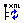 permet de sélectionner des éléments du document Word dans la fenêtre d'hiérarchie. Il suffit de cliquer sur un élément annoté puis sur cette icône pour que l'élément soit sélectionné dans la hiérarchie. [[Lancer-la-génération-XML]]

===== Lancer la génération XML

L'icône image:images/attachment/analyst41/User_Documentation_fr/Pont_MS_Word/Analyst-MS_Word_bridge_genxml.gif[Analyst-MS_Word_bridge_genxml.gif] lance la génération de votre fichier XML. Ce bouton est l'équivalent du bouton "Générer fichier XML" dans la fenêtre "Hiérarchie". [[Modifier-le-fichier-XML-généré]]

===== Modifier le fichier XML généré

L'icône  sert à ouvrir la fenêtre dans laquelle vous pouvez configurer le nom et l'emplacement du fichier XML généré (voir l'image ci-dessous).

.La fenêtre "Modifier fichier XML généré"
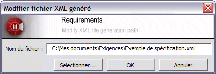

Pour changer le nom ou l'emplacement de votre fichier XML, il suffit de saisir les nouvelles informations dans la fenêtre montrée ci-dessus et d'appuyer sur la touche "OK" pour valider votre saisie. [[Afficher-des-annotations]]

===== Afficher des annotations

L'icône image:images/attachment/analyst41/User_Documentation_fr/Pont_MS_Word/Analyst-MS_Word_bridge_wordshow.gif[Analyst-MS_Word_bridge_wordshow.gif] permet d'afficher les annotations dans un document Word, si elles ne sont pas déjà visibles. Il vous suffit de cliquer sur cette icône pour faire apparaître toutes les annotations du document. [[Masquer-des-annotations]]

===== Masquer des annotations

L'icône image:images/attachment/analyst41/User_Documentation_fr/Pont_MS_Word/Analyst-MS_Word_bridge_wordmask.gif[Analyst-MS_Word_bridge_wordmask.gif] est utilisée pour masquer les annotations sur des éléments dans un document Word. Il suffit de cliquer sur cette icône pour masquer toutes les annotations du document.
