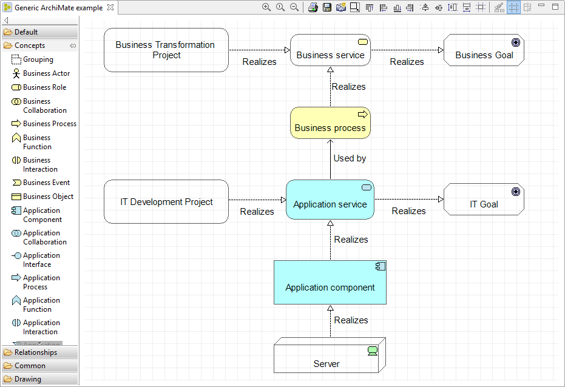
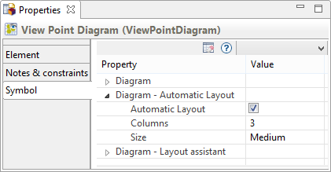

// Disable all captions for figures.
:!figure-caption:
// Path to the stylesheet files
:stylesdir: .

= Diagrammes ArchiMate

Dans ArchiMate, les vues (views) sont une représentation généralement partielle du modèle, tout comme les diagrammes en UML. Ce sont des images d'un ensemble d'éléments de modèle affichés ensemble en fonction du profil d'entreprise, du profil utilisateur ou de critères d'intérêt.

Dans Modelio, les vues ArchiMate sont toujours organisées en <<User_Documentation_fr_Modele_ArchiMate.adoc#,Points de vue>>. L'intérêt principal d'un point de vue est de regrouper des informations, sous formes de vues sur une partie spécifique du modèle soit pour des interlocuteurs spécifiques soit dans une intention spécifique (ex: montrer un aspect particulier du système).

== Vue globale ArchiMate

La façon la plus simple de créer un modèle ArchiMate dans Modelio est de créer une vue globale ArchiMate.

Une telle vue est utilisable pour visualiser ou créer n'importe quel type d'élément ArchiMate, quelle que soit sa couche (voir Layers dans la norme ArchiMate). Dès qu'un nouvel élément est créé dans la vue, il est automatiquement ajouté au modèle.

.Exemple de vue globale d'ArchiMate
image::images/attachment/archimate41/User_Documentation_fr/Diagrammes_ArchiMate/FullDiagram.png[FullDiagram.png]

*Remarque :* Lorsque le modèle ArchiMate fait partie d'un fragment SVN, l'utilisation des commandes «Get Lock» ou «Commit» sur la vue elle-même avec l'option «récursive» activée s'applique à la vue ET à tous les éléments affichés.

== Modification du type de vue

Être capable de créer tout type d'éléments dans une même vue est manifestement pratique, mais parfois il est souhaitable de ne traiter qu'un aspect spécifique à la fois afin de simplifier l'utilisation de la vue, voire de favoriser une approche méthodologique dédiée. +
Dans Modelio, il est possible de changer le type de vue, c'est-à-dire de changer l'angle sous lequel vous voulez considérer le modèle.

.Modification du type de vue
image::images/attachment/archimate41/User_Documentation_fr/Diagrammes_ArchiMate/ChangeType.png[ChangeType.png]

L'exécution de la commande "Modifier le type de vue ..." ouvre la boîte de dialogue suivante qui permet de sélectionner un nouveau type de vue:

.Choix du type de vue "Application"
image::images/attachment/archimate41/User_Documentation_fr/Diagrammes_ArchiMate/ChangeViewType.png[ChangeViewType.png]

La liste des types de vue à choisir proposés par Modelio correspond aux points de vue définis dans la spécification ArchiMate 3.0. Ainsi, les points de vue de la norme ArchiMate se traduisent par des types de vue dans Modelio, la sémantique étant équivalente.

Dans Modelio ArchiMate, les <<User_Documentation_fr_Modele_ArchiMate.adoc#%23VuesetPointsdevue#,points de vue>> représentent des ensembles de vue dont le groupement est pertinent pour un auditoire ou un objectif particulier. 

Une fois le nouveau type choisi, la vue elle-même change:

.Exemple de vue Application Utilisation

Dans cet exemple, deux changements principaux sont à noter:

* La palette contient uniquement un sous-ensemble des concepts et des relations ArchiMate, ceux pertinents dans la vue choisie "ApplicationUsage".
* Les concepts qui ne peuvent, en principe, pas être créés dans cette vue sont automatiquement affichés avec un fond transparent, indiquant qu'ils sont en quelque sorte 'étrangers' au type de vue sélectionné.

Une fois que le travail sur cet aspect du modèle est fait, il est possible de changer à nouveau lancez la commande de changement de type , soit pour passer à un autre type de vue ou simplement pour revenir à la vue globale universelle. 

*Note :* d'un point de vue technique, le type de vue est représenté comme un stéréotype appliqué sur la vue elle-même, ce qui signifie qu'il est possible de définir de nouveaux types de vues dans un module!

== Diagrammes de Points de vue

Dans Modelio ArchiMate, les points de vue servent à regrouper des vues sur la base de critères librement déterminés par l'utilisateur. A ce titre, les points de vue sont comme des catalogues de vues regroupées.

Modelio propose de visualiser le contenu d'un point de vue sous la forme d'un diagramme qui montre des vignettes représentant les vues qu'il contient. Ce type de diagramme donne une vue d'ensemble synthétique du contenu d'un point de vue.

.Exemple de diagramme de point de vue
image::images/attachment/archimate41/User_Documentation_fr/Diagrammes_ArchiMate/ViewPointDiagram.png[ViewPointDiagram.png]

Un diagramme Point de vue s'affiche automatiquement : 

* Une vignette ou miniature de chaque vue d'ArchiMate appartenant au Point de vue.
* Une vignette pour chaque éventuel sous-point de vue appartenant au Point de vue. (Les points de vue Modelio ArchiMate sont hiérarchiques)

En résumé, un diagramme de point de vue peut être utilisé comme une table des matières graphique, facilitant la recherche d'une vue spécifique notamment dans les modèles volumineux.

*Note :* Un double-click sur une vignette ouvre la vue correspondante.

=== Configuration d'un diagramme de point de vue

Les diagrammes de point de vue sont configurables en terme de contenu et de présentation.

Une configuration de mise en page est disponible dans la vue des symboles lorsque l'on sélectionne un diagramme Point de vue :

.Configuration d'un diagramme de point de vue dans la vue Symbole

==== Mode 'Mise en page automatique'

En cochant la case 'Automatic layout' , le diagramme de point de vue se met en mode 'Mise en page automatique':

* toutes les vues et tous le sous-points de vue du point de vue sélectionné sont automatiquement visibles dans le diagramme
* les vignettes sont alignées et organisées dans une table. Le nombre de colonnes peut être modifié selon les besoins, ainsi que la taille par défaut des vignettes.
* le diagramme de point de vue ne permet que la création de sous-points de vue et de vues ArchiMate, il est impossible possible d'y démasquer quoi que ce soit d'autre.

==== Mode 'Placement manuel'

En décochant la case 'Automatic layout' , le diagramme de point de vue se met en mode 'Mise en page manuelle':

* l'utilisateur détermine quelles vignettes doivent être affichées dans le diagramme (drag & drop dans le diagramme)
* l'utilisateur place les vignettes selon sa convenance
* l'utilisateur peut ajouter des figures (rectangle, cercle etc) permettant de structurer la présentation des vignettes présentées
