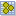
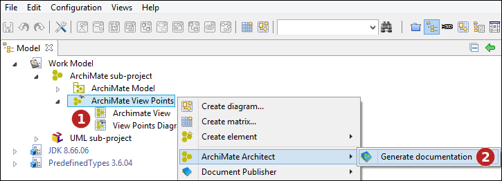
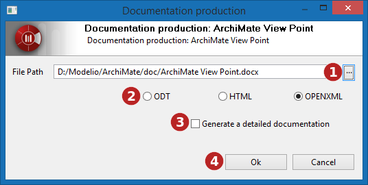

// Disable all captions for figures.
:!figure-caption:
// Path to the stylesheet files
:stylesdir: .

= Génération de la documentation

Modelio propose une fonctionnalité de génération de documentation à partir d'un modèle ArchiMate. Cette fonctionnalité s'appuie sur le module Document Publisher pour la génération, et sur des modèles de documentation spécifiques. +
 +
*Remarque :* Les modules ArchiMate Architect et Document Publisher sont nécessaires pour générer la documentation ArchiMate.

== Choix du périmètre de génération

Le périmètre de génération est la partie de modèle qui fera l'objet de la génération documentaire.

Lors du lancement de la commande de génération, l'élément sélectionné indique quelle partie du modèle sera incluse dans la documentation: +
 +
Sur une vue ArchiMate image:images/attachment/archimate41/User_Documentation_fr/Generation_de_la_documentation/archimate.archimateview.png[archimate.archimateview.png], chaque élément faisant partie de la vue sera documenté. +
Sur un point de vue ArchiMate image:images/attachment/archimate41/User_Documentation_fr/Generation_de_la_documentation/archimate.viewpoint.png[archimate.viewpoint.png] toutes les vues faisant partie du point de vue seront documentées. +
Sur une nomenclature ArchiMate , tous les éléments qui font partie de la nomenclature seront documentés.

=== Génération de la documentation

*Étapes :*

1. Cliquez avec le bouton droit de la souris sur un point de vue, une vue ou une nomenclature.
2. Exécutez la commande "Générer la documentation ...".

*Étapes :*

1. Sélectionnez le chemin vers lequel exporter la documentation.
2. Sélectionnez le format de génération. 
3. Choisissez d'inclure ou non les propriétés détaillées des éléments dans la documentation. 
4. Lancez la génération.
