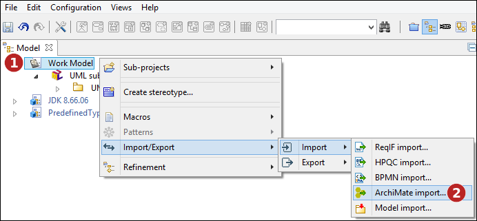
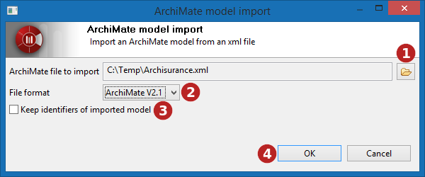
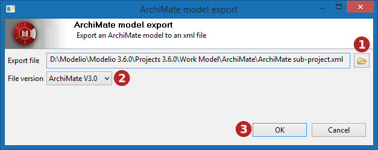

// Disable all captions for figures.
:!figure-caption:
// Path to the stylesheet files
:stylesdir: .

= Import et export

Modelio propose une fonctionnalité d'échange de modèle ArchiMate via le format de fichier Exchange ArchiMate Model de l'OpenGroup. Cette fonction permet d'échanger des modèles avec d'autres outils de modélisation comme Archi.

= Format et versions pris en charges

La fonction d'échange ArchiMate prend en charge les formats de fichier d'échange de modèle ArchiMate version 2.1, 3.0 et 3.1, tel que définis par l'OpenGroup.

= Exécution de la commande d'import ArchiMate

La commande d'import ArchiMate est disponible dans le menu contextuel d'un sous-projet ArchiMate ou d'un modèle de travail:

*Étapes :*

1. Cliquez avec le bouton droit de la souris sur le modèle de travail ou sur le sous-projet ArchiMate.
2. Exécutez la commande "Import ArchiMate..."

== Sélection d'un fichier à importer

*Étapes :*

1. Sélectionnez le fichier à importer.
2. Indiquez le format du fichier à importer. 
3. Choisissez si l'import doit conserver les identifiants définis dans le fichier importé ou si il attribue de nouveaux identifiants (UUID).
4. Lancez l'import.

*Remarque :* En choisissant en 3 la conservation des identificateurs, chaque élément déjà existant dans le modèle et ayant le même identifiant qu'un élément importé sera automatiquement mis à jour.

= Exécution de la commande d'export ArchiMate

La commande d'export d'ArchiMate est disponible dans le menu contextuel d'un sous-projet ArchiMate ou d'un modèle ArchiMate:

image::images/attachment/archimate41/User_Documentation_fr/Import_et_export/ArchiMateExport.png[ArchiMateExport.png]

*Étapes :*

1. Cliquez avec le bouton droit de la souris sur le sous-projet ArchiMate. +
2. Exécutez la commande "Export ArchiMate...".

== Sélection du fichier cible d'export

*Étapes :*

1. Sélectionnez le chemin du fichier ArchiMate exporté. Le fichier sera créé si nécessaire. +
2. Indiquez le format du fichier à exporter. +
3. Lancez l'export.
