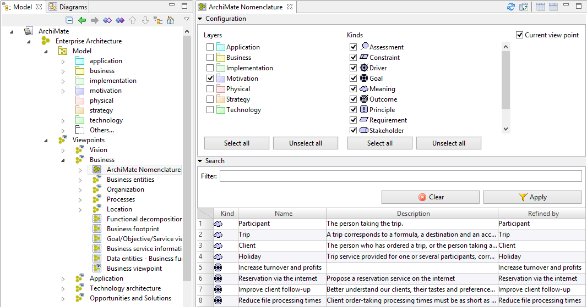
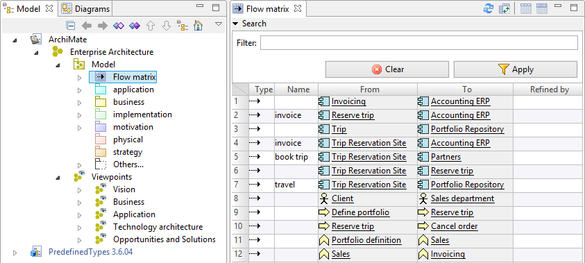

// Disable all captions for figures.
:!figure-caption:
// Path to the stylesheet files
:stylesdir: .

= Matrices ArchiMate

Modelio ArchiMate fournit 4 types de matrices :

*  <<User_Documentation_fr_Matrices_ArchiMate.adoc#HNomenclatures,Nomenclatures>>
*  <<User_Documentation_fr_Matrices_ArchiMate.adoc#HMatricedecomposantsapplicatifs,Matrice de composants applicatifs>>
*  <<User_Documentation_fr_Matrices_ArchiMate.adoc#HMatricedeprocessus,Matrice de processus>>
*  <<User_Documentation_fr_Matrices_ArchiMate.adoc#HMatricedeflux,Matrice de flux>>

== Nomenclatures

Les nomenclatures affichent des informations sur des éléments au format tabulaire, sur tout ou une partie d'un modèle ArchiMate. +
Le contenu d'une nomenclature est filtré en fonction de l'emplacement de la nomenclature et sur la base d'options configurables. +
Une fois définie et modélisée, une nomenclature peut servir à la définition d'un document généré.

=== Utilisation

Une nomenclature peut être créée sur: +

* Un modèle ArchiMate : la nomenclature comprendra alors le contenu du modèle entier.
* Une couche (layer) : la nomenclature comprendra le contenu de la couche.
* Un point de vue : la nomenclature comprendra tous les éléments représentés dans les vues appartenant au point de vue.

=== Description

.La vue de nomenclature est divisée en 3 parties: la zone de configuration, la zone de recherche et la table.

=== Zone de configuration

Le contenu de la nomenclature peut être filtré par couche, type d'élément et point de vue, le cas échéant. +

* *Couches* : filtre la table pour n'afficher que les éléments des couches sélectionnées. Ce filtre supprime également de la liste des "méta classes" celles qui ne peuvent pas appartenir aux couches sélectionnées.
* *Types* : filtre la table pour n'afficher que les éléments des types sélectionnés.
* *Point de vue courant* : Cette option n'est disponible que lorsque la nomenclature est située dans un point de vue. Elle filtre la table pour n'afficher que les éléments représentés dans les diagrammes du point de vue courant.

=== Zone de recherche

Vous pouvez filtrer les éléments affichés en tapant une partie du nom. La table se met alors à jour pour n'afficher que les éléments dont le nom coïncide avec le texte entré dans ce champ.

=== Table

Le tableau affiche les éléments filtrés :

* un tri par colonne s'obtient en double-cliquant sur l'en-tête de la colonne.
* un clic droit sur un en-tête de colonne affiche un menu contextuel permettant de choisir les colonnes affichées.

== Matrice de composants applicatifs

Cette matrice montre les composants applicatifs et leurs propriétés sous forme de table, sur un modèle ArchiMate complet ou partiel.

Le contenu de la matrice est filtré en fonction de l'emplacement de celle ci dans le modèle.

=== Usage

Une matrice de composant applicatifs peut être créée sur :

* un modèle ArchiMate : la matrice montre alors des composants applicatifs faisant partie de ce modèle ;
* la couche Applicative : la matrice inclut l'ensemble des composants applicatifs faisant partie de cette couche ;
* un point de vue : la matrice comprendra tous les composants applicatifs représentés dans les vues appartenant au point de vue.

=== Description

.La vue matrice est divisée en deux parties : la zone de recherche, et la table elle même.
image::images/attachment/archimate41/User_Documentation_fr/Matrices_ArchiMate/ApplicationComponentMatrix.png[ApplicationComponentMatrix.png]

=== Zone de recherche

Vous pouvez filtrer les éléments affichés en tapant une partie du nom.

=== Table

Le tableau affiche les éléments filtrés :

* un tri par colonne s'obtient en double-cliquant sur l'en-tête de la colonne.
* un clic droit sur un en-tête de colonne affiche un menu contextuel permettant de choisir les colonnes affichées.

Chaque propriété est visible et éditable directement dans la matrice.

== Matrice de processus

Cette matrice montre les processus et leurs propriétés sous forme de table, sur un modèle ArchiMate complet ou partiel.

Le contenu de la matrice est filtré en fonction de l'emplacement de celle ci dans le modèle.

=== Usage

Une matrice de processus peut être créée sur :

* un modèle ArchiMate : la matrice montre alors des processus faisant partie de ce modèle ;
* la couche Applicative, Métier ou Technologie : la matrice inclut l'ensemble des processus faisant partie de cette couche ;
* un point de vue : la matrice comprendra tous les processus représentés dans les vues appartenant au point de vue.

=== Description

.La vue matrice est divisée en deux parties : la zone de recherche, et la table elle même.
image::images/attachment/archimate41/User_Documentation_fr/Matrices_ArchiMate/ProcessMatrix.png[ProcessMatrix.png]

=== Zone de recherche

Vous pouvez filtrer les éléments affichés en tapant une partie du nom. La table se met alors à jour pour n'afficher que les éléments dont le nom coïncide avec le texte entré dans ce champ.

=== Table

Le tableau affiche les éléments filtrés :

* un tri par colonne s'obtient en double-cliquant sur l'en-tête de la colonne.
* un clic droit sur un en-tête de colonne affiche un menu contextuel permettant de choisir les colonnes affichées.

Chaque propriété est visible et éditable directement dans la matrice.

== Matrice de flux

Cette matrice montre les flux sous forme de table, sur un modèle ArchiMate complet ou partiel.

Le contenu de la matrice est filtré en fonction de l'emplacement de celle ci dans le modèle.

=== Usage

Une matrice de flux peut être créée sur :

* un modèle ArchiMate : la matrice montre alors les flux faisant partie de ce modèle ;
* une couche : la matrice inclut l'ensemble des flux dont la source fait partie de cette couche ;
* un point de vue : la matrice comprendra tous les flux représentés dans les vues appartenant au point de vue.

=== Description

.La vue matrice est divisée en deux parties : la zone de recherche, et la table elle même.

=== Zone de recherche

Vous pouvez filtrer les éléments affichés en tapant une partie du nom. La table se met alors à jour pour n'afficher que les éléments dont le nom coïncide avec le texte entré dans ce champ.

=== Table

Le tableau affiche les éléments filtrés :

* un tri par colonne s'obtient en double-cliquant sur l'en-tête de la colonne.
* un clic droit sur un en-tête de colonne affiche un menu contextuel permettant de choisir les colonnes affichées.
