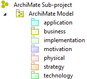
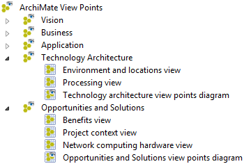
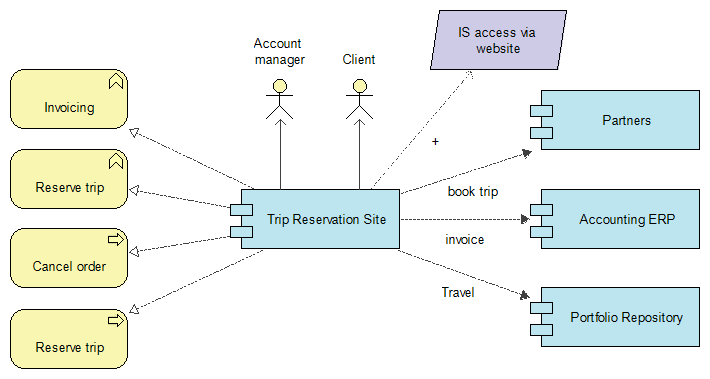
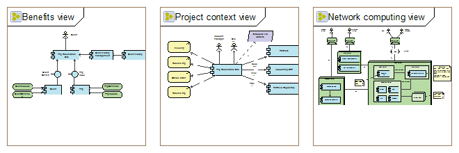

// Disable all captions for figures.
:!figure-caption:
// Path to the stylesheet files
:stylesdir: .

= Modèle et points de vue ArchiMate

== Projets, modèles de travail et sous-projets

===  Projet Modelio image:images/attachment/archimate41/User_Documentation_fr/Modele_ArchiMate/modelioproject.png[modelioproject.png]

Dans Modelio, un projet est similaire à un document dans Word: Vous pouvez l'ouvrir, modifiez son contenu et enregistrez les modifications (ou pas) avant de le fermer. Du point de vue de l'utilisateur final, le projet est l'unité de travail et de persistance des modèles Modelio. Une fois ouvert, le projet apparaît à l'utilisateur final comme un modèle unique, composé de nombreux éléments de modèle, généralement organisés en paquets et autres conteneurs de haut niveau. Cependant, dans les coulisses, les éléments de modèle manipulés peuvent être fournis par plusieurs fragments de modèle et leurs référentiels physiques. Modelio est chargé de gérer ces dépôts de façon transparente en tant que modèle unique.

==  Modèles de travail image:images/attachment/archimate41/User_Documentation_fr/Modele_ArchiMate/workmodel.png[workmodel.png]

Les modèles de travail sont des groupes d'éléments de modèle de haut niveaux. Leur fonction principale est de stocker de façon autonome une partie d'un modèle. Un élément de modèle appartenant à un modèle de travail donné peut être lié à des éléments de modèle appartenant à un autre modèle de travail, mais ce lien doit être une référence simple, et non un lien de composition. Un élément modèle appartient réellement à un modèle de travail, mais sa propriété n'est pas définitive. Il peut être déplacé vers d'autres modèles de travail, selon les besoins organisationnels des architectes.

Les modèles de travail sont étroitement couplés à la notion de système de stockage des éléments de modèles. Modelio prend en charge plusieurs technologies de de stockage de ses modèles (Local, SVN, Model Components ...).

===  Sous-projet Analyste 

Depuis la version 3.6, Modelio prend en charge plusieurs types de sous-projets (UML, ArchiMate, Analyste ...). Ces sous-projets peuvent cohabiter dans le même modèle de travail. Un sous-projet ArchiMate organise donc tous les éléments ArchiMate créés sous un modèle de travail.

image::images/attachment/archimate41/User_Documentation_fr/Modele_ArchiMate/ArchiMateSubProject.png[ArchiMateSubProject.png]

Un sous-projet ArchiMate  est organisé en deux parties distinctes: le modèle  qui contient tous les concepts et les liens ArchiMate, et les points de vue  contenant des vues partielles du modèle regroupées à des fins spécifiques.

==  Modèle ArchiMate 

Le modèle ArchiMate héberge tous les éléments ArchiMate définis dans le sous-projet. +
 +
Les éléments ArchiMate ne sont pas structurés hiérarchiquement par le Modèle, contrairement, par exemple à un modèle UML qui est lui fortement structuré. Comme montré plus loin dans cette documentation, un modèle ArchiMate est structuré à l'aide de points de vue et de vues. Pour assurer une bonne lisibilité du modèle, Modelio organise les éléments ArchiMate en les regroupant en fonction de leur "couche ^1^ ". Lorsqu'un élément ArchiMate est créé dans une vue, il est automatiquement attaché à sa couche naturelle.

^1^ couche = layer dans la norme ArchiMate 3. Les layers servent à catégoriser les types d'éléments de modèle sur la base de leur domaine d'applicabilité, ainsi par exemple la couche (le layer) "Technology" regroupe tous les types d'éléments ArchiMate destinés à modéliser la partie technologique d'un système.

La figure ci-dessous illustre la répartition des éléments de modèle en 'couches' dans la partie modèle de ArchiMate.

*Business Layer:* La couche 'Business Layer' est généralement utilisée (souvent en association avec la couche stratégie) pour modéliser l'architecture d'entreprise , définie comme une description de la structure et des interactions entre la stratégie d'entreprise, l'organisation, les fonctions, les processus métier et les besoins d'information.

*Strategy Layer:* La couche 'Strategy Layer' définit les éléments utilisés pour modéliser les capacités d'une organisation, comment celles-ci permettent ou non d'atteindre les objectifs de l'entreprise et comment elles doivent être, le cas échéant, modifiées afin d'atteindre ces objectifs.

*Motivation Layer:* La couche 'Motivation Layer' contient les éléments utilisés pour modéliser la ou les motivations qui guident la conception du changement d'une architecture d'entreprise.

*Application Layer:* La couche 'Application Layer' est généralement utilisée pour modéliser les architectures des systèmes d'information de l'entreprise, y compris l'architecture d'application laquelle décrit la structure des applications et leurs interactions.

*Technology Layer:* La couche 'Technology layer' sert à modéliser l'architecture technologique de l'entreprise, définie comme la structure des plate-formes techniques utilisées, de leur services, des composants et de leur technologie ainsi que des interactions entre ces éléments. Cette description se fait au plan logique et/ou au plan physique.

*Physical Layer:* La couche 'Physical Layer' est une extension de la couche technologique plus précisément dédiée à la modélisation du monde physique.

*Implementation and Migration Layer:* Cette couche regroupe les éléments supportant la description et l'implémentation des procédures de migration et de déploiement des architectures. Cette couche propose des éléments dédiés à la modélisation de la mise en œuvre et un élément spécialisé de plateau pour représenter la planification des migrations.

Modelio supporte la notion de sous-couches qui constitue un moyen de réorganiser le modèle à la convenance de l'utilisateur, de stocker les éléments ArchiMate par type ou suivant n'importe quel autre critère judicieux pour l'utilisateur. Les 'sous-couches' sont typées comme leur parent, elles sont assimilables à des sous-répertoires dans un système de fichier.

.Exemple de sous couches permettant l'organisation du modèle
image::images/attachment/archimate41/User_Documentation_fr/Modele_ArchiMate/ArchiMateFolders.png[ArchiMateFolders.png]

 

== Vues et Points de vue

Un modèle ArchiMate peut répondre à une grande variété de problématiques qui dépendent des préoccupations d'intervenants variés tels que architectes, responsables opérationnels, gestionnaires de projet ou même développeurs. ArchiMate préconise une approche flexible dans laquelle les architectes et les autres parties prenantes peuvent définir leur propre visualisation de l'architecture de l'entreprise.

Cette organisation spécifique est réalisée en utilisant des Vues image:images/attachment/archimate41/User_Documentation_fr/Modele_ArchiMate/archimateview.png[archimateview.png] regroupées en Point de vue ,

*Une vue ArchiMate* est une représentation partielle du modèle. C'est une photo d'un ensemble d'éléments de modèle, affichés dans le même diagramme et sélectionnés en fonction du profil d'entreprise, du profil utilisateur ou de ses critères d'intérêt.

.Vue ArchiMate image:images/attachment/archimate41/User_Documentation_fr/Modele_ArchiMate/archimateview.png[archimateview.png]

*Un Point de vue ArchiMate* dans Modelio définit une abstraction de l'ensemble des éléments de modèles représentant l'architecture d'entreprise, qui vise un type particulier de parties prenantes et qui procède d'un ensemble particulier de préoccupations.

Les points de vue peuvent être utilisés pour visualiser certains aspects de façon isolée et pour relier deux ou plusieurs aspects. En pratique, un point de vue est un ensemble de vues regroupées par des intérêts particuliers: entreprise, profil utilisateur ou intention. L'ensemble des éléments de modèle composant un point de vue résulte de l'agrégation des éléments affichés dans les vues constituant le point de vue.

.Diagramme de point de vue ArchiMate. image:images/attachment/archimate41/User_Documentation_fr/Modele_ArchiMate/archimate.viewpointdiagram.png[archimate.viewpointdiagram.png]

