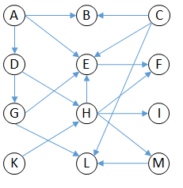
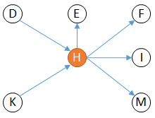
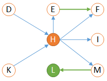

// Disable all captions for figures.
:!figure-caption:
// Path to the stylesheet files
:stylesdir: .

= Concepts de l'Analyse d'Impact

== Introduction

*Modelio Impact Analysis* est une fonctionnalité qui permet d'explorer un modèle Modelio pour en extraire les informations appelées " d'Impact ".

Depuis l'analyse d'impact, l'utilisateur peut, par exemple, trouver quels éléments de modèle vont être impactés si un élément de modèle particulier est modifié.

Des exemples d'analyse d'impact peuvent être trouvés en différents endroits comme montré dans les exemples ci dessous.

Exemple au Développement :

_Une classe Java nommée 'Personne' implémente une interface 'EtreHumain'. Il est clair que toute modification sur l'interface 'EtreHumain' impactera la classe 'Personne'. Ajouter une méthode sur l'interface peut requérir une implémentation sur la classe 'Personne'. Cet exemple, basé sur un lien d'héritage est trivial, mais si vous y réfléchissez plus attentivement, beaucoup d'impacts peuvent être caché dans un modèle comme des relations bien moins triviales comme le type des attributs et les paramètres de méthode. L'analyse d'impact de Modelio peut être utile à ce moment là._

Exemple pour les exigences et les tests:

_Lorsque les exigences d'un système sont clairement définies, des liens de traçabilité peuvent être ajoutés entre des exigences des cas de test. Le but est de pouvoir identifier quels tests peuvent nécessiter une revue si des exigences sont modifiées. Bien sûr lorsque des traçabilité directes dont simplement tracées entre les exigences et les tests, ce but est facile à atteindre. Toutefois dans le mode réel ces liens ne sont pas souvent si bien et directement établis et il peut être nécessaire d'explorer le modèle de manière approfondie pour trouver tous les tests impactés. Imaginez juste par exemple que les tests unitaires sont liés aux classes d'implémentation plutôt qu'aux exigences. L'analyse d'impact de Modelio peut être utile à ce moment là._

Ces deux exemples montrent que le concept d''impact' dépend grandement de la sémantique du modèle, du point de vue de l'utilisateur (développeur ou testeur) et de plusieurs autres facteurs.

C'est pourquoi Modelio Impact Analysis est basée sur les 3 principes suivants:

1.  Une représentation agnostique du _Modèle d'Impact (ImpactModel)_, qui ne s'appuie sur aucun formalisme (UML, BPMN, Requirements ou autres) ni le profil ou métier de l'utilisateur. Cette représentation est basée sur le <<#HLemE9tamodE8led27Analysed27ImpactdeModelio, métamodèle d'Analyse d'Impact de Modelio>>.
2.  Un _Processeur d'Impact (Impact Processor_ ): un processus spécifique qui analyse et extrait un _Modèle d'Impact (ImpactModel)_ du modèle utilisateur en interprétant seulement les éléments et relations relevant du cas d'utilisation de l'utilisateur.
3.  Plusieurs moyen d'afficher, filtrer et analyser le modèle d'impact résultat. Modelio fourni des _Diagrammes d'Impact_ et des _Matrices d'Impact_. Ces fonctions sont basées avec profit uniquement sur la représentation agnostique définie en 1.

.Synoptique de l'outil d'Analyse d'Impact Modelio
image::images/attachment/modeliocom41/User_Documentation_fr/Analyse_impact/Concepts_Analyse_Impact/1-_synoptic_of_modelio_impact_analysis_tool.png[1- synoptic_of_modelio_impact_analysis_tool.png]

Ce synoptique montre comment le modèle utilisateur est scanné et analysé par le _Processeur d'Impact_ pour produire en résultat un _Modèle d'Impact (ImpactModel_ ). Le modèle résultat peut être visualisé et analysé plus tard avec des diagrammes d'impact, des matrices d'impact ou même une génération documentaire.

Le point clé ici est que le _Modèle d'Impact_ produit est entièrement déterminé par le _Processeur d'Impact_ (et le modèle utilisateur d'entrée bien sûr). Utiliser différents processeurs d'impact permet d'avoir des interprétations et des analyses différentes du même modèle utilisateur.

== Le Modèle d'Impact

=== Le métamodèle d'Analyse d'Impact de Modelio

Voici une représentation simplifiée du métamodèle des Impacts Modelio. Ce métamodèle est le support de la représentation et de la persistance des modèles d'impact.

image::images/attachment/modeliocom41/User_Documentation_fr/Analyse_impact/Concepts_Analyse_Impact/2-_Modelio_Impact_Analysis_Metamodel.png[2- Modelio Impact Analysis Metamodel.png]

Voir link:../../org.modelio.documentation.metamodel.uml/html/Metamodel_HTML/sitemap.html[Modelio Metamodel documentation] pour une description complète du métamodèle d'impact.

===== ImpactProject

Le projet d'impact contiendra tous les _ImpactModel_ que vous pourriez créer dans votre projet Modelio. En pratique le projet d'impact est un sous projet de type impact, créé dans un fragment modifiable de votre projet Modelio.

Notez qu'un projet d'impact Modelio peut contenir plusieurs instances d' _ImpactModel_.

===== ImpactModel

Le modèle d'impact a deux rôles principaux:

1.  Contenant de modèle d'impact: stocke les liens d'impact calculés. L' _ImpactModel_ est composé de tous les _ImpactLink_ que le processeur d'impact a calculé depuis le modèle utilisateur.
2.  Configuration du modèle d'impact: stocke toutes les informations nécessaires dont le processeur d'impact à utiliser et ses options à utiliser.

Les données de configuration du modèle d'impact sont persistées, de cette manière le calcul du modèle d'impact peut être "rejoué", si des modifications se produisent dans le modèle utilisateur. Ce dernier cas s'appelle 'mettre à jour le modèle d'impact'.

Comme il n'y a qu'un seul processeur pour un _ImpactModel_ donné et comme le processeur défini la sémantique du modèle d'impact, chaque modèle d'impact exprime une et une seule sémantique et analyse.

Un modèle d'impact doit d'abord être créé et configuré (processeur et options d'analyse) puis rempli en lançant sont processeur. Habituellement un processeur d'impact bien conçu peut gérer intelligemment les mise à jour du modèle d'impact, en détruisant les liens d'impact obsolètes en en ajoutant les nouveaux.

===== ImpactLink

Les _ImpactLink_ sont des relations calculées entre des éléments de modèle.

Ils sont orientés. La direction de la flèche de X vers Y signifie "X impacte Y" ou "Y dépend de X" ou encore "Y est impacté par X". +
Attention à tous ces termes qui sont très souvent interchangés par les utilisateurs ce qui mène à une certaine confusion.

Illustrons comment "X impacte Y" se représente.

La figure ci dessous illustre comment notre lien d'impact est affiché graphiquement dans un diagramme d'impact ainsi que son orientation. Ici la figure se lit "X impacte Y".

image::images/attachment/modeliocom41/User_Documentation_fr/Analyse_impact/Concepts_Analyse_Impact/3-impact_link_is_displayed_graphically_in_an_impact_diagram.png[3-impact link is displayed graphically in an impact diagram.png]

La figure suivante montre la représentation interne du lien "X impacte Y" d'après le métamodèle d'impact.

image::images/attachment/modeliocom41/User_Documentation_fr/Analyse_impact/Concepts_Analyse_Impact/4-_X_impacts_Y.png[4- X impacts Y thing represented internally according to the impact metamodel.png]

Le diagramme d'instance ci dessus montre l'instance _ImpactLink_ (nommée 'link') qui représente le lien d'impact de X vers Y.

Toutes les relations sont navigables dans les 2 directions, ce qui signifie par exemple que pour un Y, il est possible de trouver les éléments qui impactent Y, juste en suivant le chemin Y.getImpactDependsOn().getDependsOn() => renvoie X

===== Causes

La relation 'causes' s'établit entre un _ImpactLink_ et un ensemble d'éléments. La signification est facile à deviner, les causes étant les raisons pour lesquelles le processeur d'impact a créé cet _ImpactLink_ Les causes pour un _ImpactLink_ donné peuvent être multiples et le sont dans la plupart des cas. Ce mécanisme est utilisé pour réduire le nombre d' _ImpactLink_ dans le modèle.

Prenons un exemple basé sur le processeur d'impact NameSpaceUse, pour le modèle UML suivant (représentant le design pattern composite):

image::images/attachment/modeliocom41/User_Documentation_fr/Analyse_impact/Concepts_Analyse_Impact/5-UML_composite_pattern.png[5-UML composite pattern.png]

La classe *Composite* dépend évidemment de la classe *Component* à cause de son lien d'héritage. Toutefois la classe *Composite* dépend aussi de *Component* à cause du lien d'agrégation *child*.

Au lieu de créer deux liens d'impact entre *Composite* et *Component*, le processeur d'impact NameSpaceUse va simplement créer un _ImpactLink_ unique et ajouter deux causes (ici le lien d'héritage et le lien d'agrégation).

Réduire le nombre de liens d'impact en groupant les causes est une fonctionnalité essentielle de _Modelio impact analysis_.

=== Stratégies de mise à jour

Un modèle d'impact est rempli en lançant le processeur d'impact. Cette opération peut être effectué à n'importe quel moment sur un modèle d'impact existant et déjà rempli. Cette opération s'appelle mettre à jour le modèle impact.

Si un modèle d'impact n'est jamais mis à jour après sa création et son remplissage initial, il devient obsolète au fur et à mesure que le modèle utilisateur évolue. Toute analyse ou extraction à partir du modèle d'impact donnera évidemment des résultats faux. C'est pourquoi les modèles d'impacts doivent être mis à jour régulièrement. Toutefois certains modèles d'impact peuvent être long à calculer et leur mise à jour régulière pourrait être un problème à cause des ressources processeur consommées.

C'est pourquoi Modelio supporte deux modes de mise à jour pour un modèle d'impact:

1.  Mise à jour temps réel
2.  Mise à jour manuelle

Le mode peut être choisi spécifiquement pour chaque modèle d'impact et modifié à tout moment.

==== Mise à jour temps réel

Un modèle d'impact en mode temps réel est rafraîchi à chaque fois que le modèle est modifié quel que soit la raison et la nature de la modification.

Le plus gros avantage de la mise à jour temps réel est qu'il garanti que le modèle d'impact est toujours à jour par rapport au modèle, puisque la mise à jour est synchrone avec la modification du modèle.

Le plus gros inconvénient de la mise à jour temps réel est que son calcul sera perçu par l'utilisateur vu que le rafraîchissement est synchrone avec la modification du modèle. Si le temps de mise à jour devenait trop long, l'outil deviendrait lent et peu inconfortable.

Lorsque le modèle d'impact est utilisé dans des circonstances comme 'refactoring de code pour éliminer les dépendances non voulues ou abusives' ou 'chasser les cycles de dépendances', le mode temps réel est celui qu'il vous faut. Bien sur d'un coté pour chaque action de refactoring l'utilisateur peut avoir à attendre que la mise à jour se finisse. C'est un faible prix à payer vu que d'un autre coté l'utilisateur verra immédiatement les effets de chaque action de refactoring, un retour précieux dans ce genre de cas.

==== Mise à jour manuelle

Ce mode consiste à lancer manuellement la mise à jour au besoins.

L'avantage évident de ce mode est qu'il ne consomme pas de temps processeur tant que vous ne demandez pas de mise à jour. C'est plus confortable.

Le plus gros contrecoup est clairement le fait que le modèle d'impact de sera pas à jour en permanence.

Lorsqu'un modèle d'impact est uniquement utilisé pour produire des rapports occasionnels, le mode manuel est celui à utiliser. L'utilisateur a juste à lancer une mise à jour avant de produire le rapport, le reste du temps de modèle d'impact n'a aucune influence sur les performances de Modelio.

==== Quel mode de mise à jour utiliser ?

Il n'y a pas de réponse toute faite à cette question, la réponse dépend grandement de la manière dont les modèles d'impacts sont exploités, de leur utilisation, etc ...

Toutefois voici quelques conseils:

* Préférez le mode manuel sauf si vous avez une bonne raison. C'est encore plus vrai si vous avez de nombreux modèles d'impact dans votre projet.
* N'hésitez pas à changer le mode de mise à jour selon vos besoins. En refactoring de modèle, le mode temps réel aide vraiment à vérifier ce que vous faîtes.

== Analyser un Modèle d'Impact

L'analyse d'un modèle d'impact consiste principalement à lire son contenu. Toutefois visualiser le contenu de tout le modèle d'impact n'es pas réaliste, un modèle d'impact peut contenir des dizaine de milliers de liens d'impact. C'est pourquoi les vues sur les modèles d'impact sont réduite à un sous ensemble de tout le modèle.

===== Racine d'Impact, liens amont, liens aval

Considérons le (tout petit) modèle d'impact représenté dans la figure ci dessous:

Bien que ce modèle d'impact soit petit il est déjà difficile à lire.

Voyons comment nous pouvons restreindre le périmètre de cette vue:

1.  concentrons nous sur un élément en particulier du modèle d'impact, cet élément sera appelé 'racine'. Choisissons 'H' par exemple.
2.  Dans le graphe, on lit que 'H' impacte 'E', 'F', 'I' et 'M' en suivant les liens 'sortant' de 'H'. Ces liens sont appelés liens en 'aval' de de H.
3.  Dans le graphe, on lit que 'H' est impacté par 'D' et 'K' en suivant les liens 'entrant' dans 'H'. ces liens sont appelés 'amont'.

Nous obtenons un nouveau graphe simplifié et bien plus lisible: +

Une telle vue est dite basée sur le nœud racine 'H'.

Elle fourni une compréhension claire sur les éléments impactés en cas de modification de 'H' (qui sont 'E','F','I, et 'M'). Elle montre également que toute modification de 'D' ou 'K' affectera notre racine 'H'.

Modelio fourni des <<User_Documentation_fr_Analyse_d%27impact_Diagrammes_d%27impact.adoc#,diagrammes>> qui affichent ces vues limitées d'un modèle d'impact.

===== Niveau de profondeur de l'analyse

Poursuivant notre exemple précédant, nous pouvons essayer d'augmenter notre niveau d'analyse en considérant également les liens en aval de 'E', 'F', 'I', 'M' qui ont été identifiés en analysant notre racine 'H'.

Nous obtenons le graphe suivant:

Les éléments ajoutés sont dessiné en vert.

Ici, l'analyse est dite de 'niveau 2' car nous avons continué l'analyse aval depuis 'H' pour un niveau de plus.

La même logique peut s'appliquer à l'analyse amont comme montré ci dessous (une fois de plus les nouveaux éléments sont en vert):

image::images/attachment/modeliocom41/User_Documentation_fr/Analyse_impact/Concepts_Analyse_Impact/9-_Impact_root_upstream_links_downstream_links_4.png[9- Impact root, upstream links, downstream links 4.png]

Maintenant nous pouvons prédire qu'une modification sur 'A' impactera possiblement notre racine 'H' car 'A' impacte 'D' qui impacte 'H'.

Les diagrammes d'impact de Modelio permettent de configurer le niveau d'analyse amont et aval.

=== Vues à racines multiples

Modelio supporte aussi de visualiser l'analyse d'impact de plusieurs racines dans la même vue.

Appliqué à notre exemple précédent, et sélectionnant 'H' et 'E' comme racines, une analyse amont et aval de niveau 1 donnerait:

image::images/attachment/modeliocom41/User_Documentation_fr/Analyse_impact/Concepts_Analyse_Impact/10-_Impact_root_upstream_links_downstream_links_5.png[10- Impact root, upstream links, downstream links 5.png]

Notez que jusqu'à présent, tous les liens d'impacts affichés venaient du même modèle d'impact, ce qui signifie que tous ces liens ont la même sémantique vu qu'ils ont été produits par le même processeur d'impact.

=== Vues sur des modèles d'impact multiples

Les vues des modèles d'impact multiples permettent pour une racine d'analyser différents modèles d'impact, ie pour des sémantiques différentes.

Par exemple, dans un contexte de développement pour un Package donné, un utilisateur peut avoir besoins de considérer à la fois les impacts techniques et les impacts de test et validation. Modelio permet de représenter les liens d'impact de différent modèles d'impact dans une vue unique.

Les diagrammes d'impact et les matrices d'impact avec leurs options sont décrites de manière complète ici: +

*  <<User_Documentation_fr_Analyse_d%27impact_Diagrammes_d%27impact.adoc#,Diagrammes d'Impact>>
*  <<User_Documentation_fr_Analyse_d%27impact_Matrice_d%27impact.adoc#,Matrice d'Impact>>
