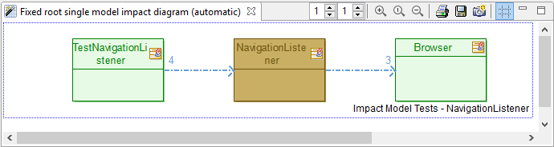
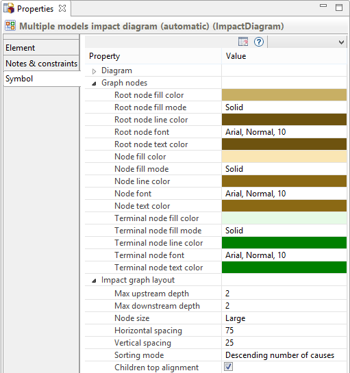

// Disable all captions for figures.
:!figure-caption:
// Path to the stylesheet files
:stylesdir: .

= Diagrammes d'impact

Modelio fourni plusieurs types de diagrammes d'impact.

Il est recommandé de lire en premier le chapitre des <<User_Documentation_fr_Analyse_d%27impact_Concepts_Analyse_Impact.adoc#,Concepts de l'analyse d'impact>> , qui explique comment les diagrammes d'impact affichent les liens d'impact d'un ou plusieurs modèles d'impact avec une ou plusieurs 'racines'  <<#x_footnote_ref_1,1>>.

Les diagrammes d'impact peuvent être <<#HCrE9ationd27undiagrammed27impact,crées>> soit en agencement 'automatique' soit en agencement 'manuel'.

Les combinaisons des différentes configurations d'un diagramme d'impact dans Modelio mènent au tableau de capacités suivant:

[width="100%",cols="20%,20%,20%,20%,20%",options="header",]
|==================================================================================================================
|Agencement +
du diagramme |Modèle fixe +
& Racine unique |Modèle fixe +
& Racines multiples |Racine fixe +
& Modèle unique |Racine fixe +
& Modèles multiples
|Agencement +
automatique a|
* Créez le diagramme sous un Modèle d'impact
* Glissez-déposez un élément dans le diagramme pour le définir comme élément racine
* voir un exemple <<#Fixedmodel_singleroot_automaticlayout_diagram,ici>>

 a|
* Créez le diagramme sous un Modèle d'impact
* Glissez-déposez plusieurs éléments dans le diagramme pour définir les éléments racine
* voir un exemple <<#Fixedmodel_multipleroots_automaticlayout_diagram,ici>>

 a|
* Créez le diagramme sous un élément de modèle qui sera la racine unique du diagramme
* Glissez-déposez dans le diagramme un modèle d'impact dont les liens relatifs à l'élément racine seront affichés
* voir un exemple <<#Fixedroot_singlemodel_automaticlayout_diagram,ici>>

 a|
* Créez le diagramme sous un élément de modèle qui sera la racine unique du diagramme
* Glissez-déposez dans le diagramme des modèles d'impact dont les liens relatifs à l'élément racine seront affichés
* voir un exemple <<#Fixedroot_multiplemodels_automaticlayout_diagram,ici>>

|Agencement +
manuel a|
* Créez le diagramme sous un Modèle d'impact
* Glissez-déposez un élément dans le diagramme pour le définir comme élément racine
* voir un exemple <<#Fixedmodel_singleroot_manuallayout_diagram,ici>>

 a|
* Créez le diagramme sous un Modèle d'impact
* Glissez-déposez plusieurs éléments dans le diagramme pour définir les éléments racine
* voir un exemple <<#Fixedmodel_multipleroots_manuallayout_diagram,ici>>

 a|
* Créez le diagramme sous un élément de modèle qui sera la racine unique du diagramme
* Glissez-déposez dans le diagramme un modèle d'impact dont les liens relatifs à l'élément racine seront affichés
* voir un exemple <<#Fixedroot_singlemodel_manuallayout_diagram,ici>>

 a|
* Créez le diagramme sous un élément de modèle qui sera la racine unique du diagramme
* Glissez-déposez dans le diagramme des modèles d'impact dont les liens relatifs à l'élément racine seront affichés
* voir un exemple <<#Fixedroot_multiplemodels_manuallayout_diagram,ici>>

|==================================================================================================================

1.   <<#x_footnote_ref_1#,>> Il n'y a pas de diagramme 'racines multiples, modèles multiples', ils seraient vraiment difficiles à définir et à lire.

= Création d'un diagramme d'impact

.Création d'un diagramme d'impact en utilisant l'assistant de création de diagrammes
image::images/attachment/modeliocom41/User_Documentation_fr/Analyse_impact/Diagrammes_d_impact/CreateImpactDiagram.png[CreateImpactDiagram.png]

*Étapes :*

1. Sélectionnez l'élément sur lequel vous voulez créer le diagramme.
2. Cliquez sur le bouton "  Créer un diagramme..." dans la barre d'outil ou bien utilisez une des entrées du menu contextuel de l'élément sélectionné.
3. Sélectionnez un type de diagramme.
4. Entrez un nom pour le futur diagramme ou bien gardez le nom par défaut.
5. Si l'élément devant posséder le diagramme n'est pas l'élément actuellement sélectionné, changez le dans le champs 'diagram owner'.
6. Cliquez sur "OK" pour terminer la création du diagramme.

= Étude d'exemples de diagrammes automatiques

Les diagrammes d'impacts automatiques sont agencés automatiquement et rafraîchit par Modelio lorsque le modèle d'impact est mis à jour. L'agencement automatique permet une mise en place simple, claire et systématique.

Les diagrammes d'impacts automatiques on une caractéristique qui mérite d'être notée: si un élément apparaît à plusieurs endroits du graphe des liens d'impacts, sa représentation dans le diagramme sera dupliquée. Il apparaîtra donc plusieurs fois dans le diagramme afin d'aligner les liens d'impact et d'éviter des liens qui se croisent. Cette spécificité améliore la lisibilité du diagramme en permettant un agencement orthogonal simple des liens.

L'utilisateur ne peut pas modifier l'agencement du diagramme en bougeant des éléments. Toutefois des options d'agencement existent dans <<#HPropriE9tE9sdudiagramme,vue symbole du diagramme>> : espacement des nœuds, taille des nœuds, etc...

== Modèle fixe, racine unique, agencement automatique

Le diagramme suivant:

* a été créé sur le modèle d'impact 'NamespaceUse model' => c'est un diagramme à modèle fixe.

* a reçu (par glisser-déposer) la classe 'Browser' comme élément 'racine' . La classe a été glissé-lâchée du modèle vers le diagramme => c'est un diagramme à racine unique.

* est agencé automatiquement .

image::images/attachment/modeliocom41/User_Documentation_fr/Analyse_impact/Diagrammes_d_impact/fixedmodelsinglerootautomaticlayoutdiagrampuces.png[fixedmodelsinglerootautomaticlayoutdiagrampuces.png]

Ce diagramme montre qu'en terme d'utilisation d'espace de nommage, la classe 'Browser' dépend des classes du JDK ' _JEditorPane_ ', ' _JFrame_ ', ' _JTextField_ ' et de l'interface JDK ' _WindowListener_ '. image:images/attachment/modeliocom41/User_Documentation_fr/Analyse_impact/Diagrammes_d_impact/1.png[1.png]

Depuis le diagramme, on voit facilement que les classes ' _AdressListener_ ', ' _NavigationListener_ ', ' _PageLoader_ ' and ' _TestBrowser_ ' dependent de la classe 'Browser'. Les liens d'impact sont dessinés en flèches bleu pointillés. Le nombre affiché sur la flèche indique combien de 'causes' ce lien représente. Le principe est que plus ce nombre est grand plus la dépendance est forte. image:images/attachment/modeliocom41/User_Documentation_fr/Analyse_impact/Diagrammes_d_impact/2.png[2.png]

Un clic droit sur n'importe quel lien d'impact montre un menu surgissant avec une entrée 'Afficher les causes'. Cette commande ouvre un boîte de dialogue qui liste en détails les 'causes' du lien sélectionné.

Notez comment le 'graphe amont', dessiné à gauche de la racine, a une profondeur de deux image:images/attachment/modeliocom41/User_Documentation_fr/Analyse_impact/Diagrammes_d_impact/3.png[3.png] alors que le 'graphe aval' à droite de la racine a une profondeur limitée à un image:images/attachment/modeliocom41/User_Documentation_fr/Analyse_impact/Diagrammes_d_impact/4.png[4.png],

=== Schéma de couleurs

* En *marron foncé* sont indiqués les éléments '*racine*'. Ici la classe '_Browser_'.
* Le *vert clair* indique les éléments '*feuille*'. Un élément feuille dans une analyse d'impact est un élément qui n'a pas de successeur dans le graphe aval (ou aucun prédécesseur dans le graphe amont) dans le modèle d'impact représenté, indépendamment de la profondeur d'affichage du diagramme.
* Devinez maintenant ce qui lie la racine d'un arbre et ses feuilles ? Ses *branches*, coloriées en *marron clair*. Un élément en marron clair est un élément qui a au moins un successeur/prédécesseur dans le graphe aval/amont dans le modèle d'impact représenté. +

Traduisons ce schéma de couleurs en langage naturel pour notre exemple:

* ' _JEditorPane_ ' est une feuille. Ca signifie que dans le modèle d'impact analysé, ' _JEditorPane_ ' ne dépend d'aucun autre élément. Ce n'est pas une surprise vu qu'étant une classe du JDK, ' _JEditorPane_ ' est très probablement un élément d'une bibliothèque externe dont les dépendances ne sont pas dans le modèle.
* ' _AdressListener_ ' n'est pas une feuille parce que la classe ' _TestAdressListener_ ' dépends d'elle. La classe ' _TestAdressListener_ ' est propablement une classe de test générée qui dépend naturellement de l'objet testé.
* Comme personne d'autre ne dépends de ' _TestAdressListener_ ' , elle est montrée en vert comme feuille. souvenez vous que ' _TestAdressListener_ ' apparait dans ce diagramme uniquement parce que le profondeur amont est réglée à deux image:images/attachment/modeliocom41/User_Documentation_fr/Analyse_impact/Diagrammes_d_impact/3.png[3.png],
* Si la profondeur amont avait été fixée à un, la classe ' _TestAdressListener_ ' n'aurait pas été affichée. Toutefois ' _AdressListener_ ' aurait tout de même été affichée comme un noeud branche, en marron, car dans le modèle d'impact des éléments dépendent vraiment de cette classe même s'il ne seraient pas affichés à cause de la profondeur limitée.

La couleur de la racine , des branches et des feuilles peuvent être personnalisés dans la <<#HPropriE9tE9sdudiagramme,vue symbole du diagramme>>.

== Modèle fixe, racines multiples, agencement automatique

Le diagramme suivant:

* a été créé sur le modèle d'impact 'NamespaceUse model' => c'est un diagramme à modèle fixe.

* a reçu (par glisser-déposer) la classe 'Browser' et 'Main' comme éléments 'racine' . Les classes ont été glissé-lâchées du modèle vers le diagramme => c'est un diagramme à racines multiples.

* est agencé automatiquement.

image::images/attachment/modeliocom41/User_Documentation_fr/Analyse_impact/Diagrammes_d_impact/fixedmodelmultiplerootsautomaticlayoutdiagrampuces.png[fixedmodelmultiplerootsautomaticlayoutdiagrampuces.png]

En pratique, Modelio affiche deux graphes d'impact dans le diagramme, un pour chaque racine.

Chaque graphe est encadré par une boîte avec un titre indiquant le modèle d'impact 1 et la racine examinée 2 dans le diagramme.

A part cela, chaque graphe est analogue à un graphe à modèle fixe, racine unique. Le même schéma de couleur et la même analyse s'appliquent.

== Racine fixe, modèle unique, agencement automatique

Le diagramme suivant:

* a été créé sur l'élément 'NavigationListener' => c'est un diagramme à racine fixe.

* a reçu (par glisser-déposer) le modèle d'impact 'Impact Model Tests' . le modèle d'impact a été glissé-déposé du modèle vers le diagramme => c'est un diagramme à modèle unique.

* est agencé automatiquement.

Les résultats ressemble de près au diagramme <<#HFixedmodel2Csingleroot2Cautomaticlayoutdiagram,'Modèle fixe, racine unique'>> au dessus. Le même schéma de couleur et la même sémantique s'appliquent.

Toutefois dans le cas présent l'élément racine est unique et fixe (la classe 'Navigation Listener' possédant le diagramme). Déposer un autre modèle d'impact dans ce diagramme le changera en diagramme à <<#HFixedroot2Cmultiplemodels2Cautomaticlayoutdiagram,'Modèles multiples, racine fixe'>>.

*Note :* Les profondeurs amont et aval sont réglées à un dans cet exemple. +

== Racine fixe, modèles multiples, agencement automatique

Le diagramme suivant:

* a été créé sur l'élément 'NavigationListener' => c'est un diagramme à racine fixe.
* a reçu (par glisser-déposer) les modèles d'impact ' _Impact Model JDK_ ' et ' _Impact Model Tests_ ' . Ces modèles d'impact ont été glissé-lachés du modèle vers le diagramme => c'est un diagramme à modèles multiples.
* est agencé automatiquement.

image::images/attachment/modeliocom41/User_Documentation_fr/Analyse_impact/Diagrammes_d_impact/automultirootmonomodelmodelelementpuces.png[automultirootmonomodelmodelelementpuces.png]

En pratique, Modelio affiche deux graphes d'impact dans ce diagramme, un pour chaque modèle d'impact.

Chaque graphe est encadré par une boîte avec un titre indiquant le modèle d'impact 1 et la racine analysée 2.

A part cela, chaque graphe est analogue à un graphe à <<#HFixedroot2Csinglemodel2Cautomaticlayoutdiagram,'Racine fixe, modèle unique'>>. Le même schéma de couleur et la même analyse s'appliquent.

= Étude d'exemples de diagrammes manuels

Les diagrammes d'impact manuels doivent être agencés par l'utilisateur.

Toutefois, leur contenu est rafraichit par Modelio lorsque le modèle d'impact est mis à jour.

L'agencement manuel permet une mise en place spécifique du diagramme pour illustrer une structure particulière du modèle d'impact.

Contrairement aux diagrammes automatique, les diagrammes manuels ne dupliquent pas le représentation d'un élément donné. +
En conséquence un élément participe à plusieurs liens d'impact il ne sera affiché qu'une fois. +
Cela peut conduire à des liens croisés et/ou un agencement pas clair, à moins que l'utilisateur mette un peu d'ordre dans le diagramme. C'est pourquoi ces diagrammes sont dis manuel, c'est à l'utilisateur de corriger l'agencement pour obtenir un affichage correct.

L'utilisateur peut modifier l'agencement du diagramme en déplaçant les éléments. Une fois qu'un élément a été déplacé manuellement dans le diagramme, Modelio ne le déplacera plus lorsqu'il rafraîchira le diagramme suite aux changements dans le modèle d'impact.

== Modèle fixe, racine unique, agencement manuel

Le diagramme suivant:

* a été créé sur le modèle d'impact 'NamespaceUse model' => c'est un diagramme à modèle fixe.
* a reçu (par glisser-déposer) la classe ' _Browser_ ' comme racine . Cette classe a été glissé-lachée du modèle vers le diagramme => c'est un diagramme à racine unique.
* est agencé manuellement par l'utilisateur.

image::images/attachment/modeliocom41/User_Documentation_fr/Analyse_impact/Diagrammes_d_impact/manualmonorootmonomodelimpactmodelpuces.png[manualmonorootmonomodelimpactmodelpuces.png]

Ce diagramme montre qu'en terme d'utilisation d'espace de nommage, la classe 'Browser' dépend des classes du JDK ' _JEditorPane_ ', ' _JFrame_ ', ' _JTextField_ ', de l'interface JDK ' _WindowListener_ ' et du type de données 'string'. image:images/attachment/modeliocom41/User_Documentation_fr/Analyse_impact/Diagrammes_d_impact/1.png[1.png]

Depuis le diagramme, on voit facilement que les classes ' _AdressListener_ ', ' _NavigationListener_ ', ' _PageLoader_ ' and ' _TestBrowser_ ' dependent de la classe 'Browser'.

Les liens d'impact sont dessinés en flèches bleu pointillés. Le nombre affiché sur la flèche indique combien de 'causes' ce lien représente. Le principe est que plus ce nombre est grand plus la dépendance est forte. image:images/attachment/modeliocom41/User_Documentation_fr/Analyse_impact/Diagrammes_d_impact/2.png[2.png]

Un clic droit sur n'importe quel lien d'impact montre un menu surgissant avec une entrée 'Afficher les causes'. Cette commande ouvre un boîte de dialogue qui liste en détails les 'causes' du lien sélectionné.

Notez que le 'graphe amont', dessiné à gauche de la racine, a une profondeur de un image:images/attachment/modeliocom41/User_Documentation_fr/Analyse_impact/Diagrammes_d_impact/3.png[3.png] tout comme le 'graphe aval' à droite de la racine image:images/attachment/modeliocom41/User_Documentation_fr/Analyse_impact/Diagrammes_d_impact/4.png[4.png],

Dasn le diagramme, l'utilisateur a choisi de placer la racine 'Browser' au centre du diagramme et les éléments dépendant et impactés en cercle autour de la racine. Toute autre option aurait pu être choisie vu que l'agencement du diagramme est entièrement sous le contrôle et la responsabilité de l'utilisateur.

=== Schéma de couleurs

* Le marron indique l'élément racine, Ici la classe ' _Browser_ '.
* Seul le noeud racine a une couleur particulière.
* Les liens d'impact sont en pourpre dans notre diagramme d'example. Cette couleur correspond à celle de la légende, en haut à gauche du diagramme.
* Losque deux éléments ont des liens d'impact réciproque, ces liens sont coloriés en rouge pour indiquer un un cycle d'impact entre les deux éléments. C'est généralement le signe d'un problème dans le modèle.
* L'épaisseur des liens d'impact est liée au nombres de causes du lien. Plus le lien a de causes, plus le trait est épais.

La couleur de l'élement racine peut être modifiée dans <<#HPropriE9tE9sdudiagramme,la vue symbole du diagramme>>.

== Modèle fixe, racine multiples, agencement manuel

Le diagramme suivant:

* a été créé sur le modèle d'impact 'NamespaceUse model' => c'est un diagramme à modèle fixe.
* a reçu (par glisser-déposer) les classes ' _Browser_ ' et 'Main' comme racines . Ces classes ont été glissé-lachées du modèle vers le diagramme => c'est un diagramme à racine multiples.
* est agencé manuellement par l'utilisateur.

image::images/attachment/modeliocom41/User_Documentation_fr/Analyse_impact/Diagrammes_d_impact/manualmultirootmonomodelimpactmodel.png[manualmultirootmonomodelimpactmodel.png]

Dans les faits, Modelio fusionne les graphes d'impact des deux racines dans le diagrammes, charge à l'utilisateur d'agencer le tout pour que le diagramme soit lisible.

A part cela, le graphe est semblable au diagramme Modèle fixe, racine unique. Le même schéma de couleur et la même sémantique s'appliquent.

== Racine fixe, modèle unique, agencement manuel

Le diagramme suivant:

* a été créé sur l'élément 'NavigationListener' => c'est un diagramme à racine fixe.

* a reçu (par glisser-déposer) le modèles d'impact ' _Impact Model JDK_ '. Ce modèle d'impact a été glissé-laché du modèle vers le diagramme => c'est un diagramme à modèle unique.

* est agencé manuellement par l'utilisateur.

image::images/attachment/modeliocom41/User_Documentation_fr/Analyse_impact/Diagrammes_d_impact/manualmonorootmonomodelmodelelement.png[manualmonorootmonomodelmodelelement.png]

En résumé, les résultats sont très similaires au modèle 'Modèle fixe, racine unique, agencement manuel' précédant.

Toutefois, dans le cas présent l'élément racine est fixe et unique (la classe 'Navigation Listener' qui possède le diagramme).

Déposer un autre modèle d'impact dans ce diagramme le changera en diagramme à <<#HFixedroot2Cmultiplemodels2Cmanuallayoutdiagram,'Racine fixe, modèles multiples'>>.

== Racine fixe, modèles multiples, agencement manuel

Le diagramme suivant:

* a été créé sur l'élément 'NavigationListener' => c'est un diagramme à racine fixe.

* a reçu (par glisser-déposer) les modèles d'impact ' _Impact Model JDK_ ' et ' _Impact Model Tests_ ' . Ces modèles d'impact ont été glissé-lachés du modèle vers le diagramme => c'est un diagramme à modèles multiples.

* est agencé manuellement par l'utilisateur.

image::images/attachment/modeliocom41/User_Documentation_fr/Analyse_impact/Diagrammes_d_impact/manualmultirootmonomodelmodelelement.png[manualmultirootmonomodelmodelelement.png]

Ce diagramme ressemble aux autres diagrammes manuels à quelques différences notables près:

* Il y a deux labels dans la légende du diagramme (en haut à gauche) qui indiquent que deux modèles d'impact sont representés pour la racine 'Navigation Listener'.
* Chaque label de la légende a sa propre couleur (bleu pout 'Impact Model Tests' et violet 'Impact Model JDK')
* La couleur des liens d'impact dépends de leur modèle d'impact d'origine. L'utilisateur peut facilement distinguer les liens d'un modèle à l'autre.
* Les liens d'impact en rouge indiquent un cycle d'impact potentiellement problèmatique entre les 2 éléments. Toutefois notez que seuls sont considérés cycles impliquant des liens d'un même modèle d'impact, pas ceux impliquant plusieurs modèles à la fois.

= Propriétés du diagramme

La vue symbole du diagramme permet de configurer plusieurs aspects du diagramme.

==== Couleurs et police

Pour chaque type de nœud (racine, branche, feuille) les options graphiques sont:

* Couleur de remplissage : la couleur de fond du nœud
* Mode de remplissage : le fond peut être colorié en couleur pleine, en dégradé, ou transparent.
* Couleur du trait : la couleur des lignes des nœuds.
* Epaisseur du trait : la largeur du trait des nœuds.
* Police : La police du texte dans les nœuds.
* Couleur du texte : La couleur du texte dans les nœuds.

==== Options d'agencement

L'agencement du diagramme peut être personnalisé:

* Profondeur en amont : Niveau de récursion dans la recherche des liens à afficher dans le diagramme pour le sous arbre de gauche. Cette valeur peut être également modifiée en utilisant le https://fr.wikipedia.org/wiki/Bouton_fl%C3%A9ch%C3%A9[bouton fléché] similaire dans la barre d'outils du diagramme.
* Profondeur en aval : Niveau de récursion dans la recherche des liens à afficher dans le diagramme pour le sous arbre de droite. Cette valeur peut être également modifiée en utilisant le https://fr.wikipedia.org/wiki/Bouton_fl%C3%A9ch%C3%A9[bouton fléché] similaire dans la barre d'outils du diagramme.
* Taille des noeuds : Cette option définit la taille des nœuds affichés. Cette valeur est l'une des uivantes: Small ~ 50x40, Medium ~ 75x60, Large ~ 115x80, Extra large ~ 170x120
* Espacement horizontal : Cette valeur définit l'espacement horizontal entre chaque nœud, en tant que pourcentage de la largeur d'un nœud.
* Espacement vertical : Cette valeur définit l'espacement vertical entre chaque nœud, en tant que pourcentage de la hauteur d'un nœud.
* Mode de tri : Le mode de tri définit l'ordonnancement des nœuds fils d'un noœud donné. Les options sont:
** Model order : l'ordre dans lequel les liens d'impact ont été trouvé dans le modèle.
** Alphabétique ascendant, Alphabétique descendant : Les nœuds fils sont triés par nom.
** Nombre de causes ascendant, Nombre de causes descendant: les nœuds sont triés par le nombre de causes des liens auquels ils sont attachés.
** Nombre de liens ascendant, Nombre de liens descendant: les nœuds sont triés par le nombre de liens auquels ils sont attachés.
* Alignement en haut du diagramme : Si activé, l'arbre affiché alignera les sous arbres sur leur nœud le plus haut. Sinon les sous arbres seront centré sur leur nœud d'origine.
