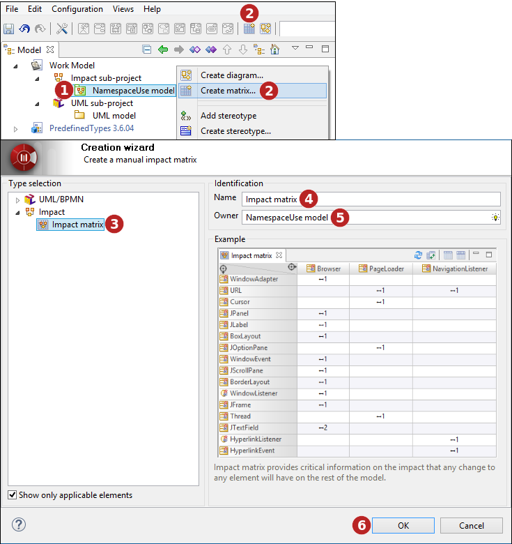
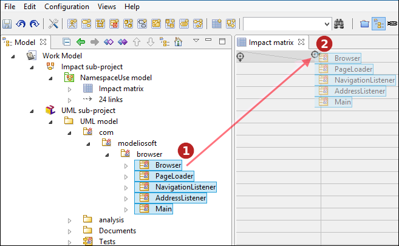
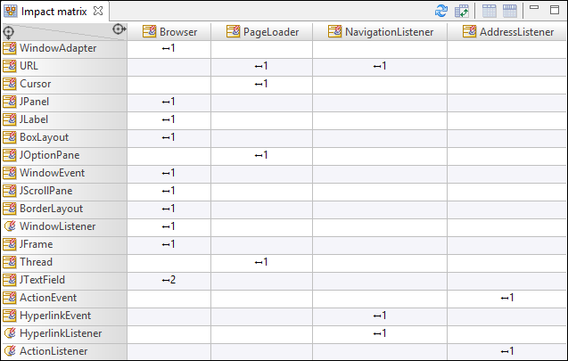

// Disable all captions for figures.
:!figure-caption:
// Path to the stylesheet files
:stylesdir: .

= Matrice d'impact

La matrice d'impact permet d'avoir une vision rapide des liens d'impact existant entre les éléments de modèle.

===== Créer une matrice d'impact

Les matrices d'impact ne peuvent être créées que sur des modèles d'impact image:images/attachment/modeliocom41/User_Documentation_fr/Analyse_impact/Matrice_d_impact/impactmodel.png[impactmodel.png].

.Création d'une matrice d'impact en utilisant l'Assistant de création.

*Légende :*

1.  Sélectionnez le modèle d'impact sous lequel vous souhaitez créer une matrice.
2.  Cliquez sur le bouton " image:images/attachment/modeliocom41/User_Documentation_fr/Analyse_impact/Matrice_d_impact/creatematrix.png[creatematrix.png] Créer une matrice..." du menu contextuel du modèle d'impact sélectionné ou de la barre d'outils.
3.  Sélectionnez la matrice d'impact.
4.  Saisissez un nom pour votre nouvelle matrice, ou bien laissez le nom proposé par défaut.
5.  Si le propriétaire de la matrice n'est pas l'élément de modèle sélectionné, indiquez un nouveau propriétaire.
6.  Cliquez sur "OK" pour valider la création de votre nouvelle matrice.

===== Remplir une matrice d'impact

Dans la matrice d'impact, vous devez glisser déposer les éléments de modèle que vous souhaitez afin d'analyser les liens d'impact entre eux. Ils peuvent être ajoutés en tant que ligne ou colonne, afin d'obtenir le résultat souhaité.

.Glisser déposer des éléments dans une matrice d'impact

*Étapes :*

1.  Sélectionnez des éléments dans l'onglet modèle.
2.  Glisser les vers l'icône image:images/attachment/modeliocom41/User_Documentation_fr/Analyse_impact/Matrice_d_impact/droparea.png[droparea.png] de la colonne ou ligne désirée et relâchez le bouton de la souris.

===== Matrice d'impact

Dans chaque cellule, une flèche indique la direction des liens d'impact, et un chiffre indique le nombre de causes d'impact.

Le contenu de la matrice est remis à jour automatiquement lorsque le modèle d'impact est mis à jour.

.Matrice d'impact

