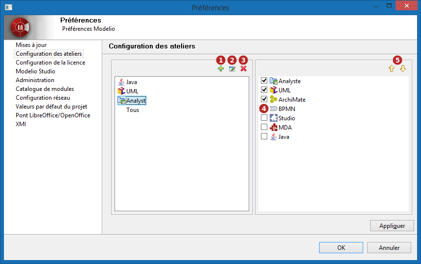
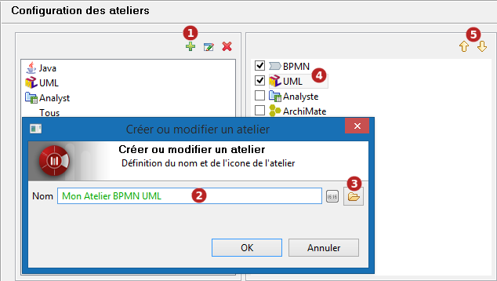
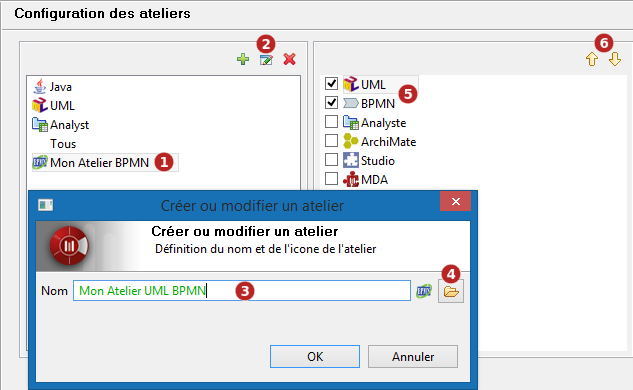
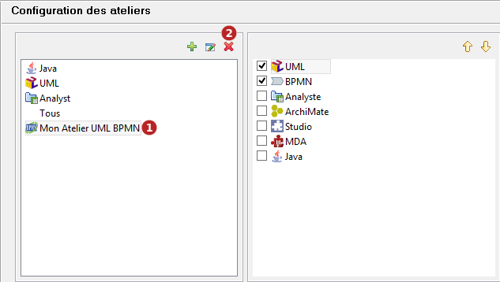

// Disable all captions for figures.
:!figure-caption:
// Path to the stylesheet files
:stylesdir: .

= Configuration

Modelio permet à l'utilisateur de modifier la composition d'un atelier existant ou de définir son propre atelier.

== Gestion des ateliers

Pour ajouter, modifier, ou supprimer un *atelier*, allez dans le menu "Configuration\Préférences..." et choisissez l'entrée "Configuration des ateliers".

L'IHM de gestion des ateliers se présente comme ceci:

*Légende :*

1.  Création d'un nouvel atelier
2.  Édition du nom et de l'icône de l'atelier
3.  Suppression d'un atelier
4.  Activation des métiers actifs de l'atelier (cases à cocher)
5.  Définition de l'ordre des métiers dans l'atelier

=== Création d'un atelier

*Étapes :*

1.  Cliquer sur l'icône ,
2.  Entrer un nom pour l'atelier (le nom ne peut être composé que de caractères alpha-numériques)
3.  Facultatif mais recommandé: Sélectionner une icône (format 16x16).
4.  Sélectionner les métiers supportés par l'atelier parmi les métiers disponibles.
5.  Ordonner les métiers si besoin pour définir leur priorité dans l'atelier

=== Reconfiguration d'un atelier

*Étapes :*

1.  Sélectionner un atelier.
2.  Cliquer sur l'icône image:images/attachment/modeliocom41/User_Documentation_fr/Ateliers_et_metiers/Configuration/edit.png[edit.png] pour modifier le nom ou l'icône de l'atelier.
1.  Éditer le nom de l'atelier (le nom ne peut être composé que de caractères alpha-numériques)
2.  Changer l'icône (format 16x16).
3.  Sélectionner directement les métiers supportés par l'atelier en agissant sur les cases à cocher dans la partie droite.
4.  Ordonner les métiers.

=== Suppression d'un atelier

*Étapes :*

1.  Sélectionner un atelier en partie gauche
2.  Cliquer sur l'icône image:images/attachment/modeliocom41/User_Documentation_fr/Ateliers_et_metiers/Configuration/delete.png[delete.png],

*Note :* supprimer un atelier ne supprime bien évidemment pas les métiers qui restent disponibles pour configurer d'autres ateliers
