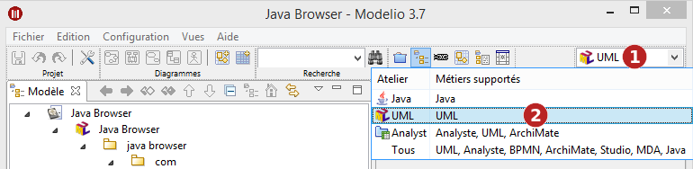
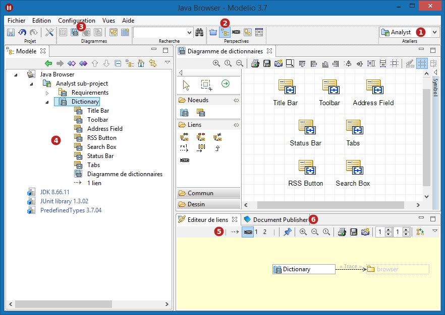
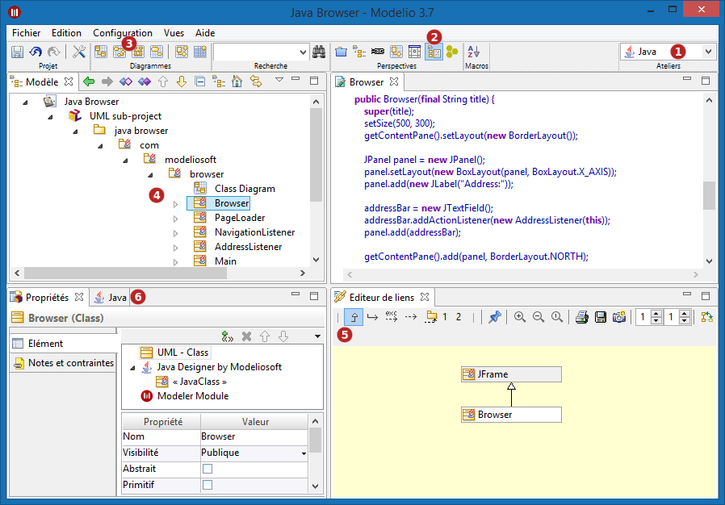

// Disable all captions for figures.
:!figure-caption:
// Path to the stylesheet files
:stylesdir: .

= Utilisation

== Sélection d'un atelier

*Étapes :*

1.  Déplier le menu déroulant. Ce menu liste les ateliers disponibles et pour chacun d'entre eux les métiers supportés.
2.  Sélectionner l'atelier.

== Exemple

Dans l'exemple suivant, nous allons passer de l'atelier "Analyst" à l'atelier "Java" (atelier proposé par le module Java Designer) et constater les changements occasionnés.

=== Etat initial - l'atelier Analyst est l'atelier courant

*Légende :*

1.  L'atelier "Analyst" est l'atelier courant.
2.  La perspective "Modèle" est sélectionnée par défaut.
3.  Seuls les diagrammes "Analyst" sont proposés dans la barre de création rapide.
4.  L'explorateur de modèle n'affiche que les éléments "Analyst" et le menu contextuel ne propose que les commandes correspondantes.
5.  L'éditeur de liens ne propose que les liens compatibles avec les éléments "Analyst".
6.  Le module Document Publisher est activé.

=== Etat final - activation de l'atelier Java

*Légende :*

1.  L'atelier "Java" est sélectionné.
2.  La perspective "Développement" est sélectionnée par défaut.
3.  Seuls les diagrammes pertinents dans le contexte Java sont proposés dans la barre de création rapide.
4.  L'explorateur de modèle n'affiche que les éléments pertinents dans le contexte Java et le menu contextuel ne propose que les commandes pertinentes.
5.  L'éditeur de liens ne propose que les liens utiles en Java.
6.  Le module Java Designer est activé, et le module Document Publisher est désactivé.
