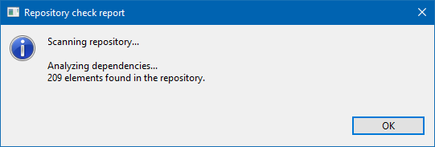

// Disable all captions for figures.
:!figure-caption:
// Path to the stylesheet files
:stylesdir: .

= La commande "Vérifier le référentiel"

=== Description

La commande "Vérifier le référentiel" supprime du référentiel des fichiers représentant des éléments qui ne sont pas référencés par le fichier de leur élément parent.

Cette commande peut être utilisée si la commande "Mettre à jour" échoue parce que certains éléments sont des orphelins.

Si des fichiers supplémentaires sont trouvés, une fenêtre informe l'utilisateur que les problèmes ont été identifiés, et lui demande l'autorisation de les réparer. Dans ce cas, la commande prend le verrou sur les fichiers à supprimer, et les supprime du référentiel. [[Conditions-et-restrictions]]

=== Conditions et restrictions

La commande "Vérifier le référentiel" ne peut être lancée que depuis le projet. Elle n'est pas disponible sur d'autres éléments. [[Interface-utilisateur]]

=== Interface utilisateur

La commande "Vérifier le référentiel" ouvre la fenêtre suivante :

.La fenêtre "Vérifier le référentiel"

=== Comportement

La commande "Vérifier le référentiel" supprime du référentiel des fichiers qui représentent des éléments qui ne sont pas référencés par le fichier de leur élément parent.
