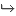
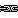
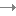
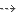
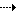
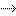
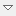

// Disable all captions for figures.
:!figure-caption:
// Path to the stylesheet files
:stylesdir: .

= Configuration de l'éditeur de liens

L'éditeur de liens peut être configuré. La configuration s'applique à :

* L'apparence de la vue
* Le contenu affiché dans la vue

Configurer l'apparence de la vue est une opération simple. En utilisant les boutons de la barre d'outils, le niveau de zoom, l'orientation (verticale ou horizontale), il est facile d'adapter la vue aux besoins ou aux goûts de l'utilisateur.

La configuration de l'affichage du contenu consiste à choisir quels sont les types de liens que l'on souhaite afficher, parmi les nombreux types de liens supportés par Modelio. Ces types de liens sont si nombreux que les afficher tous serait inutilisable. La configuration consiste donc à filtrer les types de liens à afficher.

Le filtre est basé sur la métaclasse et les éventuels stéréotypes.

Définir un filtre est une opération facile, mais qui peut s'avérer lourde si l'utilisateur veut une configuration sophistiquée basée sur plusieurs métaclasses et stéréotypes.

Modelio facilite cette tâche grâce à son mécanisme de configurations prédéfinies et personnalisées, accessibles directement dans la barre d'outils de l'éditeur de liens.

Il suffit à l'utilisateur de cliquer sur un bouton de configuration dans la barre d'outil pour adapter l'affichage de l'éditeur à son besoin.

== Configurations prédéfinies

Les configurations prédéfinies de l'éditeur de liens sont des configurations standard _sur étagère_ fournies par Modelio et pensées pour répondre aux situations les plus courantes, et des configurations prédéfinies plus spécifiques conçues pour les différents ateliers et expertises fournis par Modelio

Le fait qu' *il ne montre que les configurations correspondant à l'atelier courant* est une fonctionnalité importante de l'éditeur de liens.

Le tableau suivant liste les configurations prédéfinies pour chaque expertise standard :

[width="100%",cols="16%,14%,14%,14%,14%,14%,14%"]
|================================================================================================================================================================================
|*UML* |

Héritage : +
_Interface Realization et_ +
_Generalization._ +
 |

Associations: +
_Association, (seules les Aggregation et_ +
_Composition sont affichées)._ +
 |
image:images/attachment/modeliocom41/User_Documentation_fr/Editeur_de_liens/Link_Editor_configuration/dependency.png[dependency.png]
Dependances: +
_Tous types de dépendances._ +
 |

Traçabilité et raffinage: +
Dépendances stéréotypées +
«trace» and «refine». +
 | |
|*BPMN* |

Flux : +
_Sequence Flow et Message Flow._ +
 |
 
Traçabilité et raffinage: +
Dépendances stéréotypées +
«trace» and «refine». +
 | | | |
|*Analyst* | Element Import : +
_Dépendances stéréotypées par le profil Analyst._ +
 |

Traçabilité et raffinage : +
Dépendances stéréotypées +
«trace» and «refine». +
 | | | |
|*ArchiMate* |
image:images/attachment/modeliocom41/User_Documentation_fr/Editeur_de_liens/Link_Editor_configuration/archimate.association.png[archimate.association.png]
Tout: +
_Toutes les relations ArchiMate._ +
 |

Dynamique: +
_Flow et relations Triggering._ +
 |
image:images/attachment/modeliocom41/User_Documentation_fr/Editeur_de_liens/Link_Editor_configuration/archimate.assignment.png[archimate.assignment.png]
Structurel : +
_Association, Aggregation, Composition, +
Assignment, Realization, and Specialization._ +
 |

Dependances : +
_Access, Influence and Serving relationships._ +
 |

 Traçabilité et raffinage: +
Dépendances stéréotypées +
«trace» and «refine».
 |
|================================================================================================================================================================================

== Configurations personnalisées

Si les configurations prédéfinies sont généralement suffisantes pour couvrir les besoins de l'utilisateur, il peut arriver qu'une configuration hybride soit nécessaire, dans laquelle plusieurs types de liens, d'ordinaire indépendants, doivent être affichés. Dans cette situation, l'utilisateur peut définir sa propre configuration.

L'éditeur de liens peut supporter deux configurations personnalisées, _Utilisateur 1_ et _Utilisateur 2_.

Pour définir une configuration personnalisée, il suffit de cliquer sur le bouton , Cela déroule un menu à deux commandes, une pour chaque configuration personnalisée. Ces commandes ouvrent la fenêtre "Définition de la configuration utilisateur" illustrée ci-dessous :

image::images/attachment/modeliocom41/User_Documentation_fr/Editeur_de_liens/Link_Editor_configuration/LinkEditorUserConfigurationJava.png[LinkEditorUserConfigurationJava.png]

Dans la fenêtre "Définition de la configuration utilisateur", l'utilisateur peut :

1.  Définir le nom pour la configuration. Ce nom apparaîtra dans le tooltip du bouton de la configuration (dans la barre d'outils de l'éditeur de liens). Le choix du nom sera utile pour se souvenir de ce qu'offre le configuration. +
_Dans la figure d'exemple ci-dessus, le nom choisi, "Java links" est une indication claire que la configuration affiche les liens Java (principalement ceux du modèle statique UML, ainsi que de dépendances avec des stéréotypes spécifiques)._
2.  Choisir les paramètres de présentation : nombre de niveaux affichés en aval et en amont, et orientation. Il est préférable de choisir des petites valeurs pour que le graphique reste lisible. L'orientation du graphique est une question de goût et de préférence. +
_Dans la figure d'exemple ci-dessus, le nombre de niveaux affichés en aval et en amont de l'élément central est 2, ce qui produit un effet de symétrie autour de l'élément central._
3.  Choisir quels liens doivent être affichés en cochant les cases correspondantes. L'arborescence propose tous les types de liens disponibles, liens stéréotypés inclus (en fonction des modules déployés). Les types de liens sont regroupés par métamodèle et par module. +
_Dans la figure d'exemple, l'utilisateur a choisi les liens structurels UML (associations et héritage), ainsi que des dépendances spécifiques, stéréotypées par le module Java Designer. Il s'agit d'une configuration typique pour un développeur Java qui souhaite explorer et manipuler un modèle Java UML._

== Paramètres de présentation

La figure ci-dessous montre un exemple d'éditeur de liens avec une présentation horizontale, et symétrique avec un niveau de profondeur en aval et en amont.

image::images/attachment/modeliocom41/User_Documentation_fr/Editeur_de_liens/Link_Editor_configuration/LinkEditorAssociationsHorizontal2.png[LinkEditorAssociationsHorizontal2.png]

La figure ci-dessous montre un exemple d'éditeur de liens avec une présentation verticale. La vue affiche l'arbre d'héritage de la classe 'ElementTreePanel'.

L'utilisateur a voulu mettre l'accent sur les classes parentes et sur l'implémentation d'interfaces en ne réglant le niveau de profondeur à '0' pour les sous-classes, et à '2' pour les classes parentes.

image::images/attachment/modeliocom41/User_Documentation_fr/Editeur_de_liens/Link_Editor_configuration/LinkEditorGeneralizationsVertical.png[LinkEditorGeneralizationsVertical.png]
