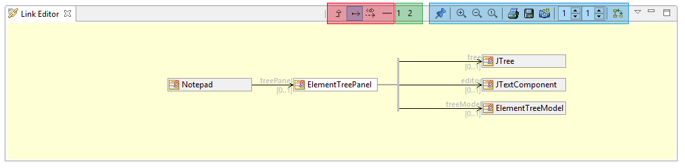
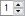

// Disable all captions for figures.
:!figure-caption:
// Path to the stylesheet files
:stylesdir: .

= La vue Editeur de liens

La figure ci-dessous montre l'éditeur de liens. Cette vue est composée d'une zone d'affichage pour le graphique de liens, et d'une barre d'outils qui contient les commandes de configuration.

La barre d'outils est composée de trois zones:

1.  Les commandes de gestion de l'éditeur de liens (surlignée en bleu dans la figure ci-dessus) qui sont, de gauche à droite :
*  *Accrocher / Décrocher l'élément sélectionné* : pour passer du mode visualisation au mode édition, et vice versa.
*  *Zoomer* : pour zoomer.
*  *Dézoomer* : pour dézoomer
* image:images/attachment/modeliocom41/User_Documentation_fr/Editeur_de_liens/The_Link_Editor_view/zoom_to_default.png[zoom_to_default.png] *Echelle 1:1* : pour réinitialiser le niveau de zoom à l'échelle 1:1.
* image:images/attachment/modeliocom41/User_Documentation_fr/Editeur_de_liens/The_Link_Editor_view/print.png[print.png] *Imprimer* : pour imprimer le contenu de l'éditeur de liens.
* image:images/attachment/modeliocom41/User_Documentation_fr/Editeur_de_liens/The_Link_Editor_view/save_image.png[save_image.png] *Enregistrer dans un fichier* : pour enregistrer le contenu de l'éditeur de liens dans une image.
* image:images/attachment/modeliocom41/User_Documentation_fr/Editeur_de_liens/The_Link_Editor_view/copy_image.png[copy_image.png] *Copier en tant que graphique* : pour copier le contenu de l'éditeur de liens dans le presse-papier.
* * Nombre de niveaux affichés en aval* : pour définir le nombre de niveaux qui seront affichés en aval de l'élément central.
* * Nombre de niveaux affichés en amont* : Pour définir le nombre de niveaux qui seront affichés en amont de l'élément central.
* image:images/attachment/modeliocom41/User_Documentation_fr/Editeur_de_liens/The_Link_Editor_view/Automatic_Orientation.png[Automatic_Orientation.png] *Changer la disposition (verticale/horizontale)* : Pour changer l'orientation du graphique.
2.  Les configurations utilisateur de l'éditeur de liens (surlignées en vert dans la figure ci-dessus), qui sont des configurations du contenu de l'éditeur de liens définies par l'utilisateur (c'est à dire, quels types de liens sont affichés). +
Il suffit de cliquer sur l'une des commandes pour activer la configuration utilisateur choisie. (voir <<User_Documentation_fr_Editeur_de_liens_Link_Editor_configuration.adoc#HCustomconfigurations,Configurations utilisateur>> ci-dessous).
3.  Les configurations prédéfinies de l'éditeur de liens (surlignées en rouge dans la figure ci-dessus) qui sont des configurations "sur étagère" fournies par Modelio. +
Il suffit de cliquer sur l'une des commandes pour activer la configuration prédéfinie choisie. (voir <<User_Documentation_fr_Editeur_de_liens_Link_Editor_configuration.adoc#HPredefinedconfigurations,Configurations prédéfinies>> ci-dessous)
