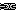
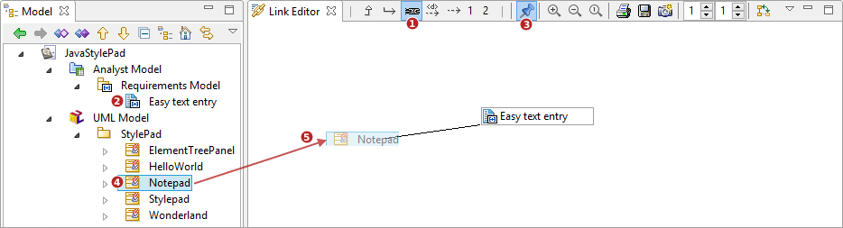

// Disable all captions for figures.
:!figure-caption:
// Path to the stylesheet files
:stylesdir: .

= Edition des liens

== Créer des liens

La création de liens dans l'éditeur de liens est très facile. La procédure est la suivante :

1.  Passer l'éditeur de liens en mode édition, c'est à dire en cliquant sur le bouton image:images/attachment/modeliocom41/User_Documentation_fr/Edition_des_liens/EditionMode.png[EditionMode.png], L'éditeur de liens n'est plus mis à jour en cas de changement de sélection dans le modèle. L'élément central de la vue est en quelque sorte verrouillé en place.
2.  Glisser-déposer n'importe quel élément depuis une autre vue (ex: la vue link:../../org.modelio.documentation.modeliomodeler/html/Modeler-_modeler_interface_uml_view.html[Explorateur de modèle] ) vers la vue éditeur de liens pour créer un nouveau lien entre l'élément déposé et l'élément central. Il est possible de *déposer plusieurs éléments* d'un coup, pourvu qu'ils soient des instances de la même métaclasse (ex: plusieurs classes ou plusieurs packages, mais pas une classe ET un package d'un coup)
3.  L'orientation du lien créé ( *depuis* l'élément central *vers* l'élément déposé ou l'inverse) est determinée par l'endroit où on dépose l'élément par rapport à l'élément central (à gauche ou à droite en orientation horizontalele, au-dessus ou en-dessous en orientation verticale)
4.  L'éditeur de liens essaye de determiner le type de lien à créer en se basant sur les types de liens visibles au moment du dépôt, et sur la métaclasse de l'élément central et de l'élément déposé. Si plusieurs types sont valides, une boîte de dialogue s'ouvre et propose de choisir le type de lien à créer
5.  Unpin the link editor view (unless you need to create more links for the same central element)

== Exemple d'utilisation

On veut ajouter plusieurs liens de traçabilité entre des exigences et des classes d'implémentation pour montrer quelles classes satisfont quelles exigences.

Pour cela, on configure l'éditeur de liens en effectuant ces deux opérations suivantes :

1.  Configurer l'éditeur de liens de manière à afficher les liens de traçabilité en sélectionnant la configuration prédéfinie 'Traçabilité et raffinage' (bouton  ), ou une configuration personnalisée qui affiche les liens de traçabilité
2.  Sélectionner l'exigence vers laquelle on veut définir une ou plusieurs implémentation(s)
3.  Cliquer sur le bouton image:images/attachment/modeliocom41/User_Documentation_fr/Edition_des_liens/EditionMode.png[EditionMode.png] pour verrouiller l'exigence comme élément central de la vue
4.  Parcourir le modèle, par exemple dans l'explorateur de modèle, jusqu'à la ou les classe(s) d'implémentation de l'exigence
5.  Sélectionner la ou les classe(s) d'implémentation et les déposer dans l'éditeur de liens, en amont de l'exigence (la traçabilité entre une exigence et sa classe d'implémentation va de la classe vers l'exigence)
6.  La configuration prédéfinie choisie('Traçabilité et raffinage') supporte deux types de liens (trace et refine). Modelio propose de choisir quel type de lien on veut créer dans une boîte de dialogue "Sélectionner le type de lien à créer"

.Boîte "Sélectionner le type de lien"
image::images/attachment/modeliocom41/User_Documentation_fr/Edition_des_liens/SelectLink.png[SelectLink.png]

Il suffit de sélectionner le type de lien à créer et de valider.

Les types de liens sont listés dans une arboresence qui les classe par module.

== Destruction de liens

L'éditeur de liens permet également de détruire de liens. Il suffit de sélectionner un lien et de presser la touche "Suppr".

Cette action détruit le lien sauf si l'opération est interdite (par exemple si les éléments liés sont verrouillés par le CMS.
