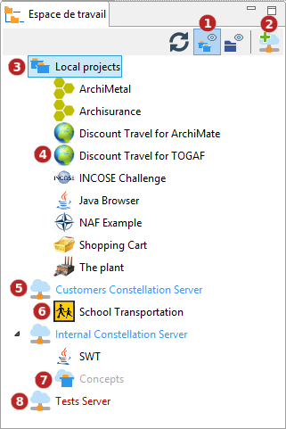
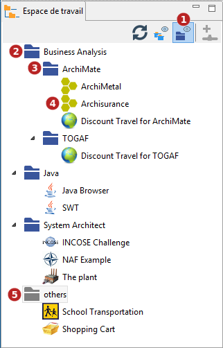
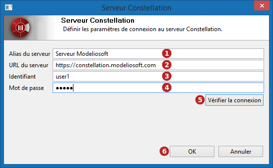

// Disable all captions for figures.
:!figure-caption:
// Path to the stylesheet files
:stylesdir: .

= Gerer l'espace de travail

La version 3.8 de Modelio a introduit une nouvelle vue de son espace de travail avec de nouvelles fonctionnalités:

1.  Deux modes de représentation : "Projets locaux et Modelio Servers" et "Dossiers".
2.  La possibilité pour l'utilisateur d'organiser ses projets sur la base d'une structure hiérarchique de dossiers.
3.  Une nouvelle approche de la gestion des projets, particulièrement ceux hébergés sur un Modelio Server.

= Modes de représentation

== Projets locaux et Modelio Servers

Ce mode de représentation montre

* Les projets locaux, accessibles physiquement dans dossier nommé "Projets locaux"
* Les Modelio Servers déclarés dans l'espace de travail, chacun dans un dossier dédié

Les projets du dossier "Projets locaux " sont classés par ordre alphabetique. Ces projets sont présents physiquement dans l'espace de travail.

Chaque dossier Modelio Server liste les projets accessible à l'utilisateur déclaré sur le Modelio Server, qu'il les ait déjà rejoints ou non.

La figure suivante montre la vue Espace de travail en mode "Projets et Modelio Servers" :

*Légende :*

1.  Bouton d'activation du mode "Projets et Modelio Servers" de l'espace de travail
2.  Bouton de connexion à un Modelio Server
3.  Dossier des projets locaux
4.  Un projet local
5.  Un Modelio Server. Le nom du serveur apparaît en bleu pour signifier qu'il est actuellement accessible à l'utilisateur
6.  Un projet Modelio Server accessible. Son nom n'est pas grisé et son icône est visible : le projet a déjà été rejoint par l'utilisateur
7.  Un projet Modelio Server disponible. Son nom est grisé et son icône n'apparaît pas : le projet n'a pas encore été rejoint
8.  Un Modelio Server non-disponible. Son nom apparaît en rouge pour signifier que le Modelio Server est soit momentanément inaccessible, soit que l'authentification de l'utilisateur est incorrecte

*Commandes :*

Les entrées de l'Espace de travail ont un menu contextuel qui affiche les commandes applicables.

Voir <<User_Documentation_fr_Gerer_l%27espace_de_travail.adoc#HCommandescontextuelles,Commandes contextuelles>>.

== Dossiers

Le mode "Dossiers" est une vue personnalisable qui permet à l'utilisateur d'organiser ses projets comme il le souhaite. Un dossier contient des références à des projets. Les références de projets apparaissent comme les projets auxquels elles se référent et permettent la plupart des opérations possibles sur un projet : ouverture, renommage, export, etc. Un dossier peut aussi contenir des sous-dossiers pour une organisation plus fine des projets de l'utilisateur.

Dans ce mode, seuls sont visibles les projets choisis par l'utilisateur, qu'ils soient locaux ou sur Modelio Server.

L'espace de travail contient un dossier par défaut nommé 'Autres', et qui contient tous les projets qui n'ont pas été placés dans un dossier créé par l'utilisateur. Ceci permet de retrouver facilement ces projets.

La figure suivante montre la vue "Espace de travail" en mode "Dossiers" :

*Légende :*

1.  Cliquer sur ce bouton pour activer le mode 'Dossiers' de la vue Espace de travail.
2.  Un dossier créé par l'utilisateur et nommé "Business Analysis".
3.  Un sous-dossier du dossier "Business Analysis", nommé "ArchiMate".
4.  Projets organisés sous le sous-dossier "ArchiMate".
5.  Le dossier "Autres" qui contient les projets qui n'ont pas encore été assignés à un dossier créé par l'utilisateur.

*Commandes :*

Les entrées de l'Espace de travail ont un menu contextuel qui affiche les commandes applicables.

Voir <<User_Documentation_fr_Gerer_l%27espace_de_travail.adoc#HCommandescontextuelles,Commandes contextuelles>>.

=== Gestion des dossiers

Les utilisateurs peuvent créer autant de dossiers et sous-dossiers qu'ils le souhaitent. Ils peuvent ajouter autant de références de projets qu'ils souhaitent dans un dossier, et même référencer un même projet dans plusieurs dossiers ou sous-dossiers.

La plupart des opérations possibles sur un dossier sont accessibles via le menu contextuel des références de projets ou des dossiers. Voir Voir <<User_Documentation_fr_Gerer_l%27espace_de_travail.adoc#HCommandescontextuelles,Commandes contextuelles>>.

Toutefois, quelques interactions spécifiques sont possibles dans l'Espace de travail lorsque le mode Dossiers est activé :

1.  Glisser-Déposer une référence de projet d'un dossier à un autre permet de déplacer cette référence vers le dossier cible. Le dossier source peut être le dossier "Autres".
2.  Ctrl+Glisser-Déposer une référence de projet permet de dupliquer la référence dans le dossier cible.

*Note :* Cas spécifique du dossier "Autres". Quel que soit le mode de Glisser-Déposer (avec Ctrl ou non), toute référence de projet déplacée depuis le dossier "Autres" disparaît de ce dossier.

= Modelio Servers

=====   Ajouter un serveur Modelio Server

Cette commande permet de configurer une entrée Modelio Server. Une fois le Modelio Server configuré, tous les projets accessibles à l'utilisateur apparaissent.

*Légende :*

1.  *Alias du serveur* : Saisir l'alias du serveur à afficher dans l'explorateur de l'espace de travail. Si ce champ est laissé vide, l'URL du serveur sera affiché.
2.  *URL du serveur* : Saisir l'URL du Modelio Server.
3.  *Identifiant* : Saisir l'identifiant de l'utilisateur pour la connexion au Modelio Server.
4.  *Mot de passe* : Saisir le mot de passe associé à l'identifiant.
5.  *Vérifier la connexion* : Cliquer sur ce bouton pour tester la connexion au serveur.
6.  *OK* : Une fois la connexion vérifiée, cliquer sur OK.

= Commandes contextuelles

L'espace de travail n'affiche que les commandes disponibles pour l'élément sélectionné. Les commandes non disponibles ne sont pas affichées. Les commandes grisées sont des commandes qui pourraient être disponibles mais ne sont pas applicable pour l'instant (Par exemple, la commande "Fermer le projet" sur un projet fermé).

=====   Créer un projet

Cette commande crée un nouveau projet.

*Disponible sur :*

* Le dossier "Projets locaux" en mode Projets locaux et Modelio Servers
* Tous les dossiers, y compris le dossier "Autres" en mode Dossiers

=====   Importer un projet

Cette commande importe un projet complet (*.zip) dans l'espace de travail courant.

*Disponible sur :*

* *Le dossier "Projets locaux" en mode Projets locaux et Modelio Servers*
* *Tous les dossiers, y compris le dossier "Autres" en mode Dossiers*

=====  image:images/attachment/modeliocom41/User_Documentation_fr/Gerer_espace_de_travail/openproject.png[openproject.png] Ouvrir un projet

Cette commande ouvre un projet existant. Le projet sélectionné doit être fermé.

*Disponible sur :*

* Tout projet présent dans le dossier "Projets locaux" en mode Projets locaux et Modelio Servers
* Tout projet présent dans tous les dossiers, y compris le dossier "Autres" en mode Dossiers

=====   Exporter le projet

Cette commande exporte un projet complet sous forme d'une archive zip. Le projet sélectionné doit être fermé.

*Disponible sur :*

* Tout projet présent dans le dossier "Projets locaux" en mode Projets locaux et Modelio Servers
* Tout projet présent dans tous les dossiers, y compris le dossier "Autres" en mode Dossiers

=====   Fermer le projet

Cette commande ferme le projet courant. Le projet sélectionné doit être ouvert.

*Disponible sur :*

* Tout projet présent dans le dossier "Projets locaux" en mode Projets locaux et Modelio Servers
* Tout projet présent dans tous les dossiers, y compris le dossier "Autres" en mode Dossier

=====  image:images/attachment/modeliocom41/User_Documentation_fr/Gerer_espace_de_travail/rename.png[rename.png] Renommer le projet

Cette commande renomme un projet. Le projet sélectionné doit être fermé.

*Disponible sur :*

* Tout projet présent dans le dossier "Projets locaux" en mode Projets locaux et Modelio Servers
* Tout projet présent dans tous les dossiers, y compris le dossier "Autres" en mode Dossier

=====   Supprimer le projet

Cette commande supprime un projet. Le projet sélectionné doit être fermé. Une confirmation est demandée à l'utilisateur car cette opération ne peut pas être annulée.

*Disponible sur :*

* Tout projet présent dans le dossier "Projets locaux" en mode Projets locaux et Modelio Servers
* Tout projet présent dans tous les dossiers, y compris le dossier "Autres" en mode Dossier

=====   Créer un dossier

Cette commande crée un dossier.

*Disponible sur :*

1.  Un ou plusieurs projets du dossier "Projets locaux" en mode Projets locaux et Modelio Servers
2.  Un ou plusieurs projets Modelio Server *déjà rejoints* en mode Projets locaux et Modelio Servers
3.  Une sélection de références de projets dans un dossier (y compris le dossier "Autres") en mode Dossiers
4.  Un dossier (à l'exception du dossier "Autres")

Pour les cas 1 et 2, le nouveau dossier est créé à la racine de lespace de travail et contient automatiquement les références aux projets à partir desquels il a été créé.

Pour le cas 4, le nouveau dossier est un sous-dossier du dossier à partir duquel il a été créé. Il est créé vide.

=====   Supprimer le dossier

Cette commande supprime le dossier sélectionné. Toutes les références et sous-dossiers contenus dans le dossier sont également supprimés. Cette commande ne supprime PAS les projets.

*Disponible sur :*

* Un dossier (à l'exception du dossier "Autres")

=====   Retirer un Modelio Server

Cette commande retire une entrée de Modelio Server de l'espace de travail. Elle ne détruit AUCUN projet précédemment rejoint par l'utilisateur sur le serveur en question.

*Disponible sur :*

* Une entrée de Modelio Server en mode Projets locaux et Modelio Servers

=====   Editer les paramètres de connexion

Cette commande permet de paramétrer une entrée Modelio Server. Elle ouvre une boîte qui permet de modifier les paramètres du Modelio Server :

* Alias du serveur (nom du serveur dans la vue Espace de travail)
* URL du serveur
* Identifiant
* Mot de passe

*Disponible sur :*

* Une entrée de Modelio Server en mode Projets locaux et Modelio Servers

=====  image:images/attachment/modeliocom41/User_Documentation_fr/Gerer_espace_de_travail/openconstellationproject.png[openconstellationproject.png] Rejoindre un projet Modelio Server

Cette commande permet de rejoindre un projet Modelio Server.

*Disponible sur :*

* Un projet Modelio Server unique et qui n'a pas encore été rejoint, dans une entrée Modelio Server en mode Projets locaux et Modelio Servers.

=====   Retirer le projet du dossier

Cette commande permet de retirer une référence de projet d'un dossier. Le projet n'est PAS supprimé, seule sa référence l'est.

*Disponible sur :*

* Toute référence de projet dans un dossier (à l'exception du dossier "Autres"), en mode Dossiers.
