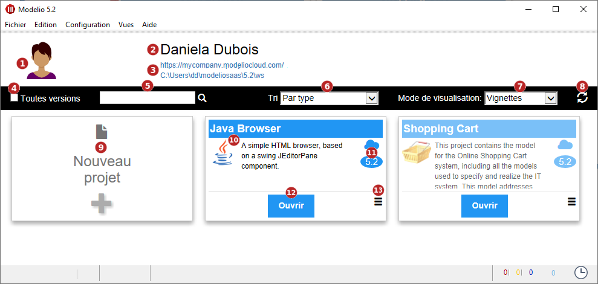
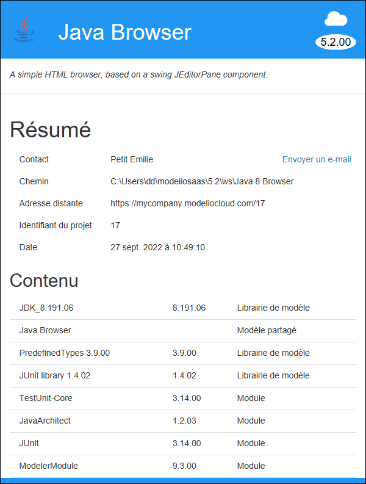

// Disable all captions for figures.
:!figure-caption:
// Path to the stylesheet files
:stylesdir: .

= Page d'Accueil

Une fois connecté via l'écran de démarrage de Modelio SaaS, la liste des projets SaaS enregistrés sur le serveur et dont vous êtes membre apparaît ainsi que vos projets locaux.

.Page d'accueil

*Légende :*

. Image associée à l'utilisateur.
. Prénom et nom de l'utilisateur.
. Addresse de Modelio Server et emplacement de l'espace de travail contenant les projets.
. Option permettant d'afficher les projets non compatibles (i.e. les projets nécessitant une version différente de Modelio SaaS client).
. Recherche
. Ordre d'affichage des projets:
.. Par date
.. Par type
.. Par nom
. Mode d'affichage des cartes de projets:
.. Vignettes
.. Liste
.. Liste compacte
. Rafraichissement de la page.
. Création de <<User_Documentation_fr_LocalProject_SaaS.adoc#,projet local>>.
. Nom, icône et description du projet (passer la souris au dessus des "..." permet d'afficher une bulle contenant la description complète du projet).
. Mode (serveur ou local) et version du projet.
. *Ouvrir* le <<User_Documentation_fr_ServerProject_SaaS.adoc#,projet>>.
. Commandes contextuelles applicables sur le projet :
.. Renommer un projet local.
.. Partager un projet local sur le serveur.
.. Supprimer un projet de l'espace de travail.

Cliquer sur une carte affiche des détails sur le projet :

