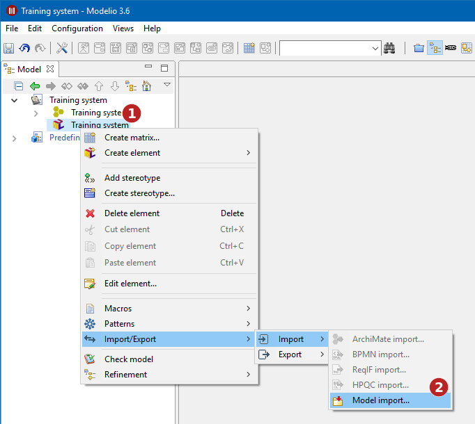
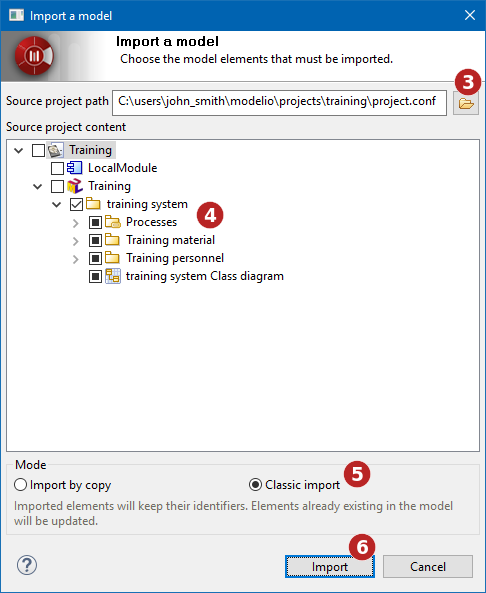

// Disable all captions for figures.
:!figure-caption:
// Path to the stylesheet files
:stylesdir: .

= Importer des éléments depuis des projets existants

=== Présentation de l'import d'éléments

La fonctionnalité d'import d'éléments permet d'importer des éléments depuis un projet existant vers votre projet courant.

Il existe deux modes d'import :

* L'import par copie, qui effectue une copie des éléments à importer, c'est à dire que les éléments sont recréés dans le modèle cible.
* L'import classique, qui permet de conserver les identifiants des éléments importés. +
*Note :* ce mode d'import n'est disponible qu'avec une licence Modelio Teamwork.

=== Importer des éléments depuis un autre projet avec la fonction d'import par copie

.Exécution d'une opération d'import d'éléments par copie
image::images/attachment/modeliocom41/User_Documentation_fr/Importer_des_elements_depuis_des_projets_existants/ModelImport_002.png[ModelImport_002.png]

1.  Sélectionnez le modèle de travail dans lequel vous souhaitez importer des éléments de modèle
2.  Exécutez la commande *Import/Export > Import > Import de modèle...*
3.  Sélectionnez le fichier 'project.conf' du projet contenant les éléments à importer
4.  Sélectionnez les éléments que vous souhaitez importer
5.  Sélectionnez l'option d'import par copie
6.  Démarrez l'import [[Eléments-importés]]

=== Importer des éléments depuis un autre projet avec la fonction d'import classique

.Exécution d'une opération d'import classique d'éléments

1.  Sélectionnez le modèle de travail dans lequel vous souhaitez importer des éléments de modèle
2.  Exécutez la commande Import/Export > Import > Import de modèle...
3.  Sélectionnez le fichier 'project.conf' du projet contenant les éléments à importer
4.  Sélectionnez les éléments que vous souhaitez importer
5.  Sélectionnez l'option d'import classique
6.  Démarrez l'import

=== Eléments importés

Les éléments qui peuvent être importés dans votre projet sont classés dans l'ordre hiérarchique classique (les packages qui contiennent les classes). Pour visualiser les classes contenues dans un package, cliquez sur le symbole "+" situé à gauche du nom du package.

La liste ci-dessous décrit exactement ce qui est importé pour chaque type d'élément.

* Projet : Le projet complet (packages, classes, ...)
* Package : Les classes (avec leurs opérations, attributs, associations "visibles"), les documents, les tagged values, les diagrammes
* Classe : Les opérations, les attributs, les associations "visibles", les documents, les tagged values, les diagrammes

Les objets non-importés sont les suivants :

* Les liens de référence d'un package vers un autre élément qui n'est pas importé et qui n'existe pas déjà dans le projet courant
* Les associations non-orientées (aucune visibilité d'un côté ou de l'autre)

L'opération d'import échouera en cas d'incohérence entre les éléments importés.
