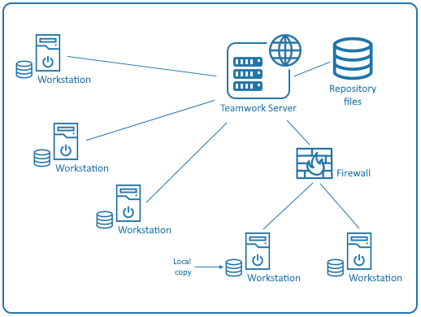

// Disable all captions for figures.
:!figure-caption:
// Path to the stylesheet files
:stylesdir: .

= Introduction aux modèles de travail partagés

== Présentation

Les modèles de travail partagés sont des modèles de travail partagés en lecture-écriture ou en lecture-seule sur des serveurs.

Dans notre contexte, le travail de groupe indique un groupe de personnes travaillant simultanément sur un seul et unique projet Modelio. Cette organisation s'appelle un groupe de travail. En termes pratiques, un groupe de travail est le plus souvent une équipe de développement.

Les modèles de travail partagés supportent le travail de groupe à travers des fonctionnalités essentielles telles que :

* le partage des données du projet entre utilisateurs,
* la centralisation des données du projet dans un référentiel central unique,
* la gestion des copies locales des données du projet,
* la modification et la publication des données du projet,
* le diff/merge de branches et de modèles.

Une fois son environnement de travail en équipe mis en place, le cycle d'activité typique d'un utilisateur des modèles partagés est le suivant :

* mise à jour du modèle local depuis le référentiel,
* modification du modèle local,
* publication des modifications dans le référentiel.

Ceci est un cycle de travail très classique, auquel nous avons rajouté d'autres commandes de gestion supplémentaires, comme la création d'un tag ou d'une branche.

L'image suivante montre un environnement de travail en équipe typique.

.Un environnement de travail en équipe typique

Dans les chapitres qui suivent, nous supposons que :

* Le serveur pour le travail de groupe a été correctement configuré, et qu'il est accessible depuis les postes de travail des utilisateurs.
* On a fourni à chaque utilisateur les données suivantes :
** son nom d'utilisateur et son mot de passe ( *$user* et *$password* )
** l'URL du serveur ( *$teamworkurl* )
