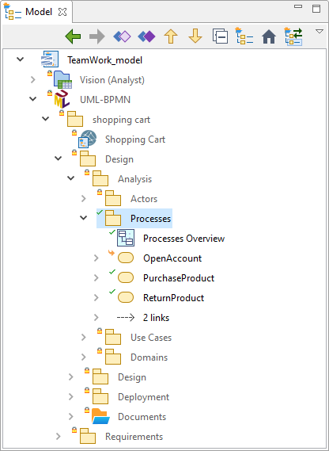

// Disable all captions for figures.
:!figure-caption:
// Path to the stylesheet files
:stylesdir: .

= Les modes de verrouillage

Il existe deux modes de verrouillage :

* Le mode *Sans verrouillage* : Tous les éléments peuvent être modifiés.
+
Si deux utilisateurs modifient et publient le même élément, la livraison des modifications du deuxième utilisateur échouera. +
Il devra d'abord lancer une mise à jour. Cette commande de mise à jour indiquera que l'élément modifié est en conflit. Il devra ensuite résoudre les conflits en utilisant la commande Résoudre les conflits et / ou la commande Passer les conflits à résolus avant de pouvoir publier les éléments modifiés.
* Le mode *Verrouillage nécessaire* : +
Un statut lecture seule / lecture-écriture est ajouté aux éléments du modèle de travail partagé. Les modèles de travail partagés sont configurés pour permettre la modification des éléments verrouillés seulement. Un élément en lecture seule ne peut être modifié, tandis qu'un élément en lecture-écriture peut être modifié localement. Les commandes Subversion vous permettent de changer le statut courant de l'élément de lecture seule en lecture-écriture et inversement.

Le mode de verrouillage est sélectionné dans la fenêtre de configuration du modèle de travail partagé. 

=== Représentation de l'état des éléments

Modelio représente l'état graphiquement en superposant des symboles sur l'icône de l'élément : +

.Représentation graphique de l'état des éléments dans Modelio

Selon le mode de verrouillage, les symboles suivants sont utilisés :

*En mode 'Verrouillage nécessaire' :*

* _(sans symbole)_ – Elément non versionné
* image:images/attachment/modeliocom41/User_Documentation_fr/Introduction_aux_modeles_de_travail_SVN/Modes_de_verrouillage/CMS_READONLY.png[CMS_READONLY.png] - Elément en mode lecture seule
*  - Elément modifié
* image:images/attachment/modeliocom41/User_Documentation_fr/Introduction_aux_modeles_de_travail_SVN/Modes_de_verrouillage/CMS_READWRITE.png[CMS_READWRITE.png] - Elément verrouillé en mode lecture-écriture
*  - Elément ajouté en version
* image:images/attachment/modeliocom41/User_Documentation_fr/Introduction_aux_modeles_de_travail_SVN/Modes_de_verrouillage/CMS_CONFLICT.png[CMS_CONFLICT.png] - Elément en conflit (ceci ne se produit généralement pas en mode "verrouillage nécessaire" sauf si les verrous ont été cassés)

*En mode 'Sans verrouillage' :*

* _(sans symbole)_ – Elément non versionné
* image:images/attachment/modeliocom41/User_Documentation_fr/Introduction_aux_modeles_de_travail_SVN/Modes_de_verrouillage/CMS_READWRITE.nolock.png[CMS_READWRITE.nolock.png] – Elément en mode lecture-écriture
* image:images/attachment/modeliocom41/User_Documentation_fr/Introduction_aux_modeles_de_travail_SVN/Modes_de_verrouillage/CMS_MODIFIED.nolock.png[CMS_MODIFIED.nolock.png] – Elément modifié
* image:images/attachment/modeliocom41/User_Documentation_fr/Introduction_aux_modeles_de_travail_SVN/Modes_de_verrouillage/CMS_READWRITE.png[CMS_READWRITE.png] – Elément verrouillé en mode lecture-écriture
*  – Elément modifié et verrouillé en mode lecture-écriture
*  – Elément ajouté en version
* image:images/attachment/modeliocom41/User_Documentation_fr/Introduction_aux_modeles_de_travail_SVN/Modes_de_verrouillage/CMS_CONFLICT.png[CMS_CONFLICT.png] – Elément en conflit

