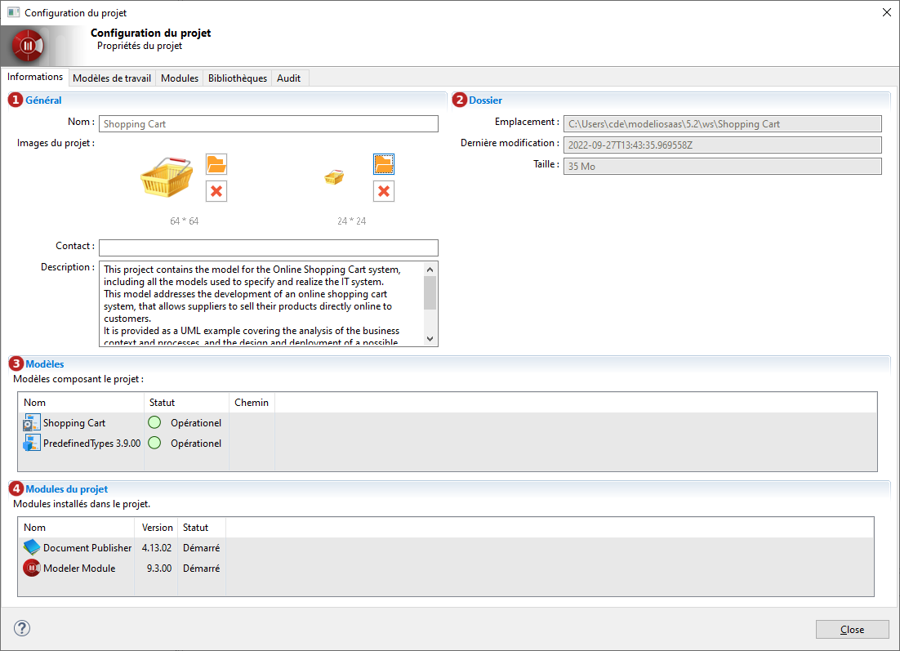

// Disable all captions for figures.
:!figure-caption:
// Path to the stylesheet files
:stylesdir: .

= Consulter les informations du projet

Afin d'obtenir des informations sur le projet ouvert, il suffit d'ouvrir la 'Configuration du projet' en cliquant sur le bouton image:images/attachment/modeliocom41/User_Documentation_fr/Project_Local/Consulting_project_information_Local/ConsultingProjectInformation_002.png[ConsultingProjectInformation_002.png].

*Légende :*

. Informations générales sur le projet. Le contact, la description du projet et ses images peuvent être modifiées.
. Informations relatives au stockage physique du projet. 
. Liste des modèles contenus dans le projet. 
. Liste des modules déployés dans le projet.
