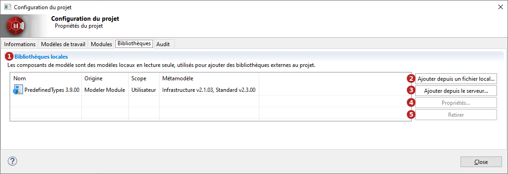

// Disable all captions for figures.
:!figure-caption:
// Path to the stylesheet files
:stylesdir: .

= Consulter les bibliothèques du projet

Une *bibliothèque de modèle* est un ensemble d'éléments de modèle non-modifiables nécessaires au développement de votre projet, packagés dans un seul et unique artéfact.

Pour avoir des détails sur les bibliothèques déployées dans un projet, sélectionnez l'onglet *Bibliothèques* de la fenêtre de *Configuration du projet* accessible depuis le bouton image:images/attachment/modeliocom41/User_Documentation_fr/Project_Local/Consulting_project_libraries_Local/ConsultingProjectInformation_002.png[ConsultingProjectInformation_002.png].

*Légende :*

. Bibliothèques déployées dans le projet
. Ajouter un composant de modèle au projet à partir d'un fichier ramc local
. Ajouter un composant de modèle au projet à partir du serveur
. Voir les détails du composant de modèle sélectionné
. Retirer le composant de modèle sélectionné du projet
