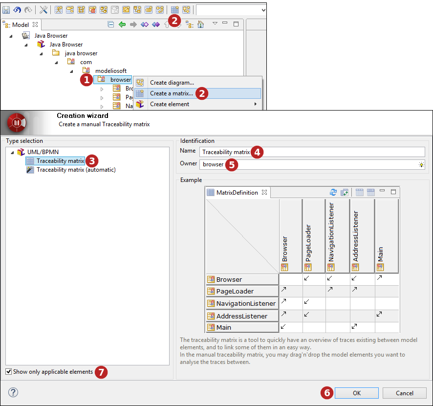
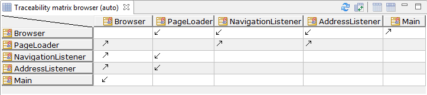
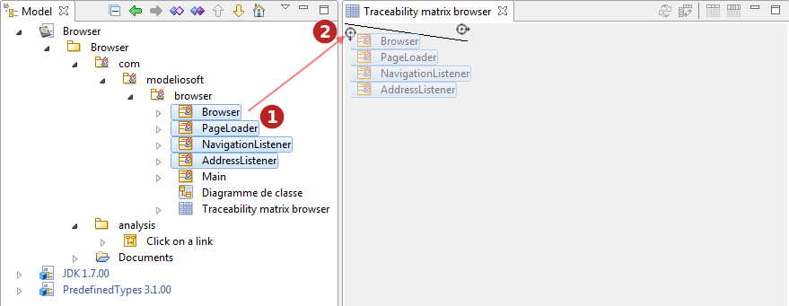

// Disable all captions for figures.
:!figure-caption:
// Path to the stylesheet files
:stylesdir: .

= Matrices de traçabilité

La matrice de traçabilité permet d'avoir une vision rapide des traces existant entre les éléments de modèle, et de les modifier rapidement.

Dans chaque cellule, une flèche indique la direction des liens de traçabilité. Un lien bidirectionnel indique que les deux éléments dépendent l'un de l'autre.

Le contenu de la matrice est remis à jour automatiquement lorsque le modèle est mis à jour, et les traces modifiées.

.Création d'une matrice de traçabilité en utilisant l'Assistant de création.

*Légende :*

1.  Sélectionnez l'élément sous lequel vous souhaitez créer une matrice.
2.  Cliquez sur le bouton " image:images/attachment/modeliocom41/User_Documentation_fr/Matrices/matrix.png[matrix.png] Créer une matrice..." du menu contextuel de l'élément sélectionné ou de la barre d'outils.
3.  Sélectionnez le type de matrice que vous souhaitez créer.
4.  Saisissez un nom pour votre nouvelle matrice, ou bien laissez le nom proposé par défaut.
5.  Si le propriétaire de la matrice n'est pas l'élément de modèle sélectionné, indiquez un nouveau propriétaire.
6.  Cliquez sur "OK" pour valider la création de votre nouvelle matrice.
7.  Les matrices qui ne sont pas applicables sont grisés, et peuvent être masqués en cochant la case "Montrer seulement les diagrammes et matrices applicables".

Deux variantes existent pour cette matrice : automatique et manuelle. 

== Matrice de traçabilité automatique

La matrice de traçabilité automatique est une matrice carrée contenant les enfants d'un Package ou d'une Class, et montrant les dépendances «trace» entre eux.

.Matrice automatique

== Matrice de traçabilité manuelle

Dans la matrice de traçabilité manuelle, vous pouvez glisser déposer les éléments de modèle que vous souhaitez afin d'analyser les traces entre eux. Ils peuvent être ajoutés en tant que ligne ou colonne, afin d'obtenir le résultat souhaité.

.Glisser déposer des éléments dans une matrice manuelle

*Étapes :*

1.  Sélectionnez des éléments dans l'onglet modèle.
2.  Glisser les vers l'icône image:images/attachment/modeliocom41/User_Documentation_fr/Matrices/droparea.png[droparea.png] de la colonne ou ligne désirée et relâchez le bouton de la souris.

.Matrice manuelle

Une utilisation courante de matrice manuelle est d'ajouter des Requirements sur un axe, et les Classes d'implémentation sur l'autre axe, pour s'assurer que tous les Requirements sont satisfaits.
