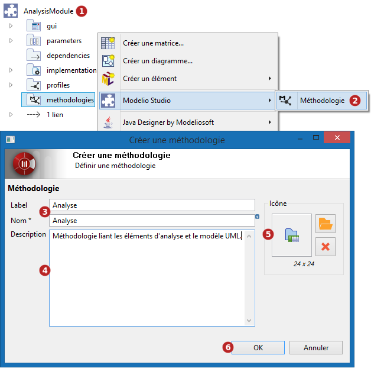
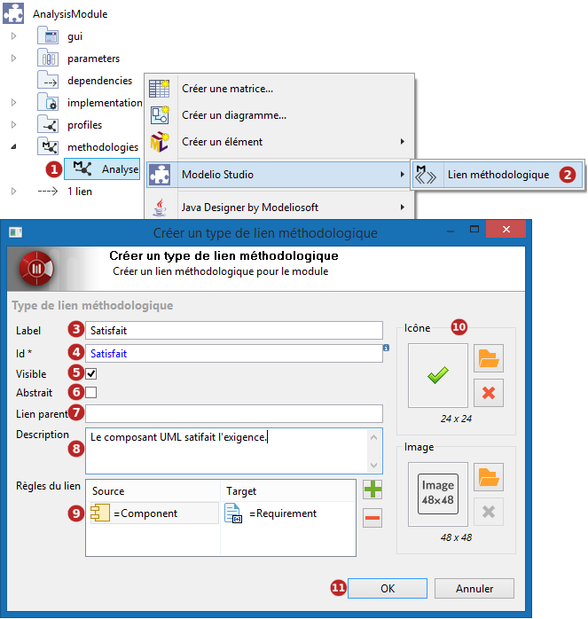

// Disable all captions for figures.
:!figure-caption:
// Path to the stylesheet files
:stylesdir: .

= Méthodologies personnalisées

Dans un projet *Modelio Studio*, il est possible de définir de nouvelles méthodologies ainsi que des types de liens méthodologiques dans un module.

Une fois ce module déployé dans un projet, tous les types de liens seront alors disponibles dans le modèle.

===== Créer une méthodologie

Les méthodologies peuvent être créées sur un image:images/attachment/modeliocom41/User_Documentation_fr/Methodologie/Methodologies_personnalisees/module.png[module.png] module ou un image:images/attachment/modeliocom41/User_Documentation_fr/Methodologie/Methodologies_personnalisees/methodologycontainer.png[methodologycontainer.png] conteneur méthodologique.

*Légende :*

1.  Sélectionnez le image:images/attachment/modeliocom41/User_Documentation_fr/Methodologie/Methodologies_personnalisees/module.png[module.png] module dans lequel vous souhaitez créer une image:images/attachment/modeliocom41/User_Documentation_fr/Methodologie/Methodologies_personnalisees/methodology.png[methodology.png] méthodologie.
2.  Sur le dossier image:images/attachment/modeliocom41/User_Documentation_fr/Methodologie/Methodologies_personnalisees/methodologycontainer.png[methodologycontainer.png] methodologies, cliquez sur le bouton "Modelio Studio/ image:images/attachment/modeliocom41/User_Documentation_fr/Methodologie/Methodologies_personnalisees/methodology.png[methodology.png] Méthodologie..." du menu contextuel.
3.  Saisissez un nom et un label.
4.  Saisissez une description pour expliquer l'utilité de cette nouvelle méthodologie.
5.  Choisissez une icône à associer à la méthodologie.
6.  Cliquez sur "OK" pour valider la création.

===== Créer un type de lien méthodologique

*Légende :*

1.  Sélectionnez une image:images/attachment/modeliocom41/User_Documentation_fr/Methodologie/Methodologies_personnalisees/methodology.png[methodology.png] méthodologie.
2.  Cliquez sur le bouton "Modelio Studio/  Lien méthodologique..." du menu contextuel.
3.  Saisissez un label.
4.  Changez l'identifiant automatiquement rempli si celui ci ne vous convient pas.
5.  Indiquez si ce type de lien doit être visible des utilisateurs pour des ajouts/suppressions manuels.
6.  Indiquez si ce type de lien doit être concret ou abstrait.
7.  Optionnellement, saisissez un lien parent si votre type de lien doit en étendre un autre.
8.  Saisissez une description.
9.  Définissez les *règles de liaison*, qui indiquent entre quels éléments ce lien pourra être créé.
10. Choisissez une icône et une image à associer à ce type de lien.
11. Cliquez sur "OK" pour valider la création.

*Remarque* : pour que les règles de liaison soient prises en compte lors du déploiement du module, il est impératif de générer l'API MDA du module lors de la génération Studio pour ce module.
