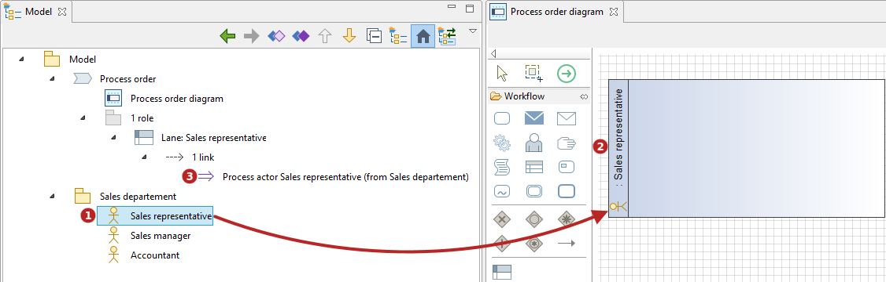
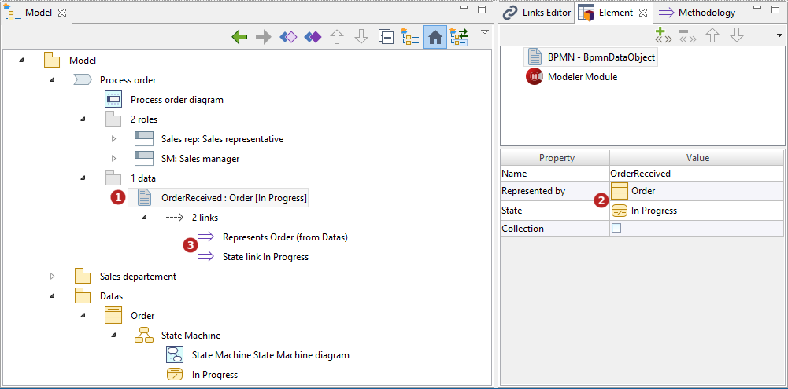

// Disable all captions for figures.
:!figure-caption:
// Path to the stylesheet files
:stylesdir: .

= Utilisation des liens méthodologiques

Il y a plusieurs façons de créer des liens méthodologiques.

==== Interactions intelligentes

Les liens méthodologiques peuvent être créés par glisser-déposer d'éléments dans les diagrammes.

Par exemple, glisser-déposer un acteur UML dans un diagramme de processus BPMN créera une Lane ainsi que le lien méthodologique approprié entre cette dernière et l'acteur.

*Légende :*

1.  Glisser-déposer un acteur dans un diagramme de processus BPMN.
2.  Une Lane est créée.
3.  Un lien méthodologique 'Acteur de processus' est créé entre la Lane et l'acteur.

==== Editeur de liens

Les liens méthodologiques peuvent aussi être créés via l'éditeur de liens.

image::images/attachment/modeliocom41/User_Documentation_fr/Methodologie/Vue_methodologique/LinkEditorPuces.png[LinkEditorPuces.png]

*Légende :*

1.  Sélectionner une Lane.
2.  Verrouiller l'éditeur de liens sur cette Lane.
3.  Activer le bouton 'Lien méthodologiques'.
4.  Glisser-déposer un acteur après la Lane dans l'éditeur de liens.
5.  Un lien méthodologique 'Acteur de processus' est créé entre la Lane et l'acteur.

==== Vue Element

Les liens méthodologiques peuvent aussi être créés via la vue Element.

Par exemple pour lier un Data Object à une classe et/ou un état, il suffit de cliquer dans les champs appropriés de la vue Element.

*Legende :*

1.  Sélectionner un Data Object.
2.  Dans la vue Element, cliquer dans le champ approprié puis utiliser CTRL+Space ou sélectionner à la souris un élément dans l'explorateur de modèle.
3.  Un lien méthodologique 'Représente' est créé entre le Data Object et la classe, et/ou un lien 'Etat' est créé du Data Object à l'état.

==== Vue Méthodologie

Les liens méthodologiques peuvent aussi être créés via la vue Méthodologie.

Par exemple pour lier un processus BPMN à plusieurs KPIs, il suffit de cliquer dans le champ approprié de la vue Méthodologie.

image::images/attachment/modeliocom41/User_Documentation_fr/Methodologie/Vue_methodologique/MethodologyPuces.png[MethodologyPuces.png]

*Légende :*

1.  Sélectionner un processus.
2.  Cliquer dans le champ 'Alloué' de la vue Méthodologie.
3.  Cliquer sur le bouton 'Recherche' pour afficher tous les KPIs.
4.  Sélectionner les KPIs désirés.
5.  Cliquer sur le bouton '>>'.
6.  Cliquer sur le bouton 'OK'.
7.  Des liens méthodologiques 'Alloué' sont créés entre le processus et les KPIs sélectionnés
