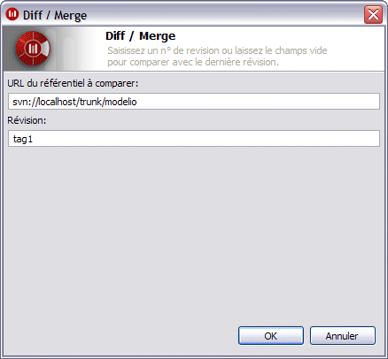
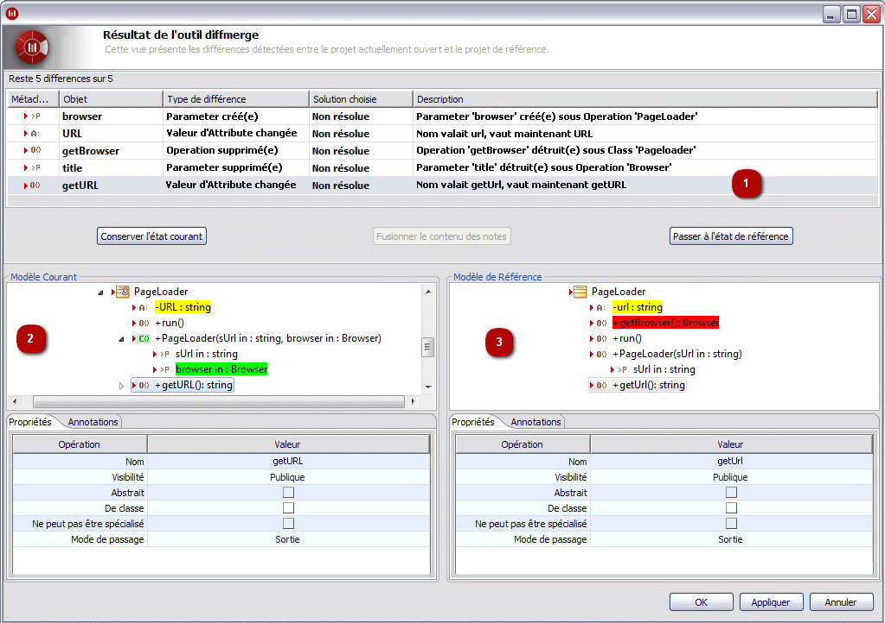
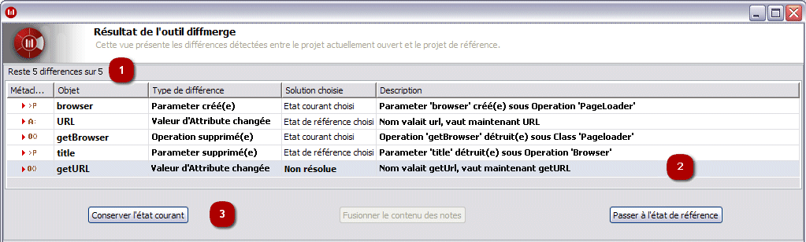

// Disable all captions for figures.
:!figure-caption:
// Path to the stylesheet files
:stylesdir: .

= La commande Diff/Merge

===== Description

La commande "Diff/Merge" compare le modèle actuel à un modèle de "référence". Ce modèle de "référence" peut être extrait de n'importe quelle révision ou n'importe quel tag du référentiel auquel est connecté le projet actuel, ou bien d'une branche.

La commande "Diff/Merge" affiche alors une fenêtre où les différences entre le modèle courant et le modèle de référence peuvent être visualisées et résolues.

La résolution est l'acte de décider, pour chaque différence trouvée :

* si l'on applique les changements apportés au modèle courant, afin de faire en sorte que celui-ci corresponde au modèle de référence, ou bien
* si l'on garde les modifications locales.

Chaque différence se trouve dans l'un des états de résolution suivants :

* *Non résolue* : Aucun choix de résolution n'a été fait pour cette différence. On peut faire ce choix à tout moment.
* *Etat courant choisi* : Le choix de résolution déjà fait pour cette différence a été de garder les modifications locales. Ceci signifie que le modèle courant continuera à différer du modèle de référence. En revanche, la différence est considérée comme étant résolue.
* *Etat de référence choisi* : Le choix de résolution déjà fait pour cette différence a été d'annuler les modifications locales. Ceci signifie que le modèle courant a été modifié afin de faire en sorte qu'il ne diffère plus du modèle de référence. La différence est considérée comme étant résolue.
* *Fusionné* : (Uniquement possible pour une différence concernant le contenu d'une note) Le choix de résolution déjà fait pour cette différence a été de fusionner le contenu de la note dans le modèle courant avec le contenu de la note dans le modèle de référence. La différence est considérée comme étant résolue.
* *Non Applicable* : Le modèle courant est dans un état où il n'est pas possible de faire un choix de résolution pour la différence en question.
** Par exemple : Une classe est gérée en travail de groupe. Elle n'a pas été verrouillée et ne peut donc pas être modifiée. Si le nom de la classe dans le modèle courant diffère de son nom dans le modèle de référence, alors une différence concernant l'attribut "Nom" de la classe serait listée. Pourtant, cette différence se trouverait dans un état "Non Applicable", car la classe ne peut pas être modifiée et il n'est donc pas possible de faire un choix de résolution.

*Notes :* Le choix d'une résolution pour une différence peut avoir un effet sur l'état de résolution d'autres différences.

Plus précisément, une différence peut devenir "Non Applicable", indépendamment de son état antérieur, à cause d'un choix de résolution fait pour une autre différence.

De même, une différence qui était "Non Applicable" peut devenir applicable, à cause du choix de résolution fait pour une autre différence. Son état de résolution serait alors le dernier état avant de devenir "Non Applicable" (par défaut, "Non résolue"). [[Conditions-et-restrictions]]

===== Conditions et restrictions

La commande "Diff/Merge" peut être lancée sur n'importe quel grain du modèle. Seul l'élément sélectionné et ses éléments composants (mode récursif) seront comparés au modèle de référence. [[Interface-utilisateur]]

===== Interface utilisateur

La commande "Diff/Merge" ouvre la fenêtre suivante :

.La fenêtre "Diff/Merge"
 [[La-fenêtre-ldquoDiffMergerdquo]]

Le champ "URL du référentiel à comparer" peut être utilisé pour indiquer une branche comme modèle de référence.

Le champ "Révision" peut être utilisé pour indiquer la révision du référentiel qui doit être utilisée comme modèle de référence.

*Notes :* Vous pouvez indiquer soit un numéro de révision, soit un nom de tag.

Si vous laissez le champ "Révision" vide, alors la commande "Diff/Merge" utilisera la dernière révision disponible (souvent connue comme "HEAD revision") comme modèle de référence.

Lorsque vous appuyez sur le bouton "OK", l'analyse des différences s'exécute, puis la fenêtre des résultats s'affiche :

.Un exemple de la fenêtre de résultats qui s'affiche après l'exécution de la commande "Diff/Merge"
 [[Un-exemple-de-la-fenêtre-de-résultats-qui-saffiche-après-lexécution-de-la-commande-ldquoDiffMergerdquo]]

*Légende :*

1.  Différences : Toutes les différences détectées sont listées et décrites ici. C'est également ici que vous faites vos choix de résolution des différences.
2.  Modèle courant : Cette zone montre l'état courant du modèle local, y compris le résultat des choix de résolution faits jusqu'ici.
3.  Modèle de référence : Cette zone montre l'état du modèle de référence, ce qui peut être utile lorsqu'il faut tenir compte du contexte avant de faire un choix de résolution pour une différence donnée.

Les boutons "OK", "Appliquer" et "Annuler" se trouvent en bas de la fenêtre des résultats.

Lorsque vous appuyez sur le bouton "OK", les choix de résolution faits jusqu'ici sont réellement appliqués au modèle du projet courant. La fenêtre de résultats se ferme alors.

Lorsque vous appuyez sur le bouton "Appliquer", les choix de résolution faits jusqu'ici sont réellement appliqués au modèle du projet courant. Les différences par rapport au modèle de référence sont alors analysées à nouveau. La fenêtre de résultats se met à jour pour afficher les résultats de cette nouvelle analyse.

Lorsque vous appuyez sur le bouton "Annuler" (ou bien sur la croix en haut à droite de la fenêtre des résultats), les choix de résolution faits jusqu'ici sont ignorés, et le modèle du projet courant reste inchangé.

*Note :* Lorsque vous appuyez sur le bouton "Appliquer", le modèle du projet courant peut être modifié. Les modifications apportées seront retenues, même si vous appuyez ensuite sur le bouton "Cancel". [[La-zone-des-différences]]

===== La zone des différences

Bien que les zones "Modèle courant" et "Modèle de référence" puissent être utilisées pour naviguer dans les deux modèles, la principale zone d'interaction dans la fenêtre de résultats est la zone des différences :

.La zone des différences en détail
 [[La-zone-des-différences-en-détail]]

*Légende :*

1.  Le compteur des différences restantes : Ce compteur vous informe du nombre de différences non encore résolues (c'est à dire, le nombre de différences "Non résolues" par rapport au nombre total de différences).
2.  Le détail des différences : La sélection d'une différence particulière dans cette liste sélectionnera l'élément le plus pertinent dans les zones "Modèle courant" et "Modèle de référence". Pour chaque différence, les informations sont fournies :
* L'élément principal impliqué dans cette différence,
* Le type exact de la différence (par exemple, la création d'un élément, le ré-ordonnancement des éléments composants, la modification d'une valeur d'attribut, et ainsi de suite),
* Le statut actuel de résolution,
* Une courte description textuelle.
3.  Les boutons d'action : Ces boutons servent à exprimer un choix de résolution de la (des) différence(s) sélectionnée(s) dans la liste des différences.
* Le bouton "Passer à l'état de référence" indique que le modèle courant devrait refléter le modèle de référence. Habituellement, ceci implique la modification du modèle courant.
* Inversement, le bouton "Conserver l'état courant" indique que le modèle courant devrait refléter le modèle tel qu'il était avant le lancement de la commande "Diff/Merge". Ceci implique qu'il n'y aura aucune modification du modèle courant, sauf si la différence était déjà dans un état de "Etat de référence choisi" ou "Fusionné". Dans ce cas, les modifications apportées auparavant sont tout simplement annulées.
* Enfin, le bouton "Fusionner le contenu des notes" n'est disponible que si la différence actuellement sélectionnée concerne le contenu d'une note. Ce bouton ouvre un outil externe de fusion de texte, pour permettre le bon déroulement de la fusion du contenu.

*Note :* L'état de résolution d'une différence peut être modifié à tout moment, à condition que la différence ne se trouve pas dans l'état "Non Applicable".

Sous *Mac OS X*, XCode est requis pour la fonctionnalité "Fusionner le contenu des notes".
