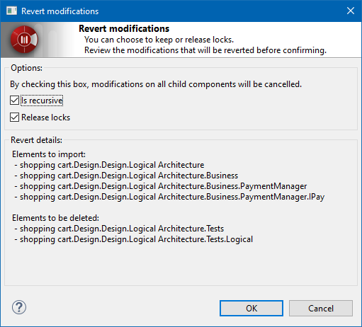

// Disable all captions for figures.
:!figure-caption:
// Path to the stylesheet files
:stylesdir: .

= La commande "Restaurer"

=== Description

La commande "Restaurer" restaure un élément local à son état actuel et avec son contenu actuel par rapport au référentiel.

=== Conditions et restrictions

Pour pouvoir lancer la commande "Restaurer" il faut que :

* L'élément soit un <<User_Documentation_fr_Introduction_aux_modeles_de_travail_SVN_Grains_SVN.adoc#,grain>>.
* L'élément soit en lecture-écriture.

=== Interface utilisateur

La commande "Restaurer" ouvre la fenêtre suivante :

.La fenêtre "Abandonner les modifications"

Cette fenêtre inclut une option "Récursif" et une option "Relâcher les verrous". Par défaut, ces options sont activés. La fenêtre liste également les éléments qui vont être restaurés, selon les valeurs sélectionnées pour les deux options. [[Comportement]]

=== Comportement

Les options proposées dans la fenêtre "Abandonner les modifications" modifient le comportement de la commande "Restaurer".

* *Récursif* : +
L'élément ET ses sous-éléments seront restaurés par l'exécution de cette commande. +
Exemple : un package et toutes ses classes.
* *Relâcher les verrous* : +
La commande relâchera également les verrous sur les éléments sur lesquels elle est lancée. Les éléments en question ne seront plus verrouillés (mode lecture seule).
