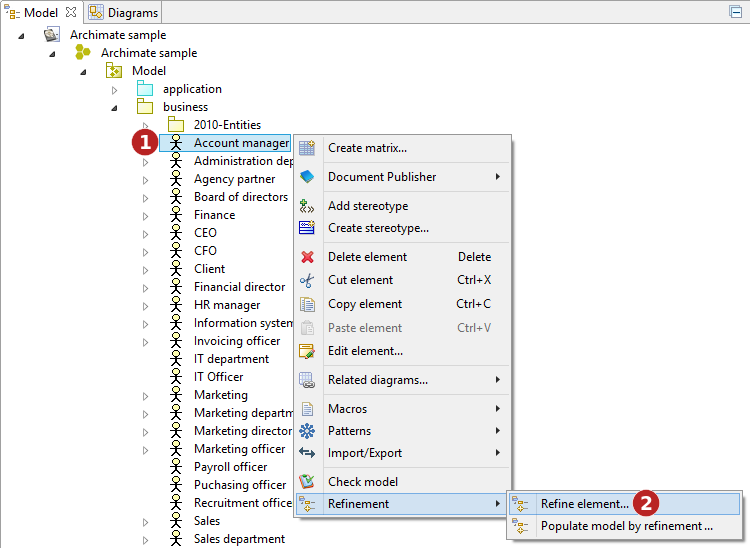
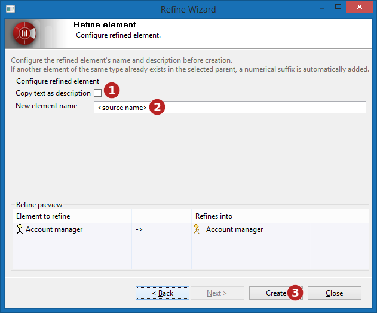
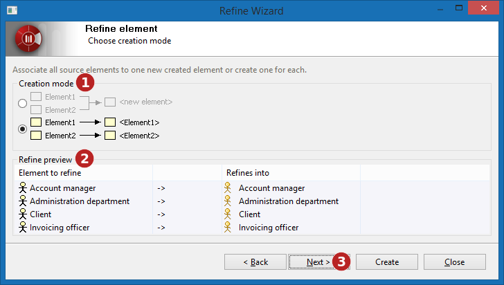

// Disable all captions for figures.
:!figure-caption:
// Path to the stylesheet files
:stylesdir: .

= Raffiner les éléments

Selon le nombre d'éléments à raffiner, l'assistant de raffinement peut prendre deux formes légèrement différentes.

= Raffiner un élément unique

Pour raffiner un élément unique, suivre la procédure suivante :

*Étapes :*

1. Faire un clic droit sur l'élément que vous voulez raffiner.
2. Lancer la commande *"Raffiner l'élément..."*.

La boite de dialogue suivante s'ouvre pour configurer le processus de raffinement :

image::images/attachment/modeliocom41/User_Documentation_fr/Raffinement_d_element/Raffiner_les_elements/Refine-02.png[Refine-02.png]

*Étapes :*

1. Choisir (en utilisant le picking) le parent de l'élément qui doit être créé. C'est l'endroit ou le nouvel élément créé apparaîtra. Le type de l'élément parent détermine les transformations qui sont autorisées ou non, ce qui modifie la liste des types proposés. ( image:images/attachment/modeliocom41/User_Documentation_fr/Raffinement_d_element/Raffiner_les_elements/2.png[2.png] )
2. Choisir le type d'élément à créer dans cette liste. 
3. L'aperçu montre les éléments à raffiner, et les éléments qui doivent être créés. Dans notre exemple, 'Account Manager' qui est un élément du modèle ArchiMate sera transformé en 'Account Manager' dans le modèle UML. Pour rappel, les éléments initiaux ne sont jamais modifiés par la transformation.
4. Presser le bouton *"Suivant"*.

*Étapes :*

1. Indiquer si les nouveaux éléments doivent avoir la même description que ceux qu'ils raffinent. Si cette case est cochée, les notes Description des éléments seront automatiquement copiées à la création des nouveaux éléments. 
2. Entrer le nom de l'élément à créer. Par défaut, le nom est celui de l'élément en train d'être raffiné.Une bonne raison de modifier le nom proposé pourrait être qu'un nom valide dans un formalisme ne l'est pas forcément dans un autre. Par exemple, les espaces sont autorisés dans les noms des éléments ArchiMate, mais poseraient problème si l'élément créé était une classe java.
3. Enfin, presser le bouton *"Créer"*.

Le résultat à la fin de notre exemple est le suivant :

* un acteur UML nommé _Account manager_ a été créé dans le Package _Organization_.
* il possède une Dépendance «refine» vers l'Acteur ArchiMate _Account manager_.

*Note :* La boite de dialogue ne se ferme pas quand le bouton "Créer" est pressé, ce qui permet de facilement raffiner un même élément en plusieurs autres.

= Raffiner plusieurs éléments

Le raffinement de plusieurs éléments en même temps est un petit peu plus compliqué :

image::images/attachment/modeliocom41/User_Documentation_fr/Raffinement_d_element/Raffiner_les_elements/Refine-04.png[Refine-04.png]

*Étapes :*

1. Faire un clic droit sur les éléments que vous voulez raffiner.
2. Lancer la commande *"Raffiner l'élément..."*.

image::images/attachment/modeliocom41/User_Documentation_fr/Raffinement_d_element/Raffiner_les_elements/Refine-05.png[Refine-05.png]

*Étapes :*

1. Choisir (en utilisant le picking) le parent de l'élément qui doit être créé. 
2. Choisir le type d'élément à créer dans cette liste. 
3. L'aperçu ne montre rien pour le moment. 
4. Presser le bouton *"Suivant"*.

*Étapes :*

1. Choisir le mode de création parmi : 
* Simple, créer un seul élément dans le modèle.
* Multiple, créer un élément différent par élément en train d'être raffiné.
2. Une fois le mode de création choisi, l'aperçu montre ce qui va être créé. 
3. Presser le bouton *"Suivant"*.

image::images/attachment/modeliocom41/User_Documentation_fr/Raffinement_d_element/Raffiner_les_elements/Refine-07.png[Refine-07.png]

*Étapes :*

1. Indiquer si les nouveaux éléments doivent avoir la même description que ceux qu'ils raffinent. 
2. Entrer le nom de l'élément à créer. 
3. Enfin, presser le bouton *"Créer"*.

Dans notre exemple, quatre Acteurs (UML) sont créés dans le Package _Organization_. Chacun d'entre eux possède une Dependance «refine» Dependency qui pointe vers l'Acteur (ArchiMate) qu'il raffine.

*Note :* en mode de création Simple, la copie de description est désactivée car il serait étrange d'avoir plusieurs notes de description en même temps sur un élément. Au contraire, en mode de création Multiple, c'est le champ nom qui est désactivé car chaque élément créé le sera avec le même nom que l'élément qu'il raffine.
