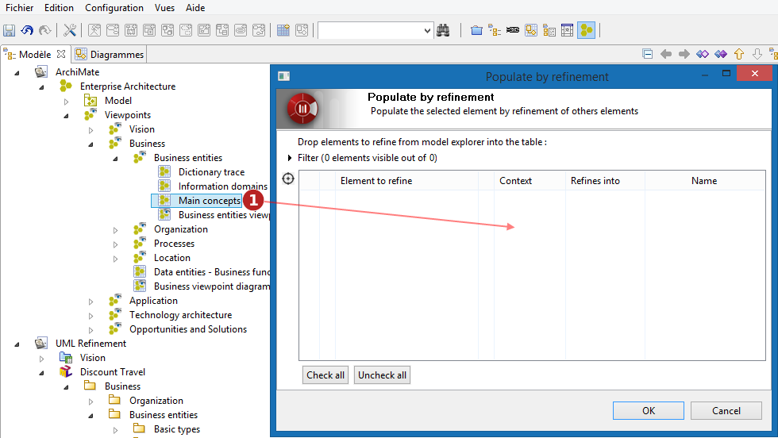
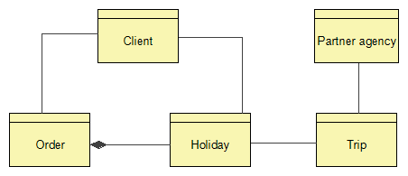
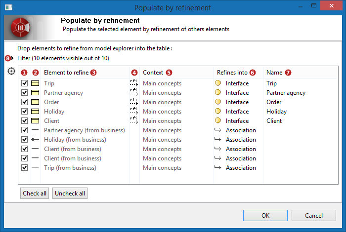
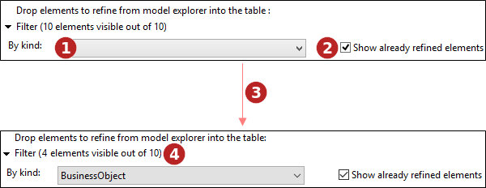
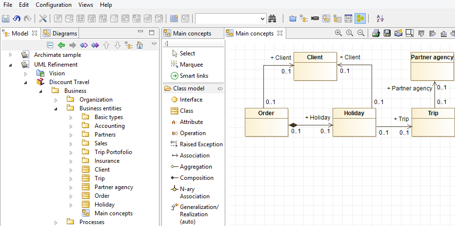

// Disable all captions for figures.
:!figure-caption:
// Path to the stylesheet files
:stylesdir: .

= Remplir par raffinement

Outre le raffinement à partir d'un élément spécifique, Modelio offre la possibilité de remplir une partie du modèle à partir d'éléments provenant de multiples sources.

Raffiner un ensemble complexe d'éléments dans une opération unique implique un processus spécifique. +
 +
Les points clés sont les suivants :

* sélectionner ou définir les ensembles d'éléments à transformer.
* pour chaque élément à transformer, choisir quel type d'élément créer (quand plusieurs possibilités existent).
* exécuter la transformation.

Lors de la transformation d'un grand ensemble d'éléments, choisir parmi plusieurs options le type d'élément à créer pour chacun des éléments de l'ensemble peut rapidement s'avérer long et ennuyeux. Pour alléger cette tâche, l'assistant de raffinement est démarré depuis l'élément cible, c'est à dire l'élément qui sera le parent des éléments à créer par transformation. Du choix du parent dépend la liste des options de transformation qui est automatiquement créée. En effet, seuls certains types d'éléments peuvent être créés sous un parent donné. Cette méthode simplifie grandement le processus de choix des éléments à produire. +
 +

image::images/attachment/modeliocom41/User_Documentation_fr/Raffinement_d_element/Remplir_par_raffinement/Populate-01.png[Populate-01.png]

*Étapes :*

1. Faire un clic droit sur l'endroit à remplir par raffinement. C'est l'endroit ou les nouveaux éléments créés apparaîtront. Le type de l'élément parent détermine les transformations qui sont autorisées ou non.
2. Lancer la commande *"Remplir par raffinement..."*.

*Note :* Sélectionner un diagramme en tant que 'parent' créé tous les nouveaux éléments dans le parent du diagramme, et les démasque dans le diagramme lui même.

*Étapes :*

1. Glisser-déposer un ou plusieurs éléments à raffiner dans le tableau. L'assistant de raffinement filtre automatiquement les éléments qui n'ont pas de règle de raffinement dans le parent sélectionné.

*Note :* L'ajout d'un diagramme dans le tableau ajoute automatiquement tous les éléments de modèle qui sont démasqués dans le diagramme.

Le diagramme "Main concepts" ajouté dans notre exemple contient le modèle ArchiMate suivant :

Il contient plusieurs BusinessObjects, reliés par des associations et compositions.

Une fois le diagramme glissé-déposé dans le tableau, celui-ci présente tous les éléments qui peuvent être raffinés selon les <<User_Documentation_fr_Raffinement_d_element_Concept_de_raffinement.adoc#,règles de raffinement>> :

 
*Étapes :*

1. Cocher cette case pour indiquer que l'élément correspondant doit être raffiné.
2. Type de l'élément dans le modèle. 
3. Nom de l'élément raffiné. 
4. Indique si l'élément est déjà raffiné dans le modèle. 
5. Si l'élément est ajouté depuis un diagramme, le nom du diagramme est précisé pour rappeler le contexte. 
6. Choix du type de l'élément à créer (liste déroulante). La liste dépend des règles de raffinement et de l'élément parent sélectionné. 
7. Nom de l'élément raffiné à créer (champ de texte libre). 
8. La zone de filtre peut être dépliée ici. Elle est très utile pour choisir le type d'éléments à raffiner. 
9. Cliquer sur *OK* pour créer les éléments raffinés.

Vue détaillée de la zone de filtre :

*Étapes :*

1. Choisir le type d'élément à afficher dans l'assistant. Par défaut, tous les éléments qui sont glissés-déposés dans la fenêtre de l'assistant sont affichés. 
2. Cocher cette case pour afficher les éléments qui ont déjà été raffinés dans le modèle. 
3. Si on sélectionne le filtre "BusinessObject". 
4. Le filtre indique combien d'éléments restent visibles dans le tableau.

*Note :* Seuls les éléments visibles seront raffinés lorsque la transformation sera validée.

Dans l'exemple, cinq classes UML sont créées dans le package "Business entities", au même niveau que le diagramme. Chacune d'elles a un lien de dépendance de type «refine»vers le BusinessObject ArchiMate qu'elle raffine. Il en va de même pour les liens de type Association et Composition entre elles.

Tous les éléments raffinés sont automatiquement démasqués dans le diagramme et positionnés comme dans le diagramme ArchiMate original.
