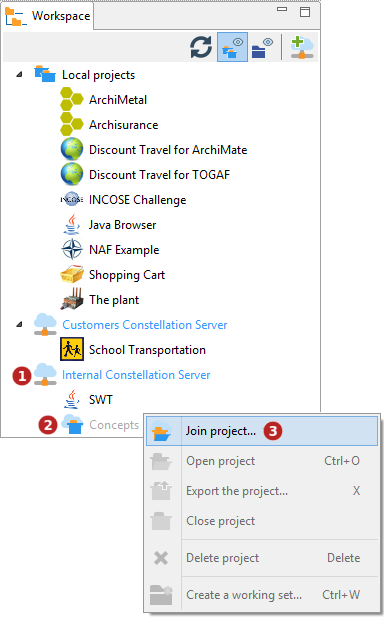

// Disable all captions for figures.
:!figure-caption:
// Path to the stylesheet files
:stylesdir: .

= Rejoindre un projet Modelio Server

Une fois vos Modelio Servers configurés dans l'espace de travail (voir la partie 'Modelio Servers' du chapitre <<User_Documentation_fr_Gerer_l%27espace_de_travail.adoc#,Gérer l'espace de travail>> ) vous pouvez rejoindre les projets qui apparaissent sous ceux-ci.

*Légende :*

1.  Sélectionner un Modelio Servers.
2.  Sélectionner le projet Modelio Server à joindre.
3.  Lancer la commande *'Rejoindre un projet Modelio Server... '*

Les projets Modelio Server non joints apparaissent en gris avec une icône générique ,

A l'issue de la phase de rapatriement des données du projet qui peut prendre un temps relativement long pour les projets volumineux, le projet rejoint est automatiquement _ouvert_ et prêt à être utilisé. Ce projet apparaîtra par la suite dans la vue workspace comme n'importe quel autre projet.

Les projets _Modelio Server_ peuvent ensuite être ouverts normalement comme n'importe quel projet local au workspace.

*Note :* Seuls les projets *Actifs* et *Gelés* dans lesquels l'utilisateur est inscrit sont accessibles. Les projets *Nouveaux* et *Fermés* ne seront pas visibles.
