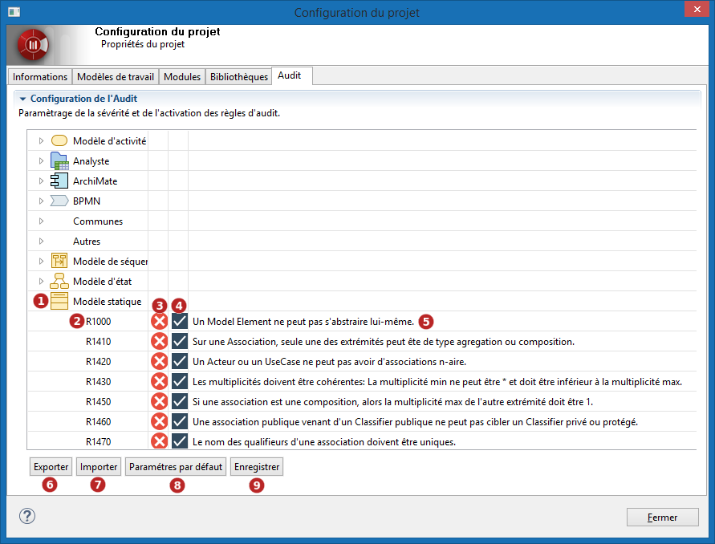

// Disable all captions for figures.
:!figure-caption:
// Path to the stylesheet files
:stylesdir: .

= Configurer l'audit du projet

Modelio vous apporte un ensemble de règles d'audit pré-définies qui vous aideront à développer des modèles corrects et cohérents. +
Chacune de ces règles peut être activée, désactivée ou configurée afin de lui donner une sévérité particulière.

Pour avoir des détails sur les règles d'audit d'un projet, sélectionnez l'onglet *Audit* de la fenêtre de *Configuration du projet* accessible depuis le bouton image:images/attachment/modeliocom41/User_Documentation_fr/Project_SaaS/Configuring_project_audit_SaaS/ConsultingProjectInformation_002.png[ConsultingProjectInformation_002.png].

*Légende :*

1. Groupement de règles par métamodèle.
2. Numéro de la règle d'audit.
3. Sévérité de la règle d'audit. Trois niveaux de sévérité sont disponibles : *Erreur*, *Avertissement* ou *Conseil*.
4. Cette case à cocher vous permet d'activer ou de désactiver la règle. Une règle désactivée n'est jamais appliquée et ne produit aucun résultat. 
5. Description de la règle. 
6. Exporter la configuration courante dans un fichier (par exemple, afin de pouvoir l'utiliser dans un autre projet). 
7. Importer la configuration depuis un fichier. 
8. Revenir à la configuration par défaut. 
9. Sauvegarde de la configuration de l'audit.
