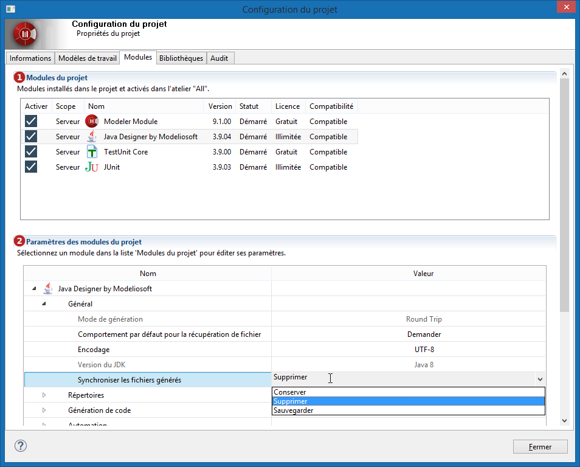

// Disable all captions for figures.
:!figure-caption:
// Path to the stylesheet files
:stylesdir: .

= Configurer les modules du projet

Les modules Modelio sont des composants complémentaires contenant chacun des services spécifiques à un besoin de modélisation particulier.

La gamme Modelio comprend un certain nombre de modules qui exploitent les modèles pour un besoin spécifique (par exemple, la génération de documentation ou la génération de code Java ou C++).

Après son installation, un module Modelio fournit les menus, icônes et annotations spécialisées spécifiques au module en question. Certains modules apportent également leur propre vue, facilitant ainsi la saisie d'informations spécifiques au module en question, comme des notes ou des tagged values dédiées.

Pour avoir des détails sur les modules déployés dans un projet, sélectionnez l'onglet *Modules* de la fenêtre de *Configuration du projet* accessible depuis le bouton image:images/attachment/modeliocom41/User_Documentation_fr/Project_SaaS/Configuring_project_modules_SaaS/ConsultingProjectInformation_002.png[ConsultingProjectInformation_002.png].

*Légende :*

1. Liste des modules installés dans le projet +
2. Paramètres du module sélectionné dans la liste des modules (les paramètres grisés sont en lecture seule car ils sont définis au niveau de Modelio SaaS Server par l'administrateur du projet).
